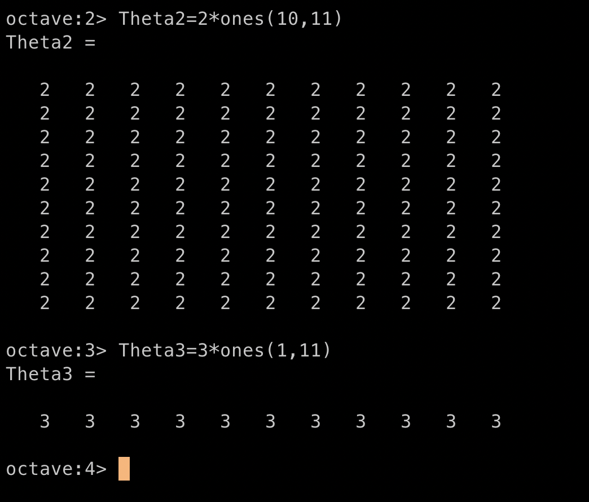
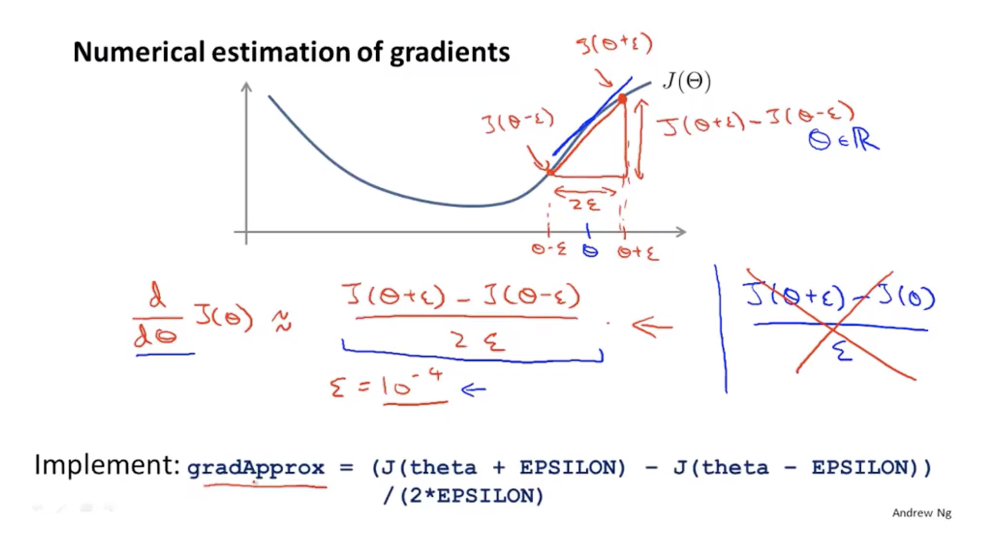

## 1、Cost Function
#### 1.1、 some new number
> - ##### $L$:the number of the layers
> - ##### $s_j$(or $K$):The number of unit(not counting bias unit) in layer $l$

#### 1.2、Cost Function
$$J(\Theta) = -\frac{1}{m}[\sum^m_{i=1}\sum^{K}_{k=1}y^{(i)}_{k}log(h_\theta(x^{(i)}))_{k}+(1-y_{k}^{(i)})log(1-(h_{\theta}(x^{(i)}))_{k})]-\frac{\lambda}{2m}\sum^{L-1}_{l=1}\sum^{s_j}_{i=1}\sum^{s_{j+1}}_{j=1}(\Theta^{(l)}_{ji})^2$$

## 2、Backpropagation algorithm
#### 2.1、Now we need to build the algorithm to minimize the $J(\Theta)$,the Gradient Descent algorithm need us compute two values for it
> - ##### $J(\Theta)$
> - ##### $ \frac{\partial}{\partial  \Theta^{(l)}_{ij}}J(\Theta)$

#### 2.2、From Error $\delta^{(l)}_j$ to Gradient Descent Algorithm
> #### We define $\delta^{(l)}_j = a^{(l)}_j - y_j$,it represents the error beteen the $y_j$(the real data from the train set) and $a^{(l)}_j$(the feature we got from the neural network)
> #### So the right order to minimize $J(\Theta)$ is
> - ##### 1st step: Run forward propagation to get the output and ervery a in hidden layers.
> - ##### 2nd step:Run backpropagation from the output layer to the input layer ,then we got $\delta^{(l)}_j$
> - ##### 3rd step:Use $\delta^{(l)}_j$ to compute $ \frac{\partial}{\partial  \Theta^{(l)}_{ij}}J(\Theta)$，because $$\frac{\partial}{\partial  \Theta^{(l)}_{ij}}J(\Theta)=a^{(l)}_j\delta^{(l+1)}_i$$
> - ##### 4th step :Run Gradient Descent to minimize $J(\Theta)$

#### 2.3、The implementation details of backpropagation algorithm and the Gradient Descent algorithm.

## 3、Backpropagation intuition

## 4、implementation note:Unrolling parameters
#### Unrolling parameters means:we unroll them form parameters matrices into parameters vectors.Because the result of cost function ($\theta$ and $dervative$)is represented as matrix.But if we need to use the fminunc(),the inpit of it must be vector.So we need to unroll parameters.

#### Example:

## 5、Gradient check
#### A reason for gradient check is sometimes the backpropagation can run with bugs and the error will be very large.gradient check can make sure the backpropagation algorithm run correctly
> #### The main idea is computing the dervative of $J(\theta)$  and then compare to the $\theta$ in $DVec$.If the values are very similar or same,backpropagation algorithm run correctly

#### The way to compute the dervative of $J(\theta)$

## 6、Random initialization
#### Zero initialization for $\theta$ is not a bad idea in logistic regression.But if we set $\theta = 0$ in neural network,every feature will in same value. So,we need the Random initialization for $\theta$.

#### implementation:Just use this formula we can make every $\theta$ between $[-\epsilon,\epsilon]$

## 7、Putting it together

