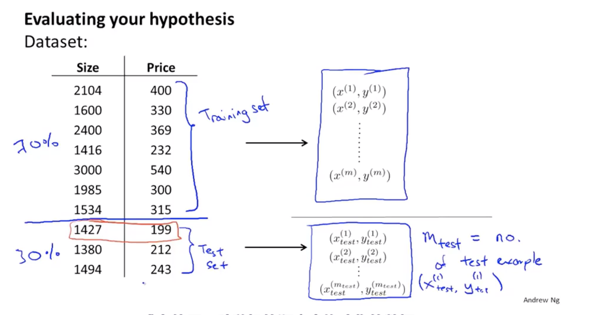
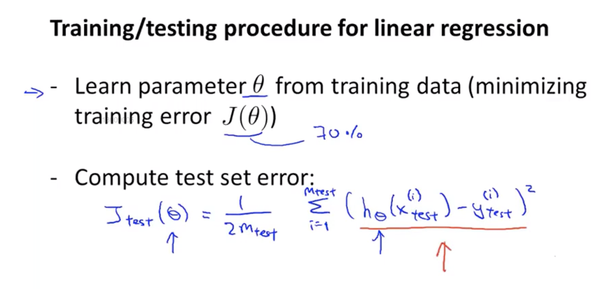

## 1、Deciding what to try next
#### Normally we have many ways to improve the performance of the machine learning algorithm.But not every one is usefully. So ,we need to decide which way we should use to improve it.

#### We can use a test to know which way we shoulde take.

## 2、Evaluating a hypothesis
#### 2.1、Separate the train set.Choose them randomly 70% as train set and 30% as the test set.

#### 2.2、Linear regression
> - ##### 1st step:train $\theta$ with $J(\theta)$
> - ##### 2nd step:use $\theta$ and $x$ in test set get the $y_{hypothesis}$,compute the error between $y_{hypothesis}$ and $y_{test}$

#### 2.3、Logistic regression:We do the samething like in linear regression.And we define a error function。

## 3、Model selection and training/validation/testsets
#### How we know which model is a good model that can fit the data better?(How to choose a model?)
#### 3.1、Old way:use the train set to get $\theta$ and use the test set to know which $\theta$ have the least error.But by this way we are still not sure ,the model can fit the new data which it have not seen before.

#### 3.2、Train,validation and test sets:
> ##### we separate the train set into not 2 parts but 3:Train(60%),validation(20%) and test sets(20%)

##### what we do is:
> - ##### 1st step:use train sets get $\theta$
> - ##### 2nd step:use $J_{cv}(\theta)$ to choose a model with the least error
> - ##### 3rd step: use the model to test set,make sure it can also fit the new data.

## 4、Diagnosing bias vs. variance
#### if the bais very large,the algorithm have underfit problem,if the variance very large it suffer from overfitting.
#### How can we distinguish between the bias and variance when the algorithm can not fit the data well?
> ##### We use the error-Polynomial diagramm to observe the curve.

> ##### The result is :

## 5、Regularization and bias/variance
#### When we use regularization, we need a parameters $\lambda$. So,the problem is how can we choose a suitable parameter $\lambda$?
> - ##### 1st step:we use the Model $h_{\theta}$ and $J(\theta)$ with the regularization to try $\lambda$ one by one
> - ##### 2nd step:We  put the $\theta$ which cumputed by $\lambda$ into function $J_{cv}(\theta)$ to see whether if the error is in the normal range.

#### Error-$\lambda$ diagram:see this diagram we know the status of the machine learning algorithm,whether if it is overfitting or underfit

## 6、Learning curves
#### Learning curves have two parts:the line of $J_{train}(\theta)$ and $J_{cv}(\theta)$.With the train set size gose up ,the $J_{train}(\theta)$ will  increase and the $J_{cv}(\theta)$ will decrease

- #### 6.1、The graph of high bias:When the train set $m$ goes up,$J_{cv}(\theta)$ goes down and the $J_{train}(\theta)$ goes up.Finally they will be very close.That means the algorithm suffers from the high bais. In this situation,if we only give the algorithm more trainsets ,it will be not useful.

- #### 6.2、The graph of high variance:When the train set $m$ goes up,$J_{cv}(\theta)$ goes down and the $J_{train}(\theta)$ goes up. It will have a very large distance between $J_{cv}(\theta)$ and $J_{train}(\theta)$.But we can see if we give it more train set,$J_{cv}(\theta)$ will be very small.

## 7、Deciding what to try next()
#### 7.1、We use the learning curves to know the problem of algorithm.Now we need to see how to fix them with the correct method
| high bias          | high variance          |
| ------------------ | ---------------------- |
| additional feature | more training examples |
| more Polynomial    | less features          |
| decrease $\lambda$ | increase $\lambda$     |

#### 7.2、How to choose the model?
> ##### Small neural network:maybe underfitting but computationally cheaper
> ##### Large neural network:better fit but maybe overfitting and computationally expensive.

#### if we have no idea which model we should use,just try every and observe $J_{cv}(\theta)$,choose it when the $J_{cv}(\theta)$ smallest.
