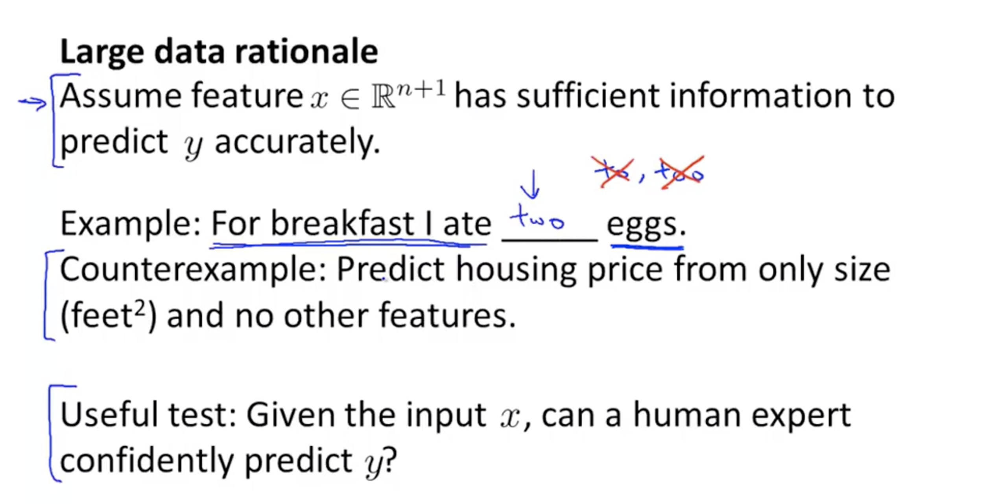

## 1、Prioritizing what to work on:Spam classification example
#### A simple example for the spam system.

#### What we need to talk about is:How to spend your time to make it have low error.That means ,how to build the algorithm in right way.

## 2、Error anaysis
#### 2.1、Advice for system design.
> ##### Just do a very quick implementation and see what is the error we should fix.From this quick model we can know what is the next step we should do.

#### 2.2、Set a numerical evaluation.
> ##### It can be a error rate.With this number we can know whether if the method realy can help us to improve the performance of the algorithm.  

## 3、Error metrics for skewed classes
#### 3.1、skewed classes:if the positive values or negative values are much more than other one,(P:N=1:99),it is a skewed classes. In this situation we can not just judge the algorithm with the error rate.

#### 3.2、Precision and Recall

|             | Actual 1       | Actual 0       |
| ----------- | -------------- | -------------- |
| Predict 1   | True positive  | false positive |
| Precision 0 | false negative | True negative  |
- ##### Precision rate:$$\frac{True\ \  positive}{Predict\ \  positive}=\frac{True\ \  positive}{True\ \  positive+False\ \ positive}$$
- ##### Recall Rate: $$\frac{True\ \  positive}{ Actual\ \ positive}=\frac{True\ \  positive}{True\ \  positive+ False\ \ negative}$$

#### We use these two rate to judge a method,whether if it can improve the performance instead only the error. By these two rate we can avoid the skewed classes.

## 4、Trading off precision and recall
#### 4.1、Threshold:If we use different threshold,we will get very different precision and recall. So,the problem is ,how can compare the precision and recall between different algorithm.(specially one of them is high other is low.)

#### 4.2、$F_1$ Score
$$F_1=2\frac{PR}{P+R}$$(higher one is better)

## 5、Data for machine learning.
#### Two important thing of the training set:
> - ##### 1、Have this training set enough features?(If we give this training set to a humen expert,can he make the correct Prediction?)
> - ##### 2、The training set also need a large size to make sure it can train the algorithm.

#### If the $J_{train}(\theta)$ is small and the $J_{train}(\theta)\approx J_{test}(\theta)$.Then we can say the algorithm will have a very good performance.

