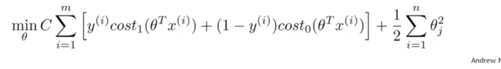

## 1、Optimization objective
#### The Optimization objective of the SVM is the Cost function of it.
#### 1.1、Now  we just have a review of the logistic Regression and from the Cost function of logistic Regression we get the Cost Function of SVM

#### 1.2、The Cost Function

#### $cost_1(\theta^Tx^{(i)})$,$cost_2(\theta^Tx^{(i)})$ is this

#### and $C$ is used to adjust the weight of $A$
#### 1.3、Tht output of $h_{\theta}$ is $0$ and $1$

## 2、Large Margin Intution
#### If we need to minimize the Cost Function we just make $CA=0$,which means $A=0$.

#### The SVM Separate the examples which a large margin.That means, it will choose a Decision Boundary which have the large margin between the negative value and the positive value.

## 3、The mathmatics behind large margin classification

## 4、Kernels I
#### If we need to fit a Non-liear Decision Boundary,the Polynomial may be is not a good idea,because when the data is large ,use Polynomial is too expensive.

#### So we use a new algorithm to fit it.
> ##### 1st landmarks:Some points
> ##### 2nd similarity function:This a a function which can evalute the similarity between $x$ and $l^{(1)}$.The function compute the distance between $l$ and $x$.
> - ##### if the distance goes to 0 , $f_1$ get to 1
> - ##### if the distance is very large , $f_1$ get to 0

#### An example:The picture of the similarity function.
> ##### If $\sigma^2$ is small,when we push $x$ away from  $l$,the value of similarity function will quickly goes down.But if $\sigma^2$ is large,it will be slow.

#### Finally,the $h_{\theta}$ which made of similarity function $f_1,f_2,f_3$ can also give us a good prediction.
#### $$h_{\theta} = \theta_0+\theta_1f_1+\theta_2f_2+\theta_3f_3$$

#### BUT there is still a qestion:How to choose $\sigma^2$ and the points $l$?

## 5、Kernels II
#### 5.1、Choosing the landmarks:
> ##### In fact we use the every $x$ in train set as $l$.

#### 5.2、SVM with kernels function $f$
> ##### SVM with kernels means,we don't use the $x$ as the input of the $cost()$ in SVM function,instead ,we use the $f$($f$ is a matrix which come from $f_i = similarity(x,l^{(i)})$),So $\theta^Tx-->\theta^Tf$

#### 5.3、The parametrs of SVM:$\lambda$ and $\sigma^2$

## 6、Using an SVM
#### If we need use SVM,some parametrs need us to specify
- > ##### Parametrs $C$,the weight.
- > ##### kernel or without kernel(linear kernel),if we choose to use the kernel function,we alse need to specify the $\sigma^2$

#### kernel function:if we have many features ,don't forget to scaling the values.

#### Question:Which model we should use?
| n and m           | model                                                 |
| ----------------- | ----------------------------------------------------- |
| n>>m              | logistic Regiession/SVM without kernel                |
| n<m(intermediate) | SVM with G kernel                                     |
| n<<m              | add features ->logistic Regiession/SVM without kernel |
#### n:features, m train examples

- > ##### logistic regiession $\approx$ SVM wichout kernel.
- > ##### 
