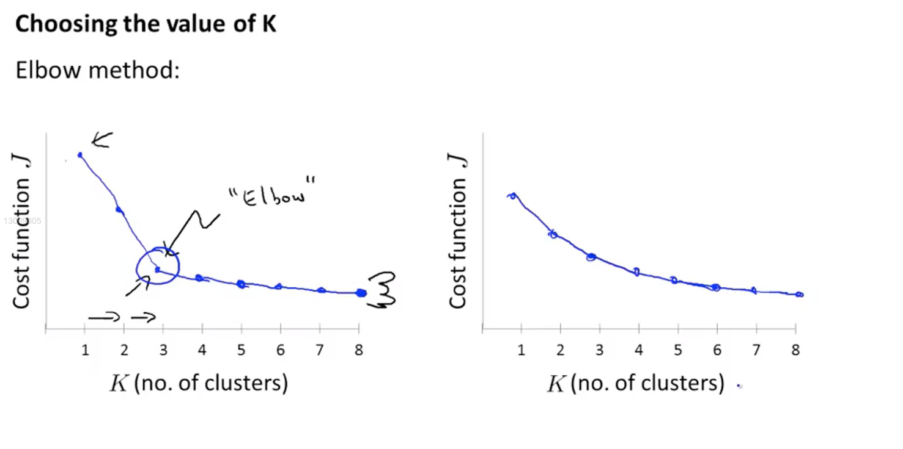

## 1、Unsupervised learning Introuction
### In nsupervised learning,we just have the data without the labels.We need to let the learning algorithm find the data structur of data set by itself.

## 2、K-means algorithm
### 2.1、These pictures can show what the k-means algorithm do.
- > #### 1st step:Set the cluster centroids randomly

- > #### 2nd step: cluster assignment.We assign each point to the different cluster which is closest to this point.

- > #### 3rd step:Move cluster centroids.We compute the means of the distance which is between the cluster centroids and each points belong it. We move the cluster centroids to the pisotion which we find by the means.

- > #### repeat the step2 and step3 until the position of cluster centroids don't change.

> ##### iteration 2

> ##### iteration 3

### 2.2、Implementation
#### Input:
- ##### K:number of clusters,set the pisotion of it randomly.
- ##### Train set: without labels

## 3、Optimization objective
### 3.1、Cost Function $J$
- > #### $c^{(i)}$
- > #### $\mu_{k}$
- > #### $\mu_{c^{(i)}}$
$$J(c^{(1)}...c^{(m)},\mu_1...\mu_K)=\frac{1}{m}\sum_{i=1}^m ||x^{(i)}-\mu_{c^(i)}||^2$$

### 3.2、Algorithm

## 4、Random initialization
### 4.1、How to Random initialization?
> #### Randomly pcik K training examples as cluster centroids.

### The problem is,if we randomly initialization may be the cost function can not get the global minimum

## 5、Choosing the number of clusters
### There is not a very commom standard to choose the number of cluster.One of it is:Elbow method
> #### We just test every number and observe the picture of the $Cost/K$.Take the number on "Elbow".But sometimes the picture will like the right one.

### So we can also choose K that basic on the problem
