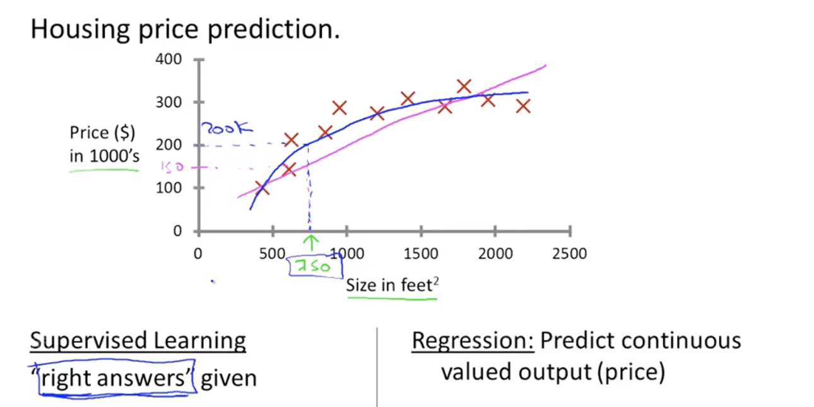
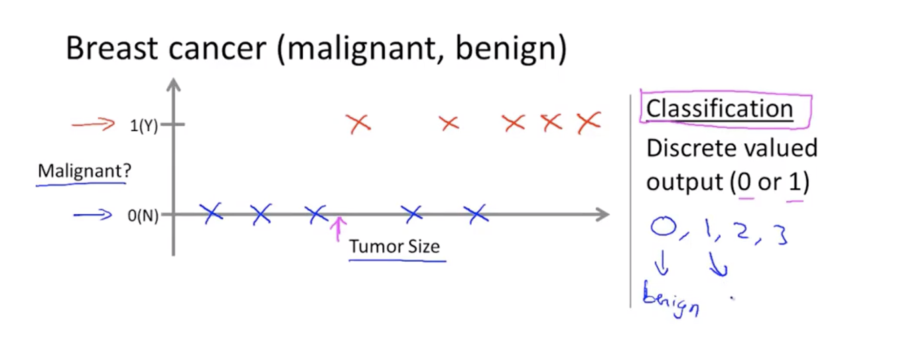

### 1、Supercised learning
> ##### The input is the data and we want to from the data get a correct output.
#### Regiession Problem:
> ##### If we need to predict a continuous values output, this is a Regiession problem. like to predict the price of a house.
#### Classification Problem
> ##### The goal is to predict a discrete valued output. 

### 2、Unspervised learning
> ##### give the dataset to the machine and let it find the data structure by itself.That means find the classification of the dataAset.
