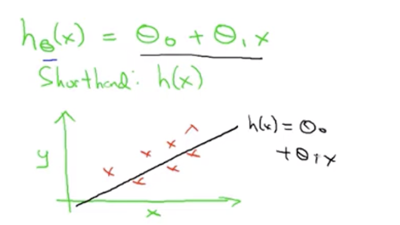
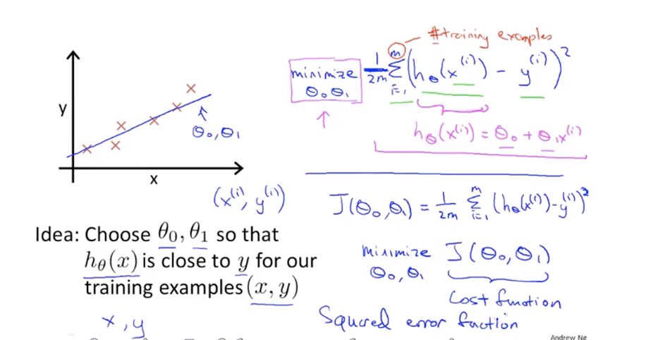
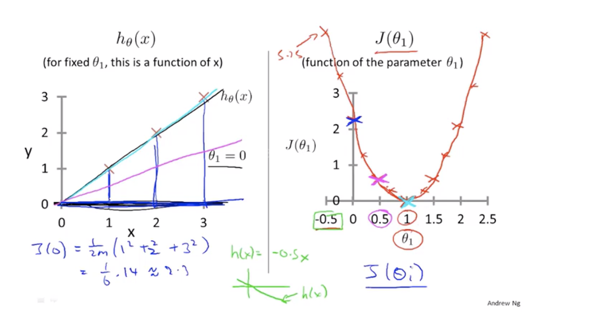
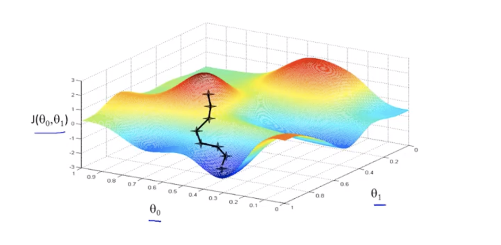
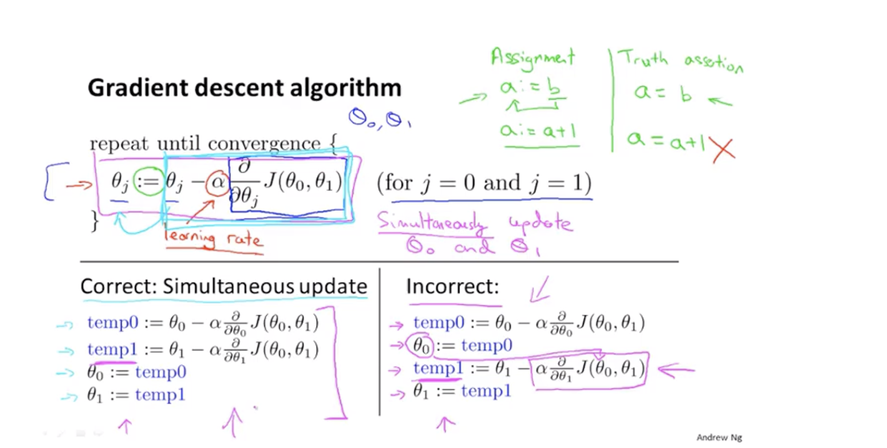
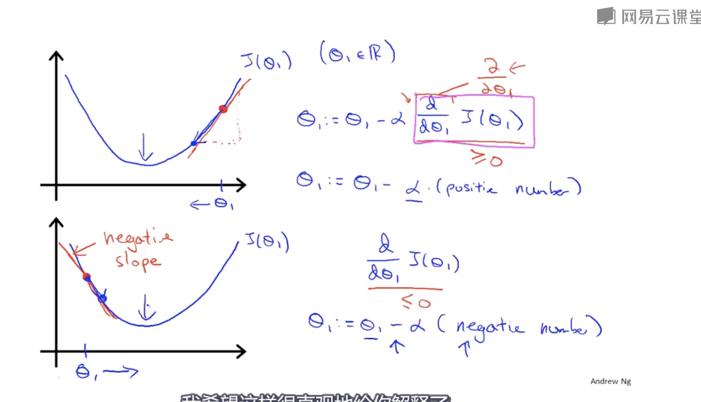
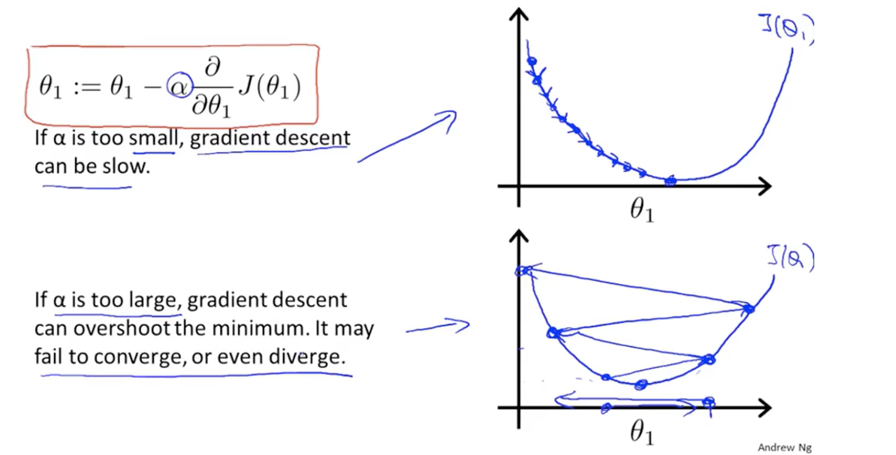
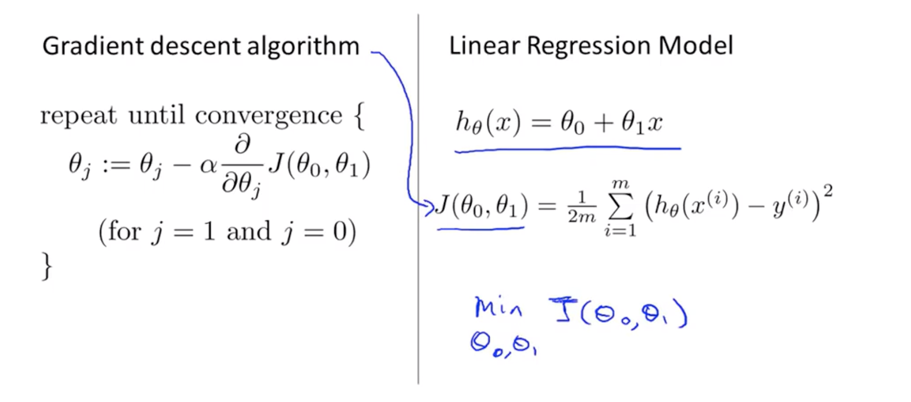
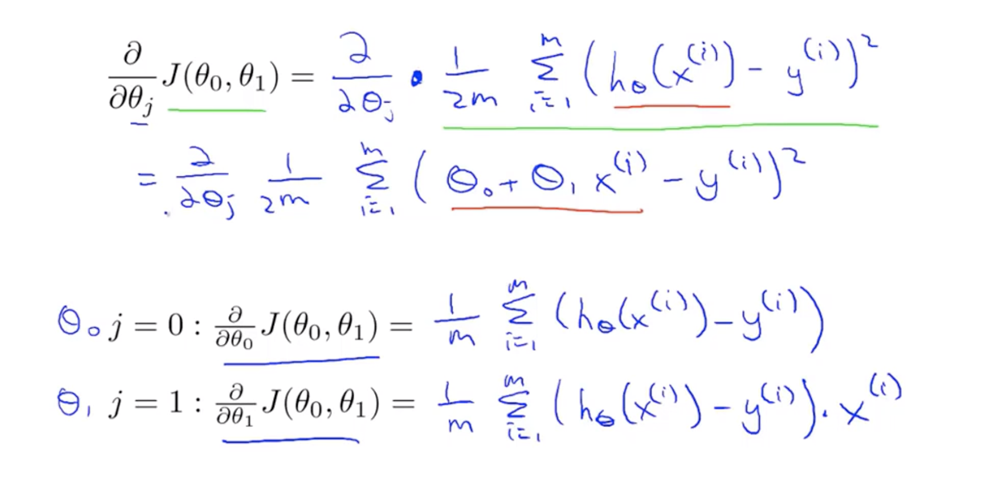
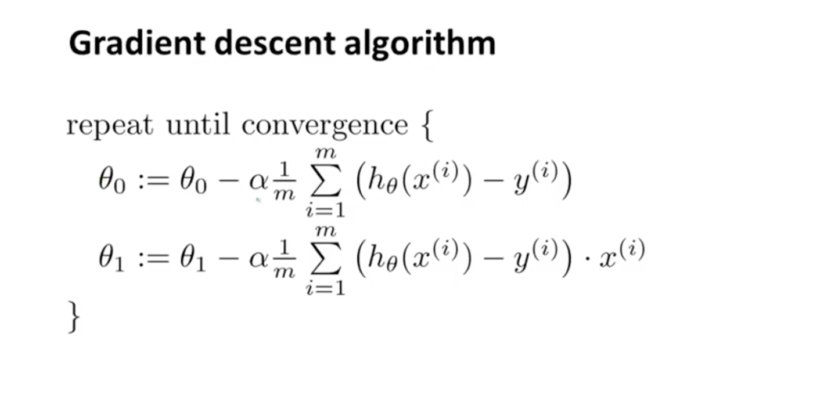

### 1、Model Representation
#### Linear regression whit one variable(univariate linear regression) $$h_{\theta}(x) = \theta_0 + \theta_1x$$

### 2、Cost Function
#### Cost function:$$J(\theta_0,\theta_1)=\frac{1}{2m}\sum_{i=1}^{m}(h_{\theta_0}(x^{(i)})-y^{(i)})^2$$

### 3、Gradient Descent
> ##### It is a algorithm which can minimize the cost function J.(and it can also solve some more general problem)
$$J(\theta_0,\theta_1)--gradient\  descent-->min\ J(\theta_0,\theta_1)$$
#### an example to explane it
> 
> ##### image we now stand on the mountion top and we want to go down as fast as possible.We begin at one point(where ever you like) and ask which way is the fastest way to go down.we look around and then take one step.then  repeat, ask and take one step until we get lowest point(may it is just a local minimize point)
#### The algorithm

> - #####  a:=b means ,a=b
> - ##### $\alpha$: learn rate,it controls how big the step we take(it is a positive number).
> - ##### $\alpha\frac{d}{d\theta_1}J(\theta_1)$ is a the step we take.
> ##### if the first point is on the right side of the minimize point,now the slope($\frac{d}{d\theta_1}J(\theta_1)$) is positive so the $-\alpha\frac{d}{d\theta_1}J(\theta_1)$ is negative.and the the point move to left direction and be closer to the minimize point.
> ##### When the point get to the minimize point, the slope is 0.it dose not move any more.

#### what if the $\alpha$ is to large?

> ##### it will hard to get the minimize point or even diverge

#### Combine the gradient descent and the cost function.

##### We just calculate the partial dervative of cost function for gradient descent function.

