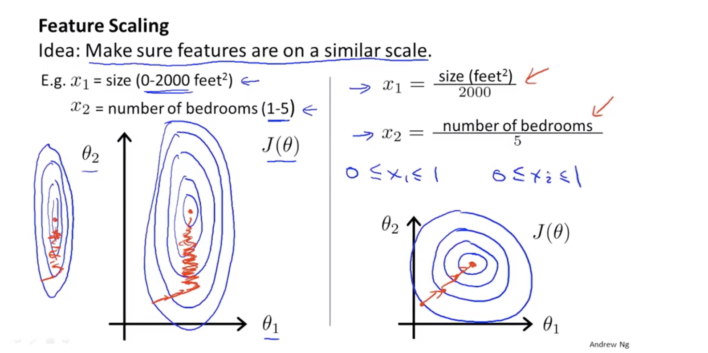
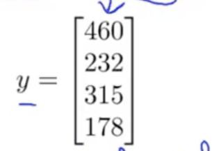

### 1、Multiple Features
#### If we have more than one feature of a house to predict the price

#### than we need to modify the hypothesis function.
$$h_\theta(x)= \theta_0 +\theta_1x+\theta_3x_2+...+\theta_nx_n $$
#### one way to simplify it：
> ##### $$h_\theta(x)=\theta ^Tx= \theta_0 +\theta_1x+\theta_3x_2+...+\theta_nx_n $$
### 2、Gradient Descent for Multiple

### 3、Gradient Descent in Practice I - Feature Scaling
#### Why we need feature sacling?
> ##### if the feature value too large or too small,the gradient descent algorithm may take more step.if we get every feature into $-1 \leq x_i \leq 1$ range(or another suitable range),it can make the algorithm run faster.
#### a simple example:
> ##### we divide the features by the maximum value and let $x_1$ and $x_2$ in range [0,1] 

#### The suitable range
##### every have have different experience.Normally [-3,3] to [$-\frac{1}{3},\frac{1}{3}$] are fine.

#### Mean normalization
##### This is another way to caling the feature
> ##### formula $$x_1 = \frac{x_1-\mu_1}{s_1}=\frac{feature_1-avg\_value\ of \ feature_1}{range=(max - min)}$$

### 4、Gradient Descent in Practice I Learning rate
#### 4.1、How to debug?
> ##### Normally we draw a $(minJ(\theta)/numver\ of\ iteration) $ diagram to know whether if the gradient descent works.if we get the line like this, by each step the $minJ(\theta)$ goes down.That means the algorithm really works.

> ##### but if we get the diagramm like these.That means it dose now work and it normally related with the learn rate $\alpha$.$\alpha$ is too large.

#### 4.2、How to choose a suitable $\alpha$
> ##### try is step by step.

### 5、Features and Polynomial Regression
#### We can free choose a feature to fit the data better.

#### How to use a polynomial to implement the regression?

### 6、Normal equation
#### This is a Method to solve for $\theta$ analytocally.(make the $J\theta$ minimize)

#### e,g:We have 4 features and we use them to make a matrix $X$,like this.
> ##### 
#### and make the matrix $y$
> ##### 
#### finally we calculate  $$\theta=(X^TX)^{-1}X^Ty$$

#### more general example is :

#### The advantage and the disadvantage of two method:

### Normal equation and non-invertibility
