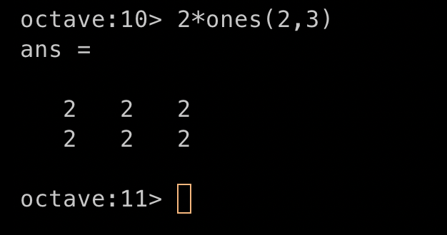
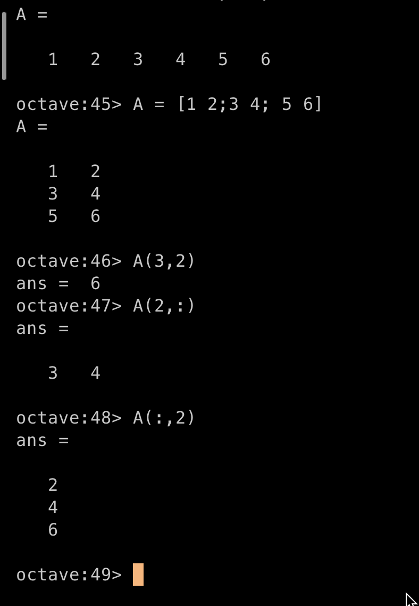
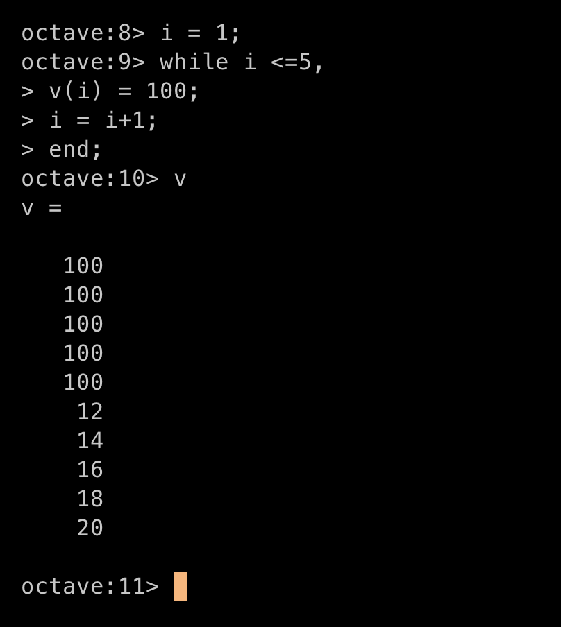
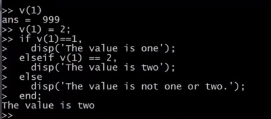

## 1、Basic operations
##### (1) 注释
> %
##### (2)不等于
> ~=
##### (3)
> format long
> format short

##### (4)步进

##### (5)快速生成矩阵

##### (6)随机生成矩阵

##### (7)hist 生成图像

##### (8)生成单位矩阵

##### (9)帮助命令

### 2、移动数据
##### (1) size

##### (2)length

##### (3)who

##### (4)whos

##### (5)clear:不加参数默认清除所有变量

##### (6)save 保存数据

##### (7)load 加载数据

##### (8)访问矩阵中的数据

##### (9)增加行与列


##### (10)拼接矩阵

## 3、计算数据
##### (1)常规计算

##### (2)元素相乘或者相除

##### (3)计算log

##### (4)计算绝对值

##### (5)对矩阵中的元素操作

##### (6)转置

##### (7)求矩阵中每列的最大值

##### (8)比大小返回真假

##### (9)find 搜索返回索引

##### (10)求和，求积

##### (11)魔术矩阵：任意一行一列对角线相加的和相等

##### (12)求逆矩阵(伪逆矩阵忽略不可逆的问题)

## 4、作图

## 5、控制语句与函数

## 5、Vectorization
