## 1、Classification
#### if we need to solve a classification problems, for it "linear regression" is sometimes  not a good idea. It can not fit the data better.
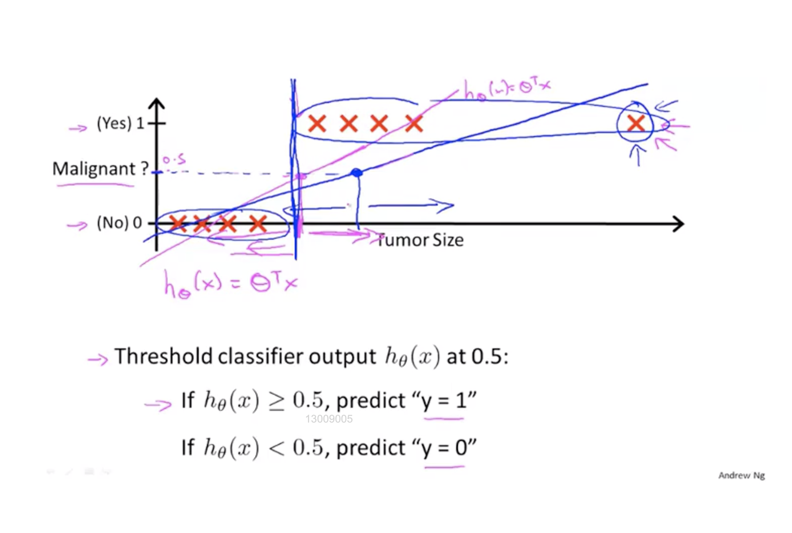
#### compare with the linear regression the output of the Logistic regression have a range $[0,1]$
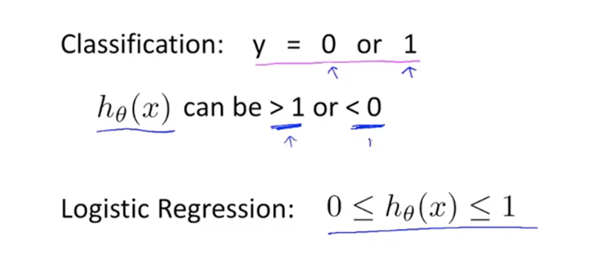
#### Actually logistic is a classification algorithm not a regression algorithm.

## 2、Hypothesis Representation
#### 2.1、The hypothesis function of logistic regression model.
### $$h_\theta(x) = g(\theta^Tx) \\ g(z)=\frac{1}{1+e^{-z}} \\ \therefore h_\theta(x)=\frac{1}{1+e^{-\theta^Tx}}$$
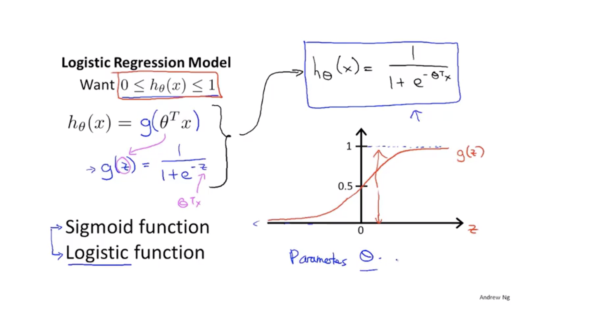

#### 2.2、The output of the hypothesis is actuallly a conditional probability.The case is $y = 1 $ or $ y = 0$,the condition is the trainset x
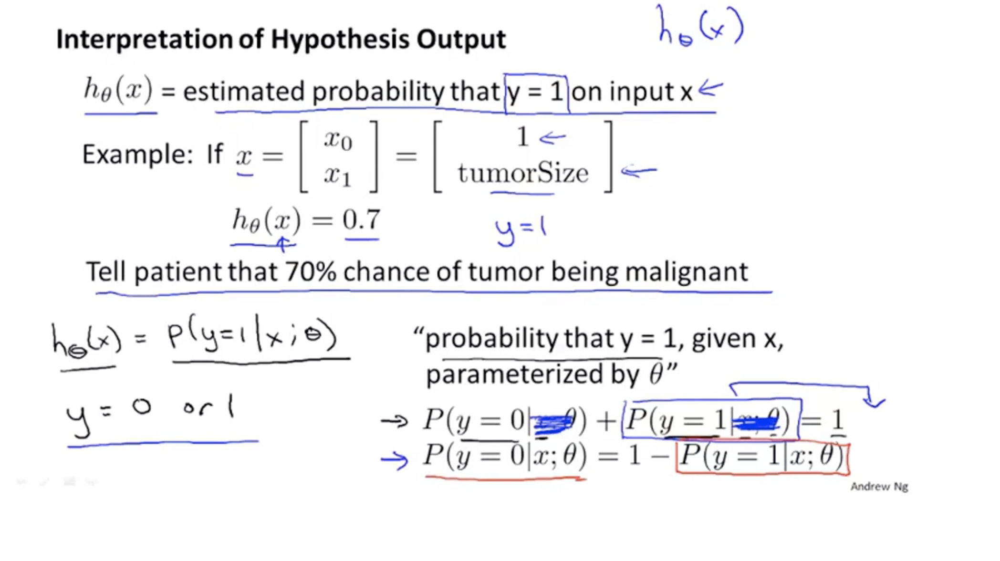

## 3、Decision Boundary
#### A simple example fot the decision boundary pf the logistic regression:
> ##### from the diagram we kown that
>  ##### $$g(z) > 0.5 z > 0 \ then\  h_0(x)=1$$
>  ##### $$g(z) < 0.5 z < 0 \ then\  h_0(x)=0$$
> ##### now zero is the decision boundary of the logistic regression.
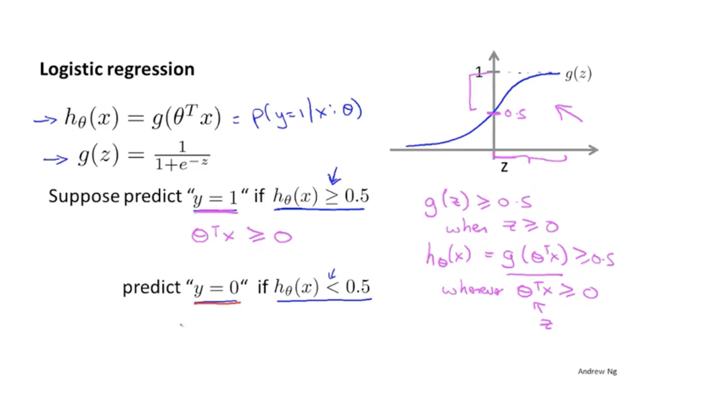
#### The decision boundary can also be  complex.if we choose the parameters $\theta_0 =-3,\theta_1 = 1,\theta_2 = 1$,$$z=x\theta^T=-3+x_1+x_2 \\ \therefore if\ x_1+x_2 > 0,h_\theta(x)=1 \\\therefore if\ x_1+x_2 < 0,h_\theta(x)=0 $$
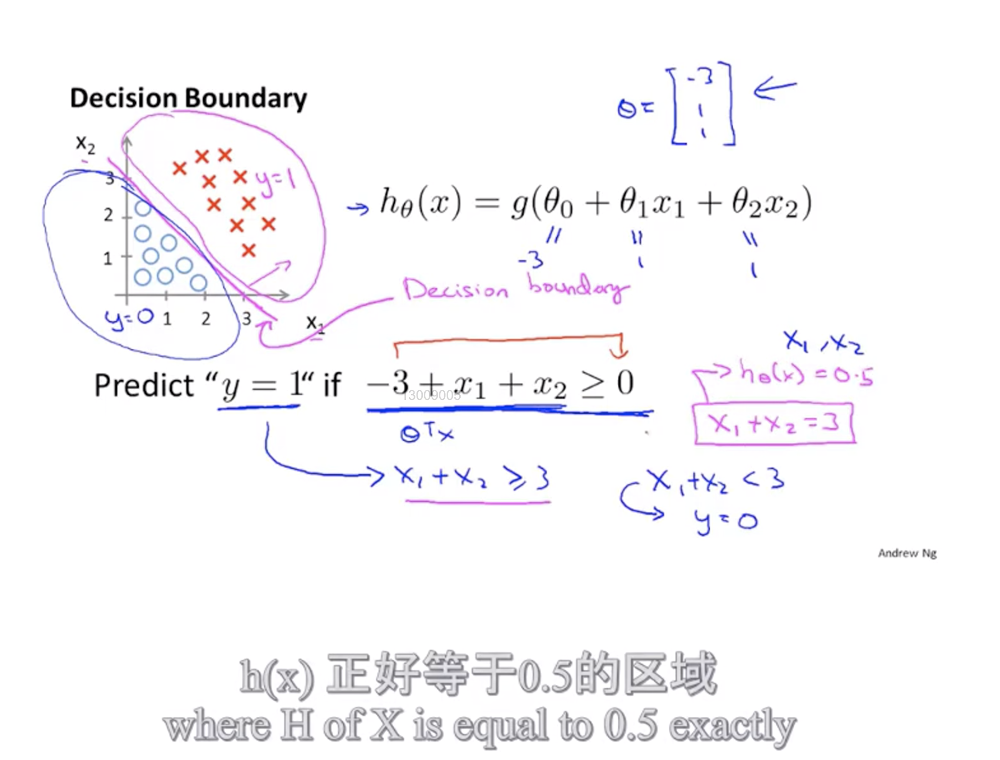
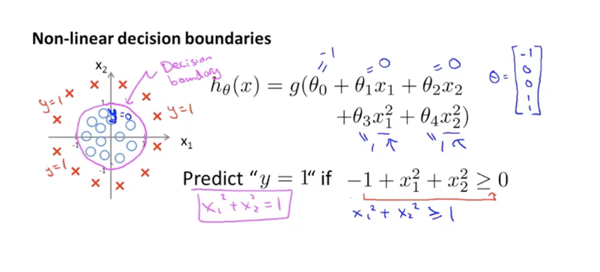
#### notice that:From train set we can get the  parameters ,but the decision boundary is only depend on the parameters.Once we get the parameters,there is no relationship between the decision boundary and train set.

## 4、Cost Function in logistic regression
#### We use the cost function to fit the parameters $\theta$.but the cost function we used is not the linear regression cost function. Becasue if we use it to fit the logistic ,we can not granti the Gradient descent algorithm can finally get the globle minimum. So we build a new cost function for the logistic regression.
#### $$Cost(h_\theta(x),y)=\begin{cases} -log(h_\theta(x))\ if\ y=1\\-log(1-h_\theta(x))\ if\ y=0\end{cases}$$
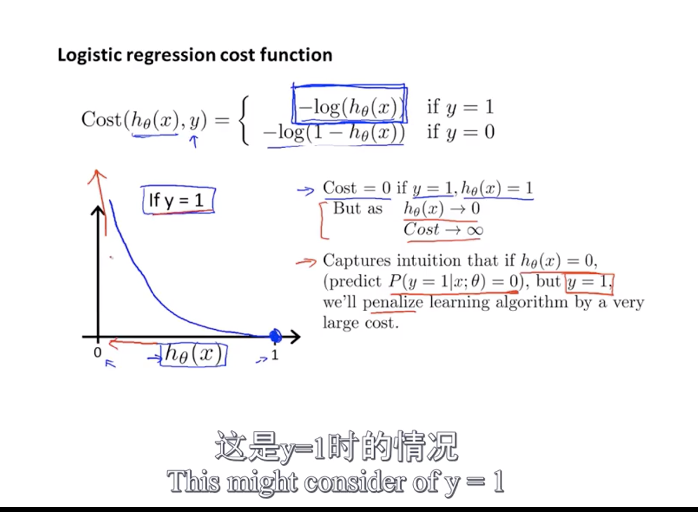
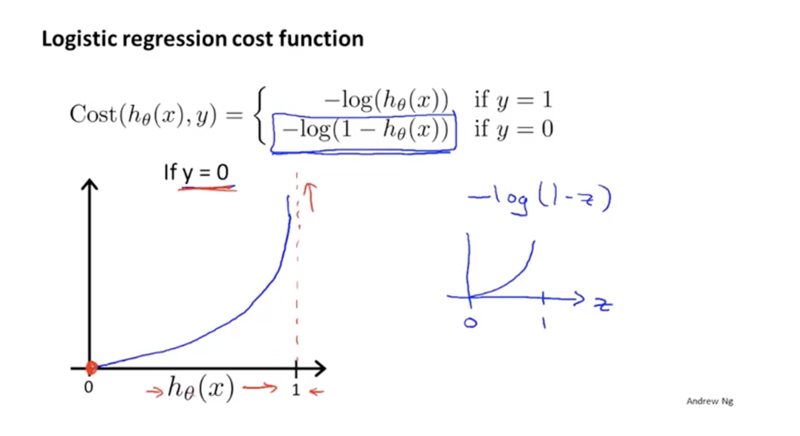

## 5、Simplified cost function and gradient descent
#### 5.1、The simplified cost function
> #### $$Cost(h_\theta(x),y)=-ylog(h_\theta(x))-(1-y)log(1-h_\theta(x))$$
#### 5.2、gradient descent of logistic regression.
##### The representation of gradient descent is same like the formula of linear regression ,but in fact the $h_\theta(x)$ is not same
> - ##### linear regression: $$ h_\theta(x) = \theta^Tx$$
> - ##### logistic regression: $$h_\theta(x)=\frac{1}{1+e^{-\theta^Tx}}$$
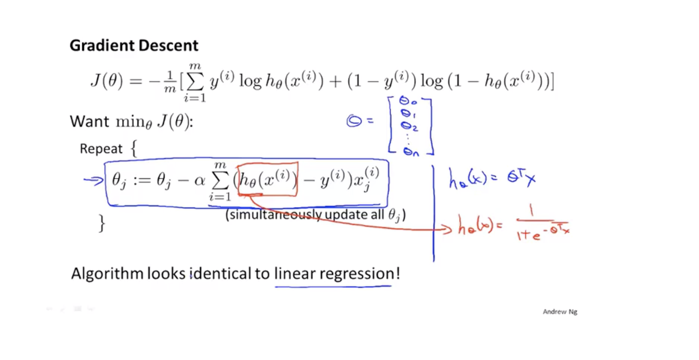

## 6、Advance optimization
#### When the train set is very large,the normal gradient descent algorithm may be have not a good performance,so we need some advance algorithm.
#### to use these algorithm,we don't need to write them, we can just use the library in octave , matlab or python.
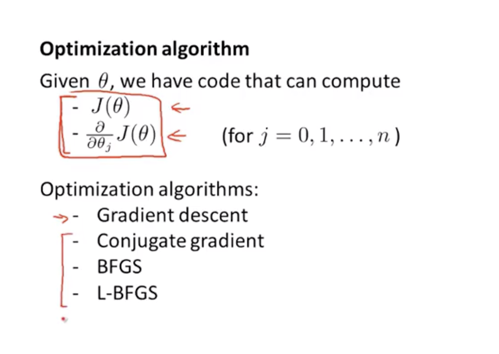
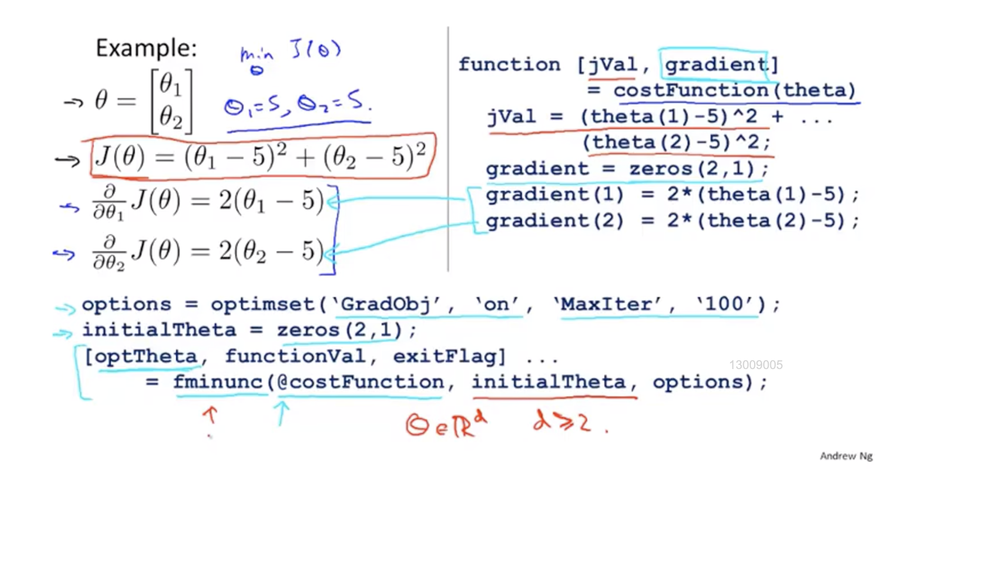

## 7、Multi-class classification :1 vs all
#### sometimes the problem have more than two result.
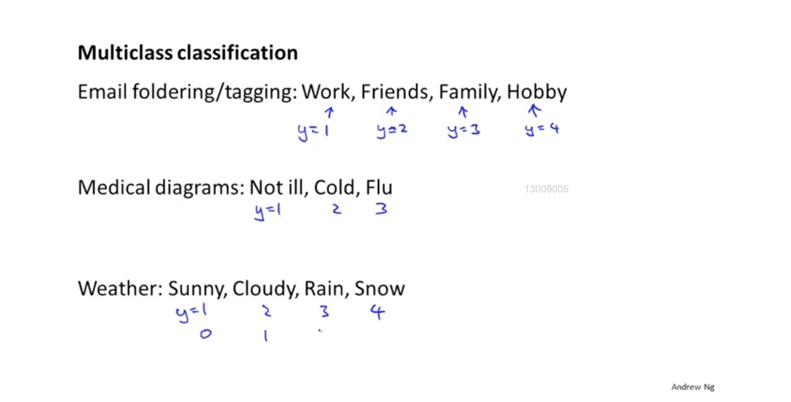
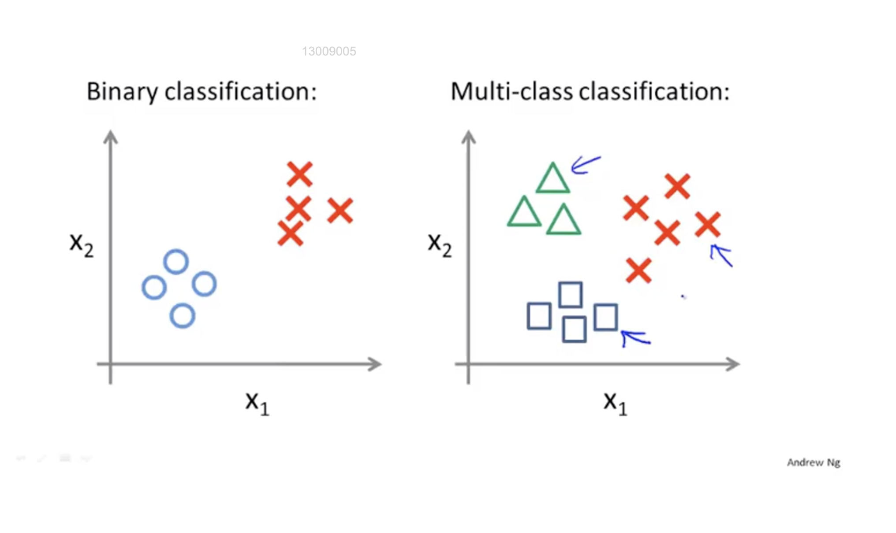

#### The idea to deal with it is,we just switch it to a 2 classification problem to get the decision boundary and then we  combine them.
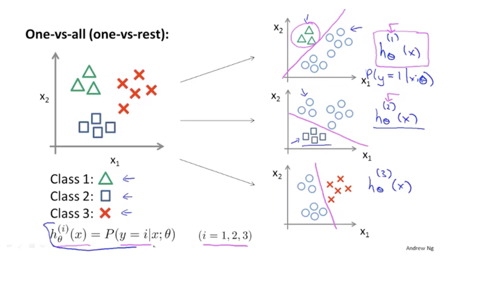
