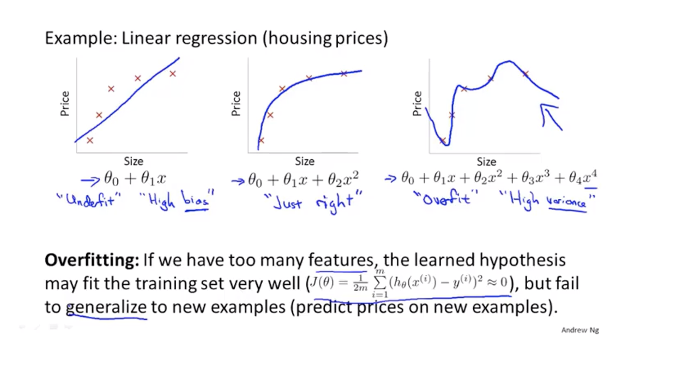
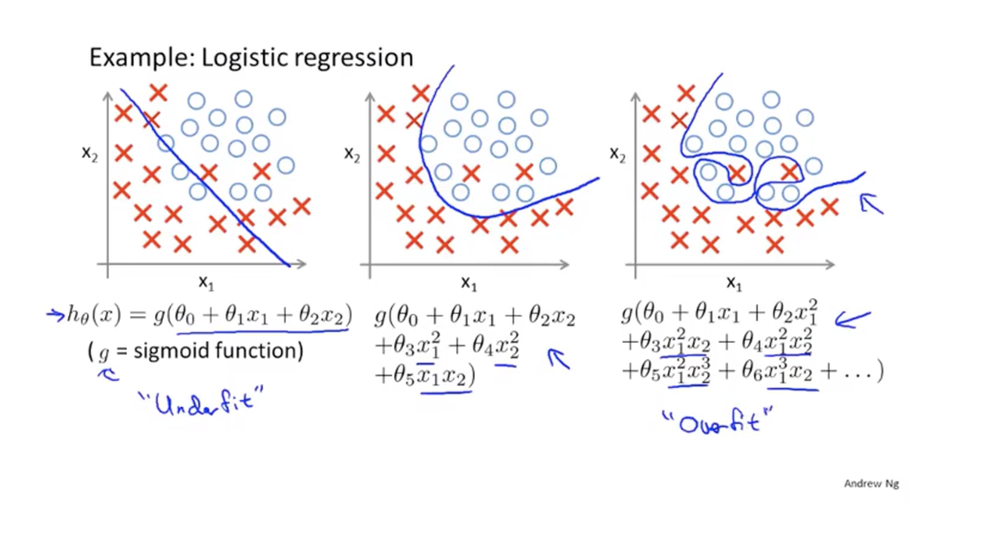
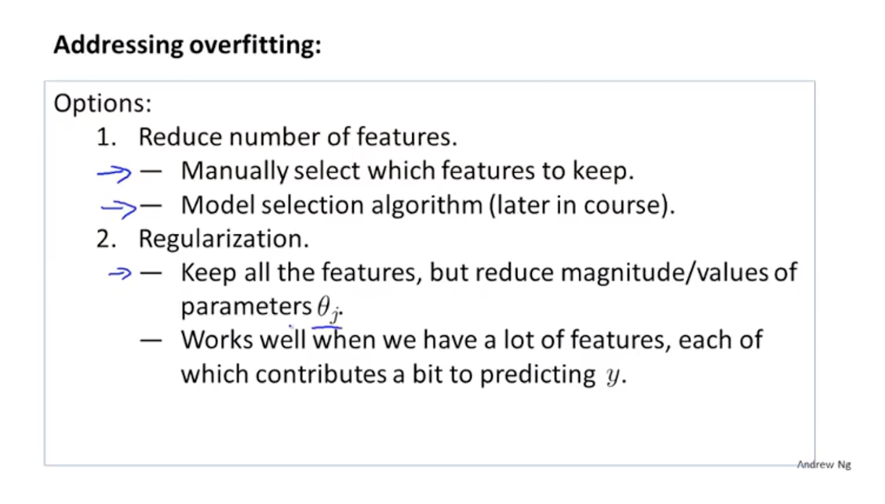
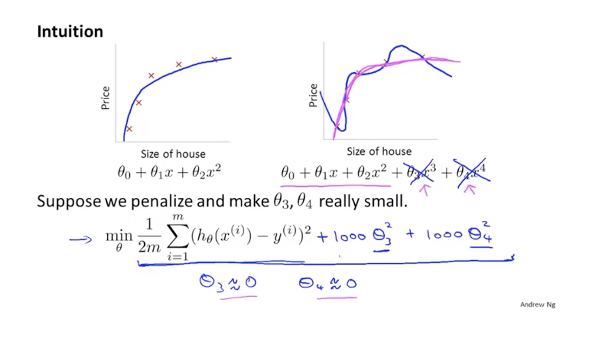
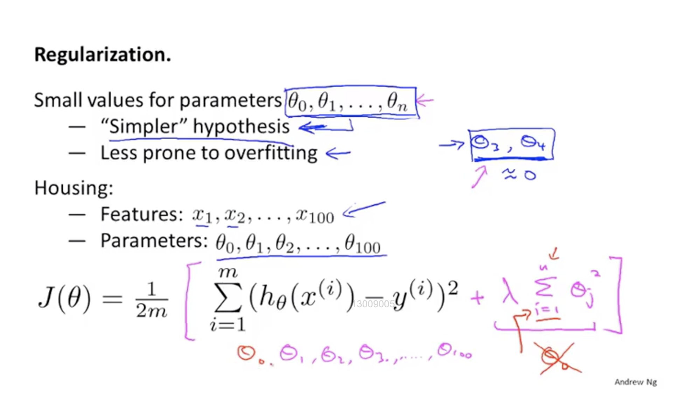
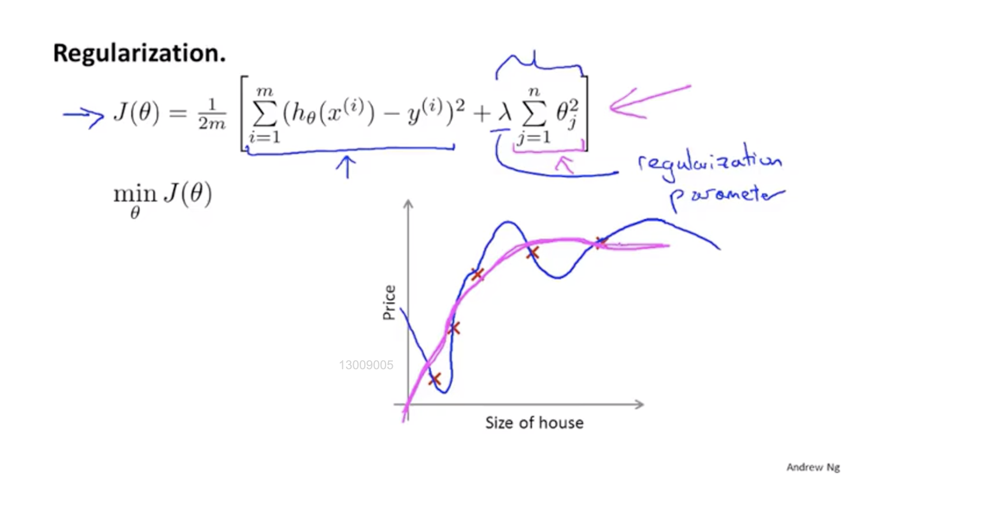
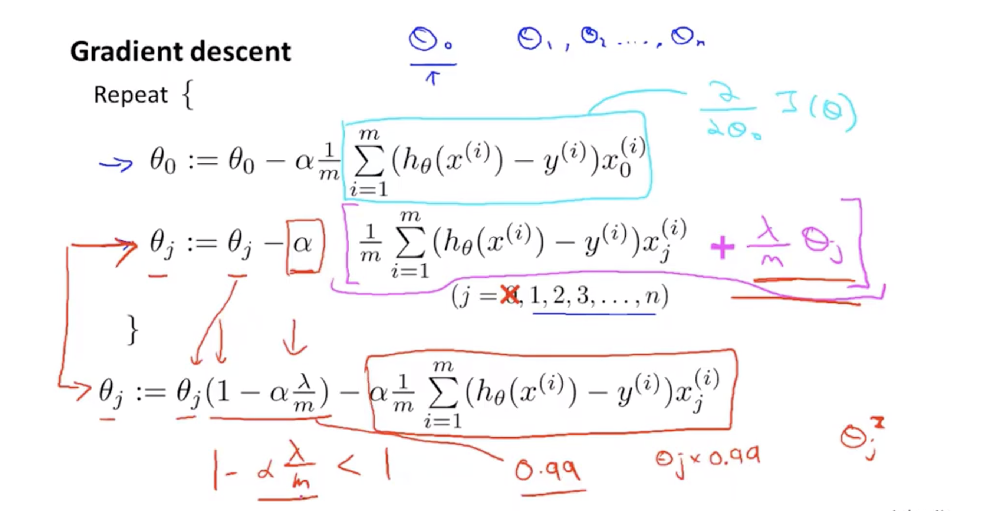
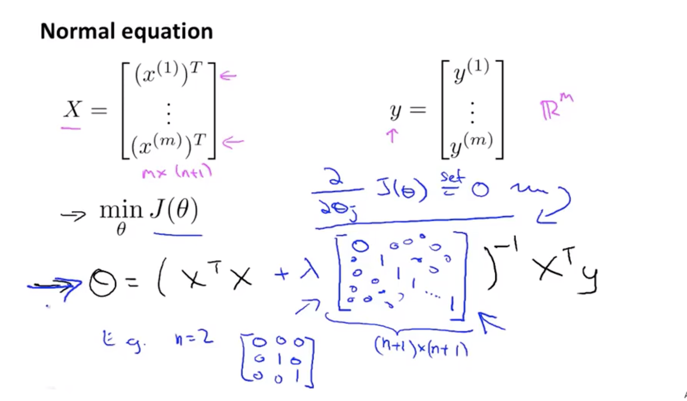

## 1、The problem of overfitting
#### We have 2 problem when we fit the train set
> - ##### underfit:which means the line can not fit the data well
> - ##### overfitting: means the line try to fit every point in the train set.That makes it can not generalize to new examples.That means if we give it a new data it the line can not fit it.

#### The way to solve this problem:
> - ##### Reduce number of features
> - ##### Regularization

## 2、Cost Function
#### The main idea of regularization is ,we give the cost function a penalization.Use this method we can make the line more smooth.

#### But the problem is ,we don't know which parameters that we need give it a penalization. So we give every parameters the penalization.
#### The cost function will be
#### $$J(\theta)=\frac{1}{2m}[\sum^{m}_{i=1}(h_\theta(x^{(i)})-y^{(i)})+\lambda\sum^{m}_{i=1}\theta_j^2]$$

#### finally the problem is,how to choose the parameter $\lambda$,it can not be to large and also to small.

## 3、Regularized linear regression

