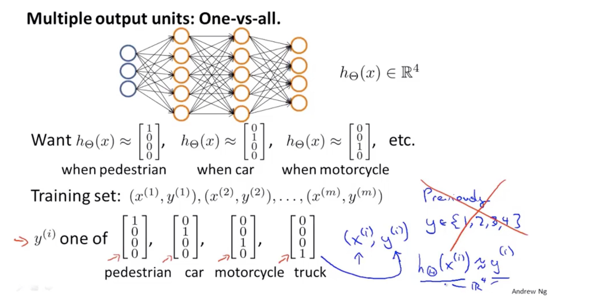

## 1、Non-linear Hypotheses
#### why we need neural nerworks?
> ##### Because if n is too large,the logistic regression can not deal with it.
## 2、Neurons and the brain

## 3、Model representation I
#### 3.1、for a real neuron ,it has
- ##### Dendrite as input wires
- ##### Axon as output wires

#### 3.2、a normal neuron model is like this:Some units as the input wires and a main body as the calculate unit.
- ##### We call hypothesis function $h_\theta$ as activation function.
- #####  parameters $\theta$ also called weight here
- ##### sometimes we also have $x_0$ as the bias unit ,it always equal 1.

### 3.3、Architectures of the model
#### We mainly have 3 layers
- ##### input layer x
- ##### hidden layers (can more than one)
- ##### output layer

### 3.4、
- ##### input layer $x$ are the trains sets.
- ##### hidden layer are the function $$g(z)=\frac{1}{1+e^{-z}}$$
- ##### output layer is the hypothesis function $h_\theta$

## 4、Model representation II
#### 4.1、forward propagation
#### 4.1.1、first we need talk about the variables
> - ##### $x = \begin{bmatrix}  x_1 \\ x_2 \\ x_3 \\ x_4 \end{bmatrix}$ is the train set ,we can use a matrix $X$ to represent them.
> - ##### $\Theta^{(1)} =\begin{bmatrix}\Theta_{10}^{(1)}& \Theta_{11}^{(1)}& \Theta_{12}^{(1)}  & \Theta_{13}^{(1)} \end{bmatrix}$ is  the parameters we used between the 1st and the 2nd layer.if we need we can change $\Theta$ between different layers.
> - ##### $a^{(1)} \ a^{(2)}\ a^{(3)}$They are the output of the 1 st layer and also the input of the  3rd layer
> - ##### $h_\theta(x) = a^{(3)}$ It is the final output
#### 4.1.2、Vectorized implementation
> - ##### $x = \begin{bmatrix}  x_0 \\ x_1 \\ x_2 \\ x_3 \end{bmatrix},\Theta^{(1)} =\begin{bmatrix}\Theta_{10}^{(1)}& \Theta_{11}^{(1)}& \Theta_{12}^{(1)}  & \Theta_{13}^{(1)} \end{bmatrix}$
> - ##### $z_1^{(2)} = \Theta_1*x=\begin{bmatrix}\Theta_{10}^{(1)}x_0+\Theta_{11}^{(1)}x_1+\Theta_{12}x_2+\Theta_{13}^{(1)}x_3 \end{bmatrix} \\ z_2^{(2)} = ...  \\ z_3^{(2)} = ...$
> - ##### $z^{(2)} = \begin{bmatrix}  z_1 \\ z_2 \\ z_3  \end{bmatrix}$
> - ##### $a^{(2)}=g(z^{(2)})$
> - ##### $z^{(3)}=\Theta^{(2)}a^{(2)}$
> - ##### $h_\theta(x)=a^{(3)}=g(z^{(3)})$

#### 4.2、Own feature learning
##### The matrix $x$ is the feature which we as the train set to the algorithm enter.And from the $x$ we calculate the $a^{(2)}$ as the new feature.That means, the algorithm can learn the feature by itself.

#### 4.3、The architectures of the network
##### The neural network can have many layers:

## 5、Examples and intuitions I
#### A simple example to show how to implement $AND$ wiht neural network.
> #####

## 6、Examples and intuitions II
#### Why the neural network can calculate some complex problem?
> ##### Because we can combine some simple neural network as one complex neural network. Like this example:$AND$ is the input layer ,$(NOT\ x_1) AND (NOT\ x_2)$ is the hidden layer.$OR$ is the output layer. So we use three layers implement the function $XNOR$

## 7、Multi-class Classification

