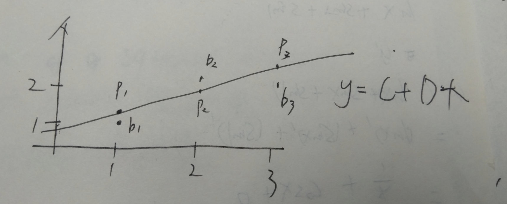
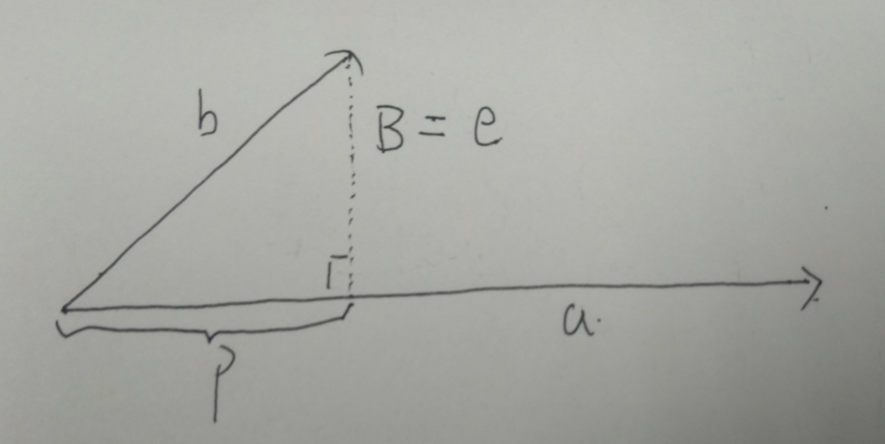

## 4.1、 Orthogonality of the Four Subspaces
#### 4.1.1、Orthogonal:
> if x,y (x,y are columns vectors),$$x^T y=0--> \begin{bmatrix} &&&&&\end{bmatrix}\begin{bmatrix} \\ \\ \\ \\ \\ \end{bmatrix}=0$$
> ##### We call $x^T$ is orthogonal with $y$.

#### Zero vector is orthogonal to every vector.because:
> ##### $A*V_0 =0$

#### 4.1.2 Subspace Orthogonal.
#### if subspace S is orthogonal with subspace T ,that means:
> #####  every vector in S is orthogonal to every vector in T.
#### We have two fact of row space and column space.
> ##### row space is orthogonal to nullspace
> ##### column space is orthogonal to nullspace
> because $$A*0 = 0 , A^T * 0 = 0 $$

#### We can also call the nullspace and row space are Orthogonal complements in $R^n$,it means.Nullspace contain all vectors which is orthogonal to row space.

#### 4.1.3 Matrix $A^T A$:this is a important matrix in linear algebra.
##### (1) it is symmetric:
> $$ (A^T A)^T=A^T A $$
##### (2) $N(A^T A)=N(A)$
> rank of $A^T A$= rank of A
##### (3) $A^T A$ is invertible exactly if:A has the independence columns.

## 4.2、Projection
#### 4.2.1：Projection in 1 dimension

#### As we see,a,b are vectors,p is the projection of b onto a, $p = xa$,$e= b-p$
> $\because$ e is perpendicular to a
> $\therefore a^T (b-xa)=0 -->xa^Ta=a^Tb-->x = \frac{a^Tb}{a^a}
$

> $\because \begin{cases} p =ax  \\ x = \frac{a^Tb}{a^a} \end{cases} \therefore p = a \frac{a^Tb}{a^a}$

#### 4.2.2 Projection Matric P
##### $$\because Projection\ p = P * b $$ $$\therefore P = \frac{aa^T}{a^Ta}$$
##### 3 facts of P
- ##### $C(P)$ is a line through vector a
- ##### P is symmetric $P^T=P$
- ##### $P = P^2$
##### why we need projection?
> ##### When the equation $Ax=b$ have no solutions,we can solve $A x =p$ instead.(p is the projection of b onto column spaces.)

#### 4.2.3 Projection in high dimension.(if D = 2)

#### Now we have a plane and vector b.$a_1,a_2 $are 2 vectors in plane.A is a matrix which made of 2 vectors in plane.
#### $\because P\ is\ in\ plane \therefore P=Ax$
#### So we need find x ,the key to find it is $e = b-A $,e is perpendicular to plane.
#### $$\because \begin{cases}  a_1^T(b-Ax)=0\\ a_2^T(b-Ax)=0\end{cases}$$
#### $$\therefore \begin{bmatrix}a_1^T \\a_2^T \end{bmatrix}(b-Ax)=\begin{bmatrix}0\\0 \end{bmatrix}$$
#### $$or\  A^T(b-Ax)=0 $$
#### $$\therefore e\ is\ in\ N(A^T)$$
#### $$\therefore e\ \bot C(A)$$

#### $$A^TAx = A^T b$$
#### $$x = (A^TA)^{-1}A^Tb$$
#### $$vector\ p = Ax =  A(A^TA)^{-1}A^Tb $$
#### $$matrix\ P =A(A^TA)^{-1}A^T $$

## 4.3、Least squares and best straight line.
### 4.3.1:find the straight line
#### We start with a a graph and ask:How to get the best straight line for these 3 point,$b_1,b_2,b_3$.

#### We suppose the line is $y = C+Dx$ and the point is $b_1(1,1)$,$b_2(2,2)$,$b_3(3,2)$.
> ##### The equations is $$ \begin{cases}C+D=1 \\C+2D=2 \\C+3D=2 \end{cases} $$ We can see ,the equations have no solution . Bue we can get a best solution which have the less difference.
> ##### We build the matrix $Ax=b$ :$$\begin{bmatrix} 1&1 \\ 1&2 \\ 1&3 \end{bmatrix}\begin{bmatrix} C\\D \end{bmatrix} = \begin{bmatrix} 1\\2\\2\end{bmatrix}$$,we can use $$A^TAx=A^Tb$$  to solve it.
> ##### $$A^TA = \begin{bmatrix}1 &1&1 \\1&2&3\end{bmatrix}\begin{bmatrix} 1&1\\ 1&2\\1&3\end{bmatrix} = \begin{bmatrix}3&6 \\6&14  \end{bmatrix}$$
> ##### $$A^Tb = \begin{bmatrix}1 &1&1 \\1&2&3\end{bmatrix}\begin{bmatrix}1\\2\\2\end{bmatrix} = \begin{bmatrix}5\\11\end{bmatrix}$$
> ##### $\because A^TAx=A^Tb$
> ##### $$\therefore \begin{bmatrix}3&6 \\6&14  \end{bmatrix}\begin{bmatrix}C\\D \end{bmatrix}=\begin{bmatrix}5\\11\end{bmatrix}$$
> ##### $$\therefore \begin{cases}3C+6D = 5 \\ 6C+14D=11\end{cases}$$
> ##### $$\therefore \begin{cases}D = \frac{1}{2} \\ C=\frac{2}{3}\end{cases}$$

### 4.3.2、Matrix $A^TA$ is invertible:
#### If A has independence columns the Matrix $A^TA$ is invertible.

### 4.3.3、Orthonormal vectors
#### If columns are the perpendicular unit vectors like $\begin{bmatrix}1\\0\\0\end{bmatrix},\begin{bmatrix}0\\0\\1\end{bmatrix},\begin{bmatrix}0\\1\\0\end{bmatrix}$ they are definitely independence.
#### We call the vectors which are $\begin{cases}unit \ vector \\ perpendicular \end{cases}$ orthonormal vector.
> #### e,g: $\begin{bmatrix}-\sin\theta \\ \cos\theta\end{bmatrix}and\ \begin{bmatrix}-\cos\theta\\ \sin\theta \end{bmatrix}$ 

## 4.4、Orthogonal Bases and Gram-Schmidt
### 4.4.1、Orthogonal basis and orthogonal matrix
#### (1)why orthogonal basis?
> ##### It is easy to operate when we use orthogonal basis in calcuation.
#### (2)The orthogonal basis are  the orthogonal vectors which :
> ##### $$q_i * q_j = \begin{cases} 0\ if\ i \neq j \\1\ if\ i = j \end{cases}$$
#### (3)orthogonal matrix Q:
> ##### $$Q = \begin{bmatrix}\\ \\ \\q_i &....& q_n\\ \\ \\ \end{bmatrix}$$
#### one fact of Q
> ##### $$Q^TQ= I$$if Q is  square then $Q^TQ=I$ tells as $A^T = A^{-1}$

#### (4)A method to check whether if the matrix is a orthogonal matrix or not.
> #### e,g:$$Q =\frac{1}{3} \begin{bmatrix}1&-2&2 \\ 2&-1 &-2 \\ 2&2&1 \end{bmatrix}$$
> ##### Step 1:Check the columns ,the multiplication of each 2 columns must be 0.$$\begin{cases} q_1 * q_2 = 1* (-2) + (-1) * 2+2 * 2 = 0 \\ q_1 * q_3 = 1 * 2 + 2 * (-2) + 1* 2 =0\\ q_2 * q_3 = (-2)* 2 + (-1)* (-2)+1 * 2=0 \end{cases}$$
> ##### Step 2: make the length of each column = 1 $$\begin{cases} length\ of\ q_1=\sqrt{(1^2+2^2+2^2)} = 3 \\ length\ of\ q_2=\sqrt{((-1)^2+(-2)^2+2^2)}=3 \\ length\ of\ q_3=\sqrt{(1^2+(-2)^2+2^2)}=3 \end{cases} \\ \therefore \frac{1}{3} $$

#### (5) why orthogonal matrix Q?
#### Q has orthogonal columns project onto its column space.
> ##### $$\therefore P = Q(Q^TQ)^{-1}Q^T=QQ^T=I$$(if Q is square)
> ##### $$A^TAx =A^Tb\ now\ A\ is\ Q \\ \therefore Q^TQx = Q^Tb --> Ix = Q^Tb--> x =Q^Tb$$ That means $x_i = q_i^T b$.This make the equations easier than before.

### 4.4.2、Gram-Schmidt:How to get Matrix Q from 2 or more normal vectors
#### The main idea is:
- ##### step 1:vector a,b (They are independence)
- ##### step 2:get orthogonal basis A,B
- ##### step 3:get orthonormal vectors and build the Q

> ##### $$A =a \\ B = b-q \\ \because q = \frac{A^Tb}{A^TA}A \\ \therefore B= b- \frac{A^Tb}{A^TA}A $$
#### e,g:
> #####  $a= \begin{bmatrix} 1 \\1 \\1\end{bmatrix},b=\begin{bmatrix} 1 \\0 \\2\end{bmatrix}$
> ##### $$A = a = \begin{bmatrix} 1 \\1 \\1\end{bmatrix} \\ B = b - \frac{A^Tb}{A^TA}A \\ \because \begin{cases}A^Tb = 3 \\ A^TA = 3\end{cases} \\ \therefore B =\begin{bmatrix} 1 \\0 \\2\end{bmatrix}- \frac{3}{3}\begin{bmatrix} 1 \\1\\1\end{bmatrix}=\begin{bmatrix} 0 \\-1 \\1\end{bmatrix} $$
> ##### $$\because A=\begin{bmatrix} 1 \\1 \\1\end{bmatrix},B= \begin{bmatrix} 0 \\-1 \\1\end{bmatrix} \\ \therefore Q= \begin{bmatrix} 1 &0 \\ 1 &-1 \\ 1&1\end{bmatrix} =\begin{bmatrix} \frac{1}{\sqrt{3}} &0 \\ \frac{1}{\sqrt{3}} &\frac{-1}{\sqrt{2}} \\ \frac{1}{\sqrt{3}}&\frac{1}{\sqrt{2}}\end{bmatrix} $$
#### What if we have 3 vectors at first?
> ##### if we have vector a,b,c $$C = c - \frac{A^Tc}{A^TA}A-\frac{B^Tc}{B^TB}B$$then $C \bot A\ and\ C \bot B$

#### 4.4.3、The relationship between A and Q
$$A = QR$$
