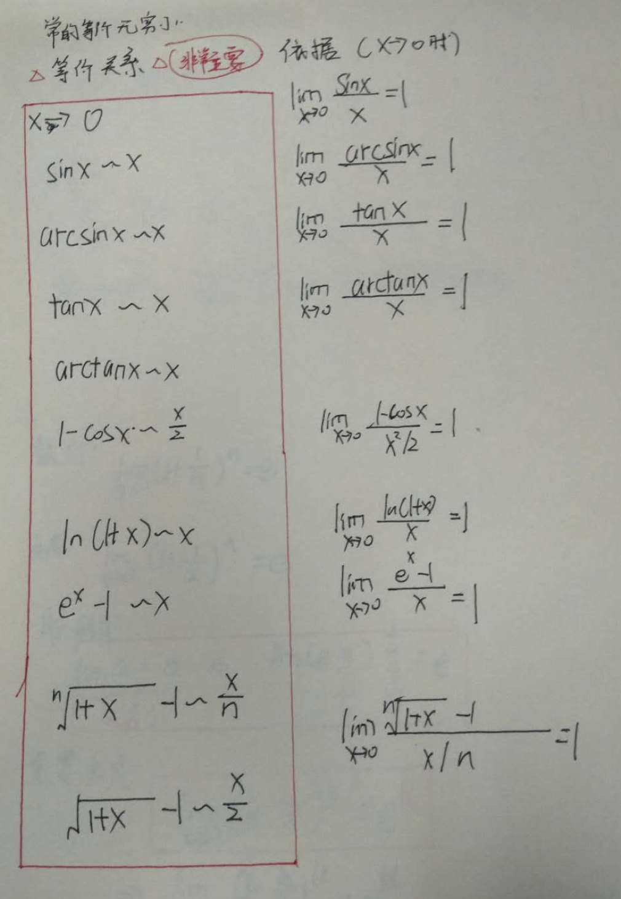

## 1.7、无穷小之间的比较
### 1.7.1、同阶无穷小，等价无穷小，高阶无穷小
#### 设 $ \lim \alpha =0$、 $\lim \beta=0$
- #### (1)$\lim \frac{\beta}{\alpha}=0$-->$\beta$比$\alpha$有更高阶的无穷小(分子接近0的速度比分母更快)

- #### (2)$\lim \frac{\beta}{\alpha}=C,(c\neq0)$-->$\beta$与$\alpha$是同阶无穷小

- #### (3)$\lim \frac{\beta}{\alpha}=1$-->$\beta$与$\alpha$是等价无穷小。

> #### 比较$3x^2$,与x的无穷小
> #### $\lim_{x \to 0}\frac{3x^2}{x}=0$,所以$3x^2$是高阶的无穷小
- #### 推广性质：低阶无穷小+高阶无穷小=低阶无穷小。

### 1.7.2、无穷小的加关系的性质
- #### （1）自反性
- #### （2）对称性
- #### （3）传递性
- #### 定理一：两个无穷小的差，是比这两个无穷小更高阶的无穷小
- #### *定理二：无穷小的等价替换原理*:无穷小乘积因子可以用等价的无穷小替换而不改变极限。
> #### 设 $\lim \alpha=0 $,$\lim \beta=0$,$\alpha$与$\beta$是等价的无穷小，则$$ \lim f(x)\alpha=\lim f(x)\beta$$

### 1.7.3、常用的等价无穷小
### 

### 1.7.4、两个重要极限
#### （1）$\lim_{x \to 0}\frac{sinx}{x}=1$
- #### 推广形式:$\lim_{() \to 0}\frac{sin()}{()}$
- #### $x \to \infty $时，$\lim_{x \to \infty }\frac{sinx}{x}=0$

#### （2）
> #### 数列：$\lim_{n \to \infty} (1+\frac{1}{n})^n=e$
> #### 函数：$\lim_{x \to \infty}(1+\frac{1}{x})^x=e$
#### 一般形式：若$\alpha$为无穷小，则 $\lim (1+a)^{\frac{1}{a}}=e$
> #### 重要公式 $$\lim_{x \to \infty}(1+\frac{k}{x})^x=e^k$$
