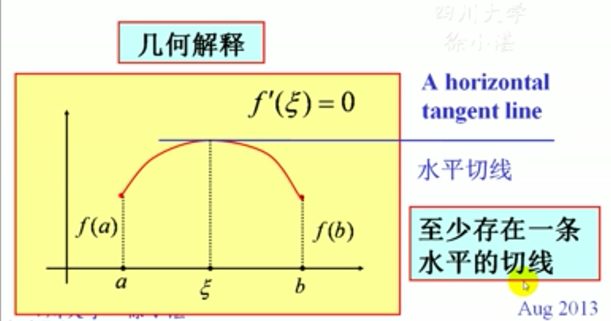
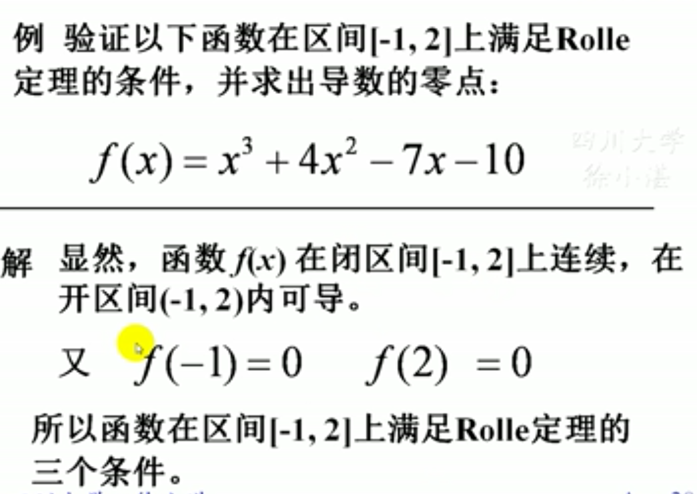
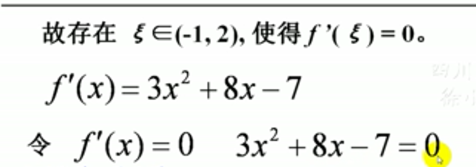
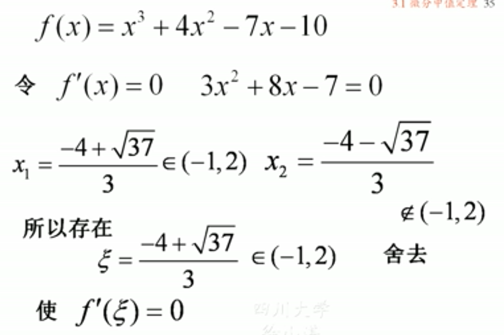
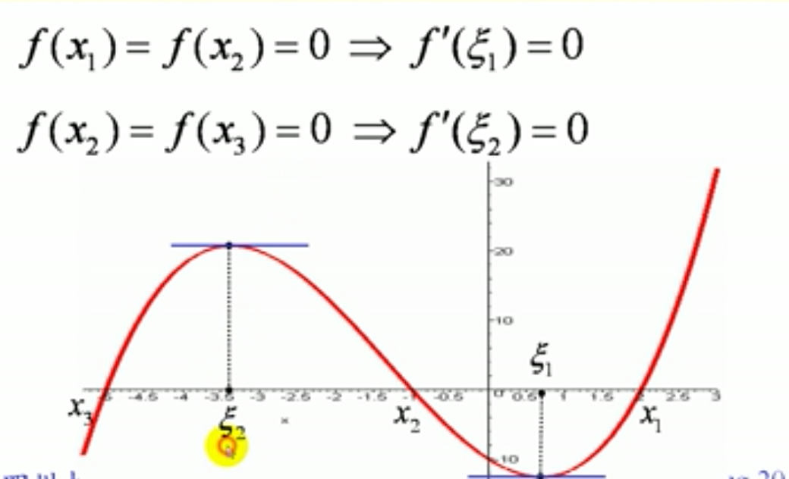
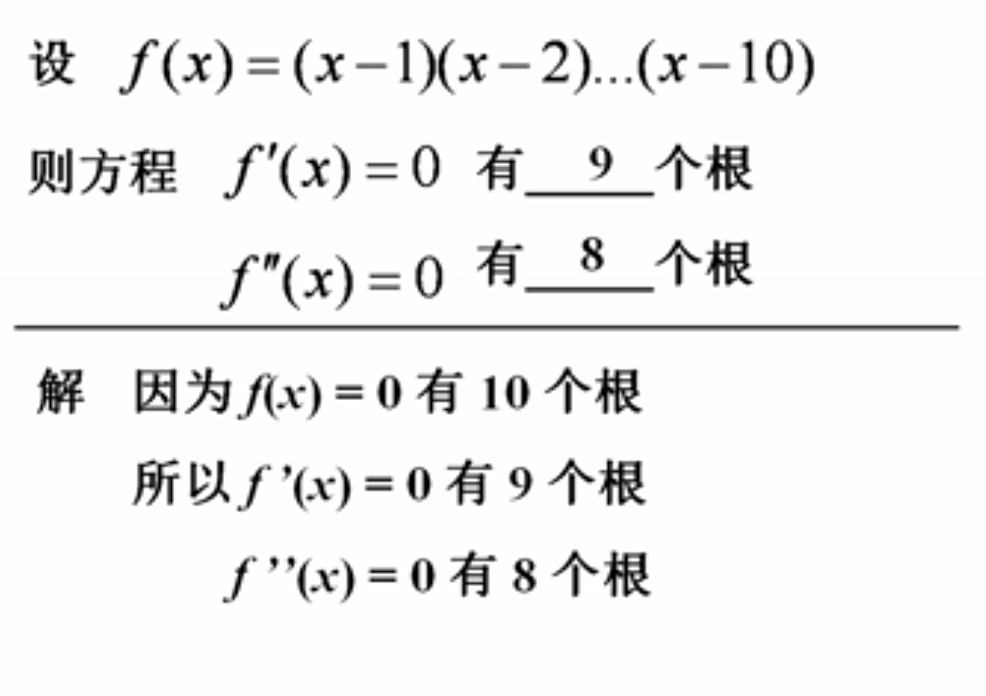
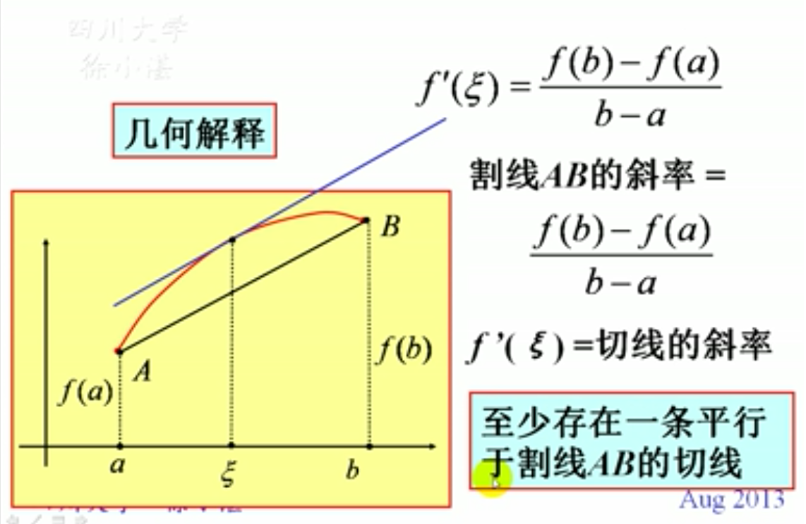
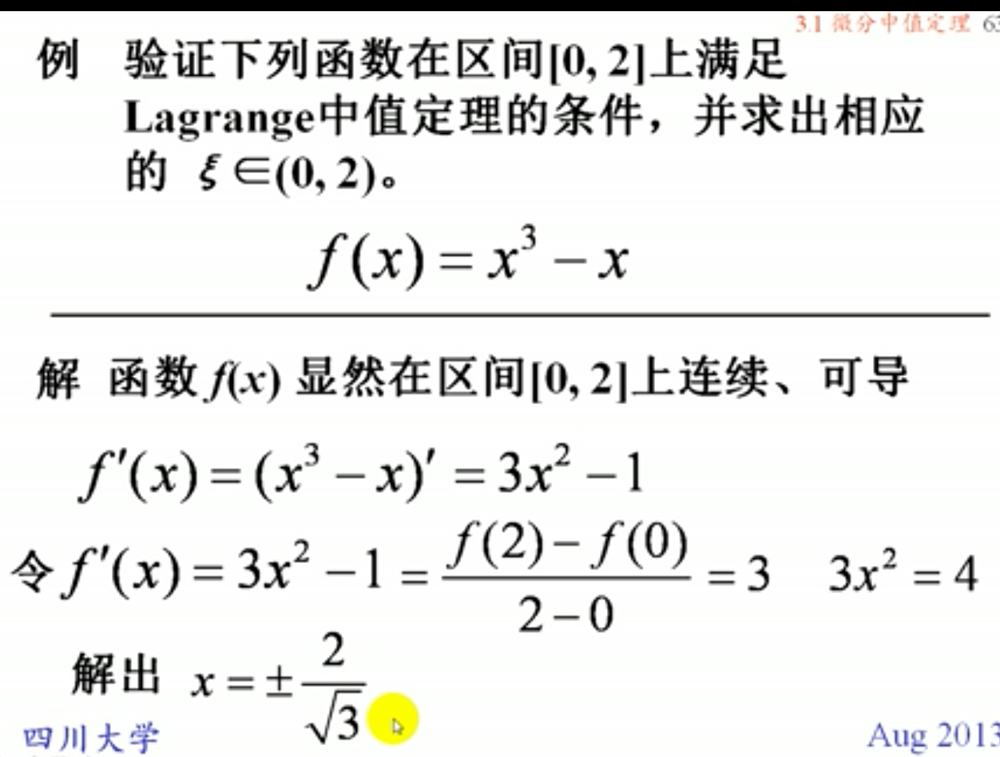
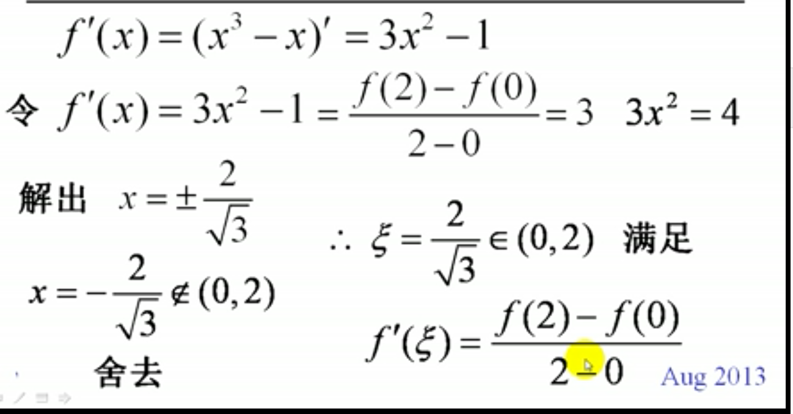
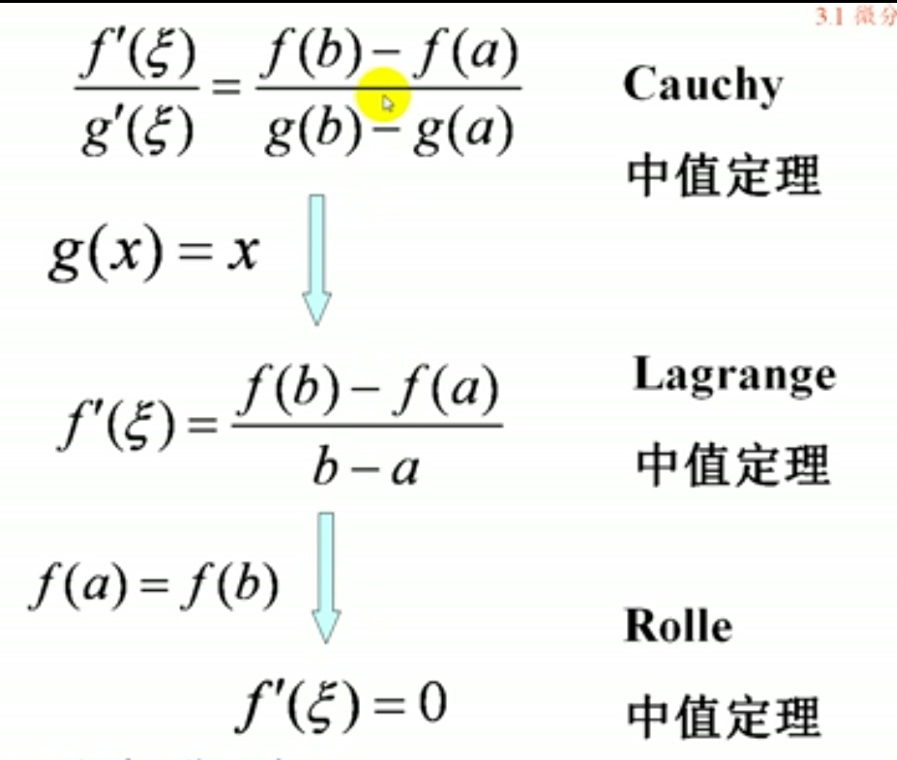

## 一、微分中值定理：罗尔定理
### Rolle定理：设函数f(x)满足三个条件
- ### f(x)在闭区间[a,b]上连续
- ### f(x)在开区间(a,b)内可导
- ### 端值相等:f(a)=f(b)
### 则存在$\xi \in (a,b)$，使得$f'(\xi)=0$

### 几何解释：至少存在一条水平切线
> 

- ### 推论：可导函数的的两个零点之间，必有一个导数的零点（称为驻点）

## 二、拉格朗日中值定理
### 定义：设函数f(x)满足以下两个条件：
- ### (1)f(x)在闭区间[a,b]上连续
- ### (2)f(x)在开区间(a,b)内可导
### 则存在$\xi \in (a,b)$使得$$f'(\xi)=\frac{f(b)-f(a)}{b-a}$$
### 几何解释：至少存在一条平行于割线AB的切线
> ### 例

### 拉格朗日中值定理的推论：
- #### 在一个区间上导数恒为零的函数必为常值函数
- #### 在一区间上导数恒相等的两个函数只相差一个常数

## 三、柯西中值定理
### 定义：设函数f(x)和F(x)
> ### (1)在闭区间[a,b]上连续

> ### (2)在开区间(a,b)内可导；且$F'(x)\neq 0$
### 则存在$\xi \in (a,b),$使得$$\frac{f'(\xi)}{F'(\xi)}=\frac{f(b)-f(a)}{F(b)-F(a)} $$

### 四、三个中值定理之间的关系
