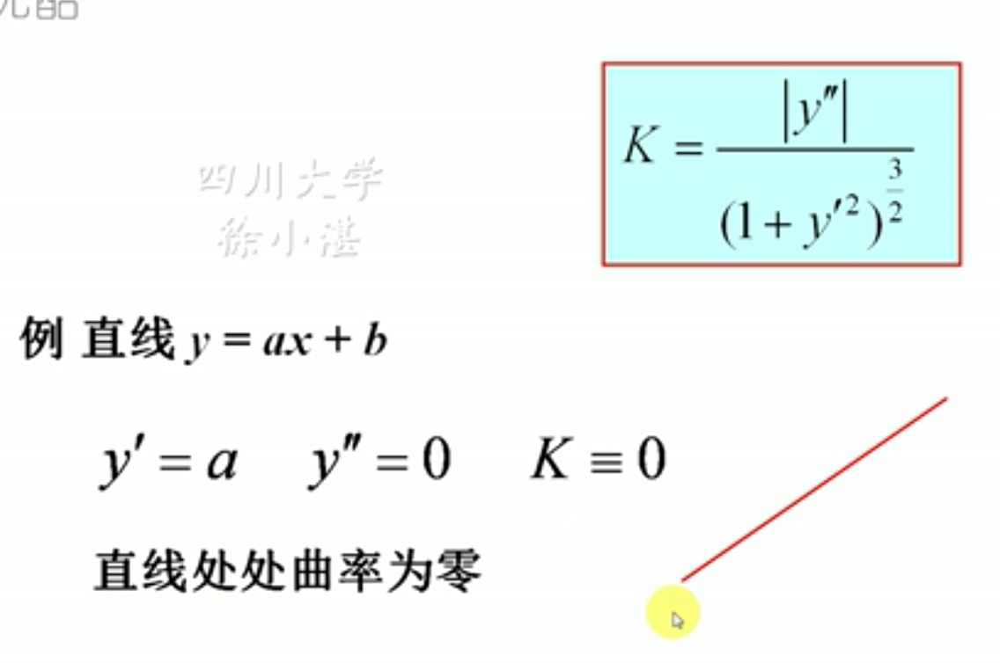
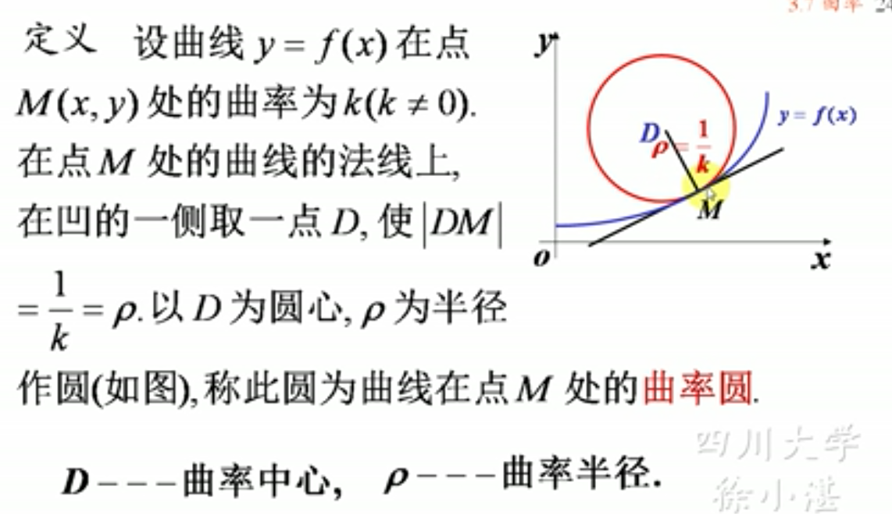
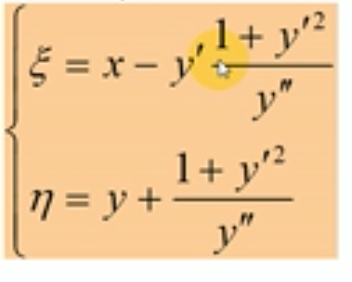
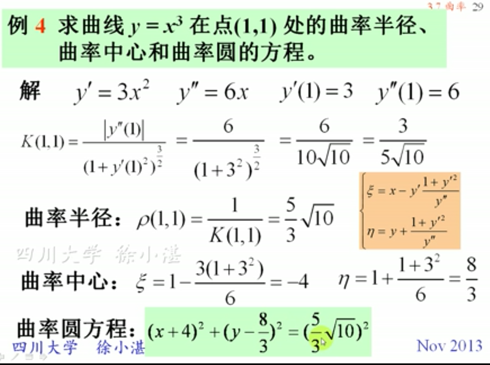
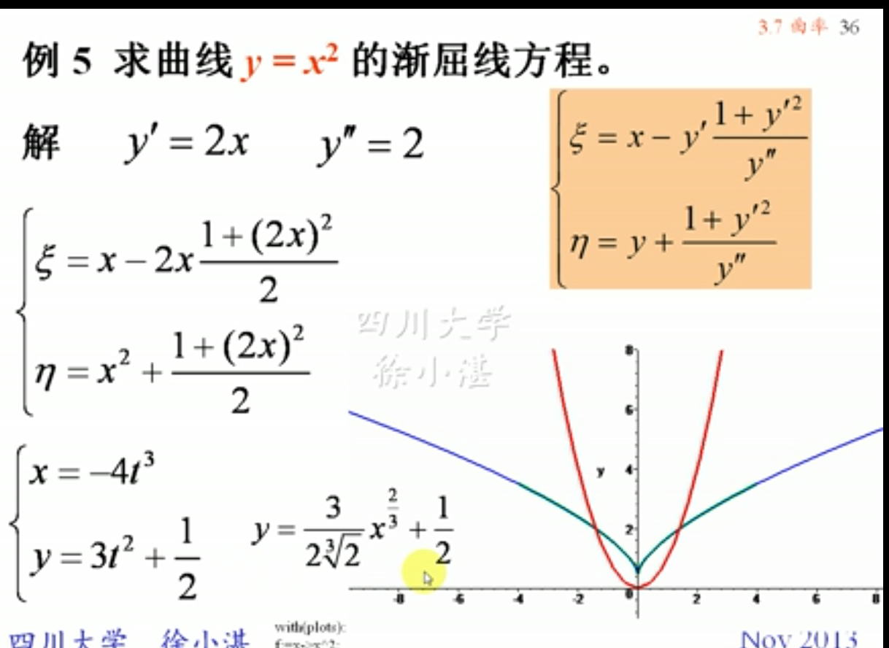

## 一、弧微分
### 设曲线$y=f(x)$，对应弧微分$ds=\sqrt{1+y'^2}dx$
### 对于参数方程表示的曲线
- #### $x=\varphi (t)$
- #### $y=\psi (t)$
### 其微分为：
- #### $dx=\varphi'(t)dt$
- #### $dy=\psi'(t)dt$
### 弧微分为$$ds=\sqrt{\varphi'^2(t)+\psi'^2(t)}dt$$

## 二、曲率及其计算公式
### (1)定义：描述曲线弯曲程度的量
### 计算公式：$$K=\frac{|y''|}{(1+y'^2)^{\frac{3}{2}}}$$ $$K=\frac{|\varphi'(t)\psi''(t)-\varphi''(t)\psi'(t)|}{[\varphi'^2(t)+\psi'^2(t)]^{\frac{3}{2}}}$$
#### 例：求直线的曲率

### (2)曲率圆、曲率中心、曲率半径
### 曲率中心的公式

### 例子：
## 三、渐屈线与渐伸线
### 渐屈线：屈线C的曲率中心轨迹G称为曲线C的渐屈线。
### 反之，C本身称为G的渐伸线。
#### 例
