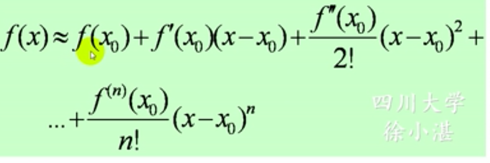

## 泰勒公式
### (1)带Peano余项的Taylor公式：设函数f(x)在$x_0$处有0~n阶导数，则$$f(x)=\sum_{k=0}^{n}\frac{f^{(k)}(x_0)}{k!}(x-x_0)^k+o[(x-x_0)^n]$$,$o[(x-x_0)^n]$为Peano余项
### 展开的写法为：

### 特点：
- #### 条件较弱，只需在$x_0$有n阶导数
- #### 缺点是误差不容易做定量的分析

### (2)带泰勒中值定理：设函数f(x)在$x_0$的某一个邻域内有0~n+1阶导数，则对该邻域内的任何x有$$f(x)=\sum_{k=0}^{n}\frac{f^{(k)}(x_0)}{k!}(x-x_0)^k+R_n(x)$$,其中余项R为：$$R_n(x)=\frac{f^{(n+1)}(\xi)}{(n+1)!}(x-x_0)^{n+1}$$，当$x_0=0$时，得到麦克劳林公式：

#### 例：
> 
