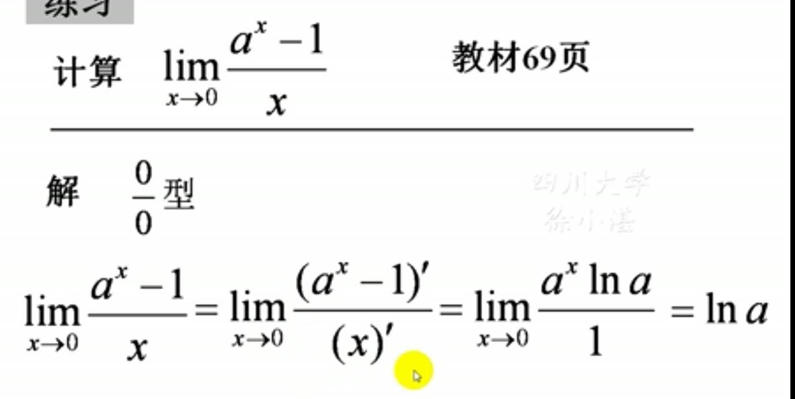

## 洛必达法则
### 1、定理：设
- #### (1) $\lim_{x \to a}f(x)=0$,$\lim_{x \to a}F(x)=0$（适用于$\frac{0}{0}$的极限）
- #### (2)两个函数在a的某个去心邻域可导，且F(x)的导数不为0
- #### (3)极限$\lim_{x \to a}\frac{f'(x)}{F'(x)}=A(\infty)$,(极限存在或极限为无穷)
### 则$$\lim_{x \to a}\frac{f(x)}{F(x)}=\lim_{x \to a}\frac{f'(x)}{F'(x)}=A(\infty)$$

### 例题
> #### 

### 注意
- ### $\frac{0}{0}$和$\frac{\infty}{\infty}$都可以使用洛必达
- ### 无论是$x \to 0$或$x \to \infty$，都可以使用洛必达

- ### 当使用洛必达法则发现导数商的极限不存在时，说明此时洛必达法则不起作用，令换别的方法。

### 2、对于其他形式的未定式的处理方法
#### (1)对于$\lim_{}f(x)g(x)$, $\infty \cdot 0$型的可以转换为
> #### $\lim_{}f(x)g(x)=\lim_{}\frac{g(x)}{1/f(x)}$，即$\frac{0}{0}$型
> #### $\lim_{}f(x)g(x)=\lim_{}\frac{f(x)}{1/g(x)}$，即$\frac{\infty}{\infty}$型
#### 转化之后，再使用洛必达法则

#### 例题
> 

#### (2)对于$\lim[f(x)-g(x)]$,$\infty - \infty$型的，采用通分的方式处理
> #### $\lim[f(x)-g(x)]=\lim\frac{F(x)}{G(x)}$,转换成$\frac{0}{0}$型，再使用洛必达法则
#### 例题
>

#### (3)对于幂指函数的极限$\lim{}f(x)^{g(x)}$可能为：$1^{\infty}$,$\infty^0$,$0^0$型的。通过自然对数的方式转换：
> #### $$\lim_{}f(x)^{g(x)}=\lim_{}e^{\ln f(x)^{g(x)}}=e^{\lim g(x)\ln f(x)}$$
#### 然后最指数部分用洛必达求极限，最后得出答案。
#### 例
> 
