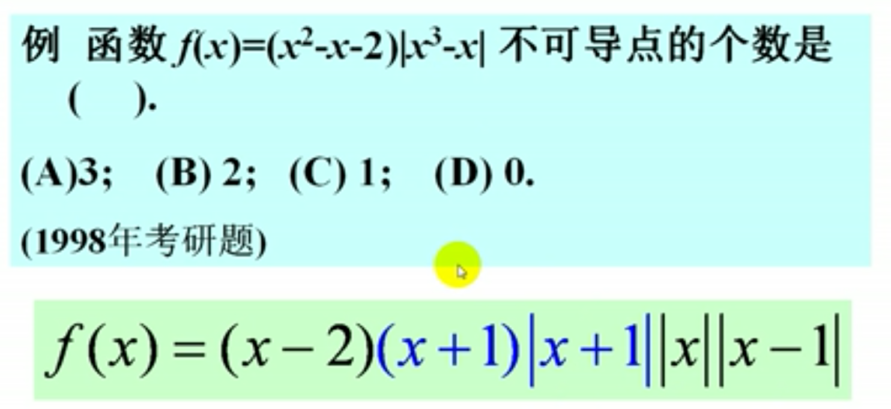
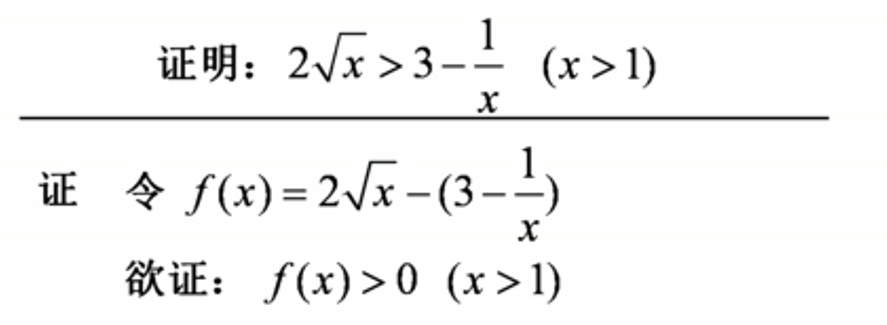

## 函数的单调性和极值
### 1、函数单调性的判别法
### 定理一：函数单调性的判别定理。设函数f(x)在闭区间[a,b]上连续，在开区间(a,b)内可导。
- #### 如果在(a,b)内f'(x)>0，则函数f(x)在[a,b]上单调增加。
- #### 如果在(a,b)内f'(x)<0，则函数f(x)在[a,b]上单调减少。
### 注意：
  - #### 函数单调增加，导数不一定大于零。（有可能不可导，或者导数为零）
  - #### 可导函数在某一点的导数大于零，不能说明函数在该点的某个邻域内是单调增加的。

### 2、函数的极值
### (1)极大值与极小值:
  - #### 极大值：函数在一个邻域内所取的到的最大的函数值，即局部最大值
  - #### 极小值：函数在一个邻域内所取的到的最小的函数值，即局部最小值
### 定理1：极值的必要条件：设函数f(x)在点$x_0$处可导，且在点$x_0$处取得极值，则必有$f'(x_0)=0$，此时$x_0$也称为驻点。即可导的极值点必为驻点。（但是极值点不一定是驻点，驻点也不一定极值点。）
### 定理2：（极值的第一充分条件）如何判断函数的是否为极值点，以及为极大值还是极小值点

 

### 定理3：极值的第二充分条件：设函数f(x)在点$x_0$处二阶可导，且$f'(x_0)=0,f''(x_0) \neq 0$则：
- ### $f''(x_0)< 0 =>f(x_0)$为极大值
- ### $f''(x_0)> 0 =>f(x_0)$为极小值

### 定理4：极值的高阶充分条件：

### 题型：
#### 1、点是否可导：
> #### 例此时需要判断：x=1,-1,0时，其他部分形成的g(x)是否为0，以此判断这三个点处是否可导。

#### 2、对比两个函数，在特定区间的大小：，首先是要把两个函数比大小的形式转换为一个函数，再利用导函数求单调性，配合端点值来判断。而原函数在x=1处也等于0，所以在x>1的区域内，函数恒大于0。此时，两函数大小关系确定。

#### 3、证明某一个单调函数为正函数
> #### 例
