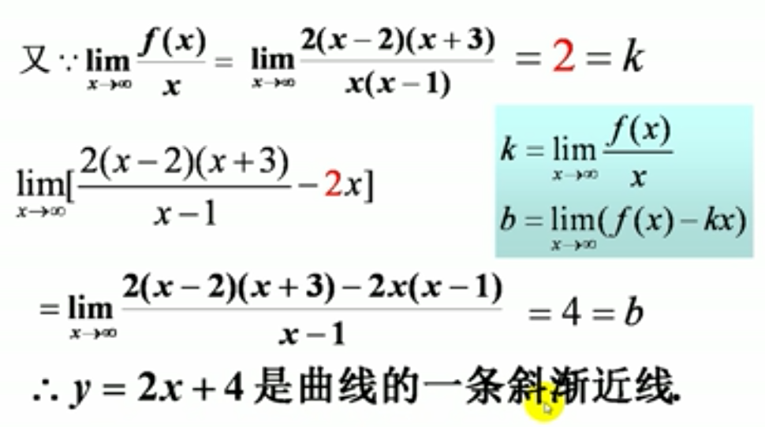

### 一、渐近线
#### 1、铅直渐近线：如果$\lim_{x \to x_0^+}f(x)=\infty$或$\lim_{x \to x_0^-}f(x)=\infty$,那么$x=x_0$就是$y=f(x)$的一条铅直渐近线

#### 2、水平渐近线:如果$\lim_{x \to +\infty}f(x)=A$或$\lim_{x \to -\infty}f(x)=A$,那么$y=A$就是$y=f(x)$的一条水平渐近线。

#### 3、斜渐近线：$y=kx+b$
- #### $k = \lim_{x \to \infty}\frac{f(x)}{x}\neq 0$
- #### $b=\lim_{x \to \infty}(f(x)-kx)$
#### 例：

### 二、绘制函数图形
#### 
#### 例
