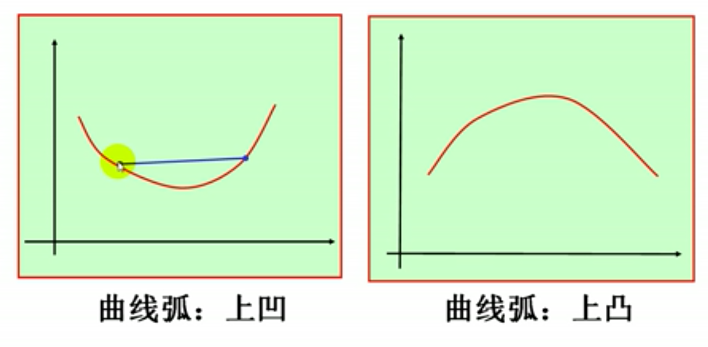
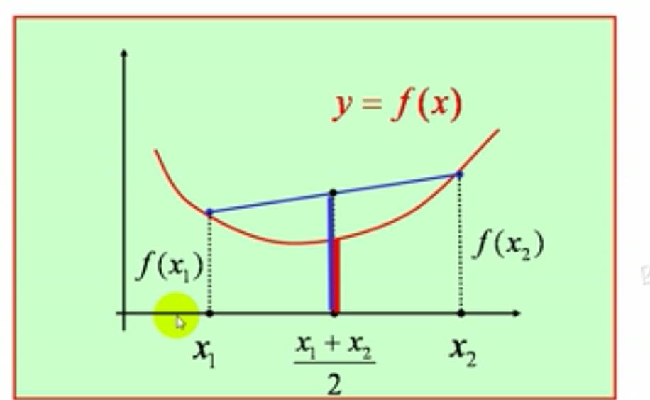
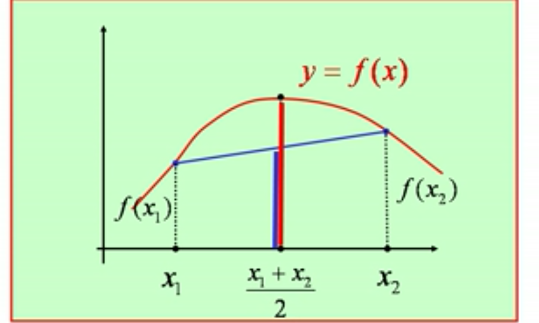
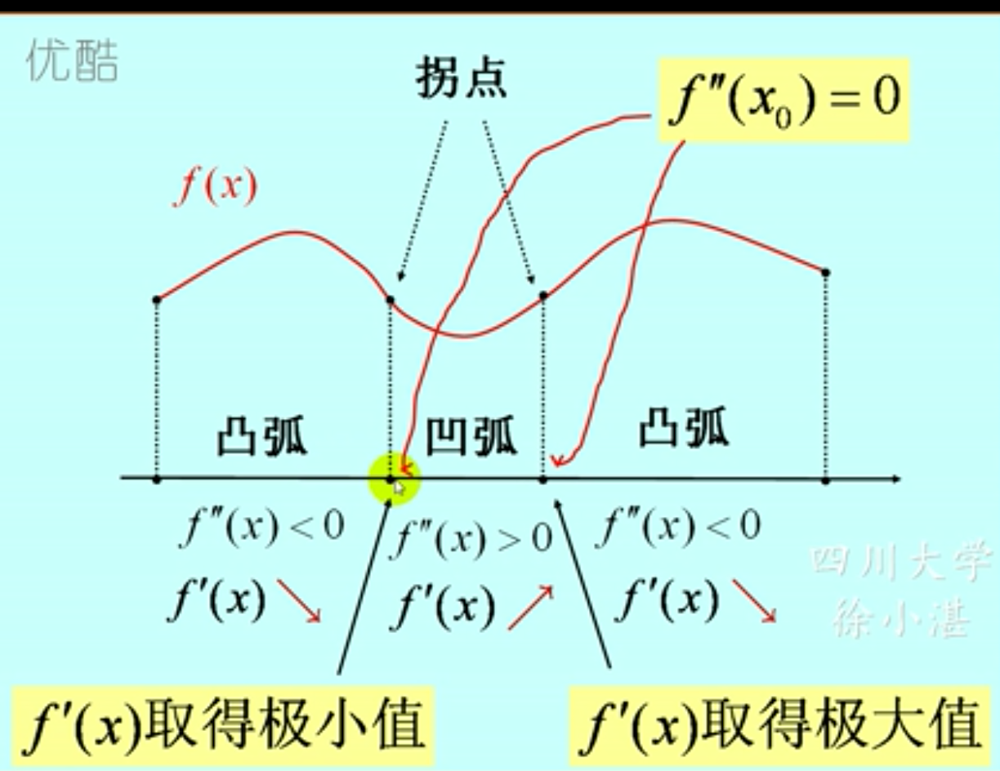
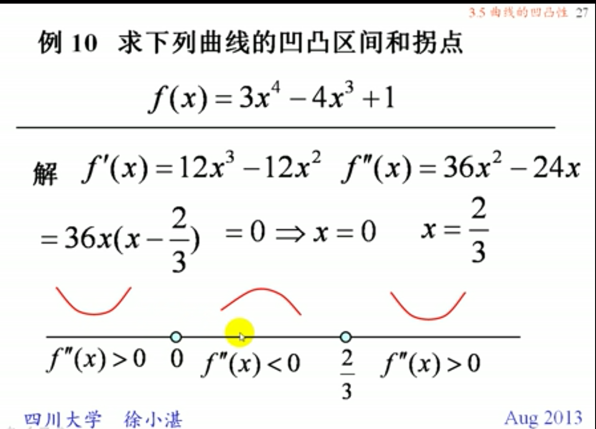
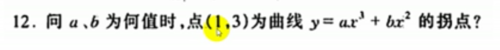

## 一、曲线的凹凸性与拐点
### 1、上凹与上凸
- #### 凹弧的定义：$f(\frac{x_1+x_2}{2})<\frac{f(x_1)+f(x_2)}{2}$
- #### 凸弧的定义:$f(\frac{x_1+x_2}{2})>\frac{f(x_1)+f(x_2)}{2}$
### 2、引理：利用一阶导数的单调性来判断凹凸性:设函数f(x)在[a,b]上连续，在(a,b)内可导那么：
> #### 若在(a,b)内f'(x)单调增加则曲线y=f(x)在[a,b]上是凹的
> #### 若在(a,b)内f'(x)单调减少则曲线y=f(x)在[a,b]上是凸的

### 3、定理：设函数f(x)在[a,b]上连续，在(a,b)内可导那么：
> #### 若在(a,b)内$f''(x)>0$,则曲线y=f(x)在[a,b]上是凹的。
> #### 若在(a,b)内$f''(x)<0$,则曲线y=f(x)在[a,b]上是凸的。

> #### 拐点：在$f''(x)=0$处，为拐点

#### 例
#### 解：题中所隐含的条件:
- #### (1)点(1,3)在曲线y上
- #### (2)$y''(x)$在(1,3)处的值为0
#### 联立可解出a,b

### 4、当$f''(x_0)=0$,$f'''(x_0)\neq0$时，$(x_0,f(x_0))$是曲线y=f(x)的拐点。
