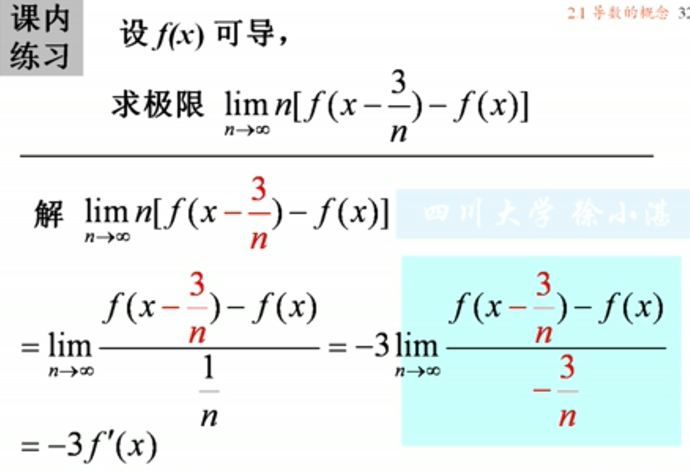

## 1、导数的引例

函数切线：

## 2、导数的定义
### (1)导数的定义
> ### 函数:y=f(x),在点$x_0$的某个邻域内有定义。当x在$x_0$处取得增量$\Delta x$，相应的函数取得增量$\Delta y=f(x_0+x)-f(x_0)$,如果$\lim_{\Delta x \to 0}\frac{\Delta y}{\Delta x}$存在，则称f(x)在点$x_0$处可导，并称该极限为f(x)在$x_0$处的导数。记为$f'(x_0)$,即$$f'(x_0)=\lim_{\Delta x \to 0}\frac{\Delta y}{\Delta x}=\lim_{\Delta x \to 0}\frac{f(x_0+\Delta x)-f(x_0)}{\Delta x}$$

### (2)导数常见的其他形式
- ### $f'(x_0)=\lim_{h \to 0}\frac{f(x_ 0+h)-f(x_0)}{h}$  

- ### $f'(x_0)=\lim_{x \to x_0} \frac{f(x)-f(x_0)}{x-x_0}$

### (3)导函数及其几何意义
> ### 若函数f(x)在区间(a,b)上每一点都可导，则映射x->f'(x)构成区间(a,b)上的一个函数$y=f'(x)$称为 *导函数*，几何意义为：曲线上的每一个点都有切线。
### (4)导数的记号
- ### $f'(x)$
- ### $y'$
- ### $\frac{dy}{dx}$,($\frac{dy}{dx}=\lim_{\Delta x \to 0}\frac{\Delta y}{\Delta x}$)
- ###   
- ### $y'(x_0)$,在$x_0$处的导数
- ### $\frac  {dy}{dx}\mid_{x=x_0}$,在$x_0$处的导数

### 例

### (5)单侧导数
### 导数存在的充分必要条件是：左右导数存在且相等。

### (6)常见的导数
> #### $$(C)'=0$$
> #### $$(x^\mu)'=\mu x^{\mu-1}$$
> #### $$(\sqrt{x}'=\frac{1}{2\sqrt{x}})$$
> #### $$(\frac{1}{x})'=-\frac{1}{x^2}$$
> #### $$(sinx)'=cosx$$
> #### $$(cosx)'=-sinx$$
> #### $$(a^x)'=a^x\ln a$$
> #### $$(e^x)'=e^x$$
> #### $$(\log_{a}x)'=\frac{1}{x\ln a}$$
> #### $$(\ln x)'=\frac{1}{x}$$
> ####  $$(\sqrt{1+x^2})'=\frac{x}{\sqrt{1+x^2}}$$
> #### $$(\ln |x|)'=\frac{1}{x}$$

## 3、导数的几何意义：
### (1)意义：$f'(x_0)$为曲线y=f(x)在点$P(x_0,y_0)$处的切线的斜率。即，导数$f'(x_0)$反映出曲线y=f(x)在点$P(x_0,y_0)$
- ### 曲线y=f(x)在点$P(x_0,y_0)$处的*切线方程*，$$y-f(x_0)=f'(x_0)(x-x_0)$$
- ### 曲线y=f(x)在点$P(x_0,y_0)$处的*法线方程*，$$y-f(x_0)=-\frac{1}{f'(x_0)}(x-x_0)$$
> ### 例 

## 4、函数可导性与连续性的关系
- ### 定理：函数在一点可导，则函数在该点一定连续。
- ### 连续与可导的关系：
