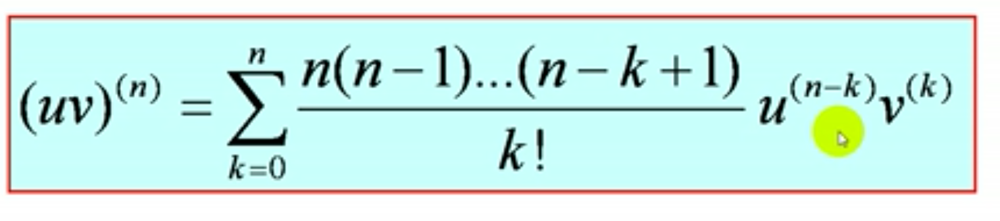
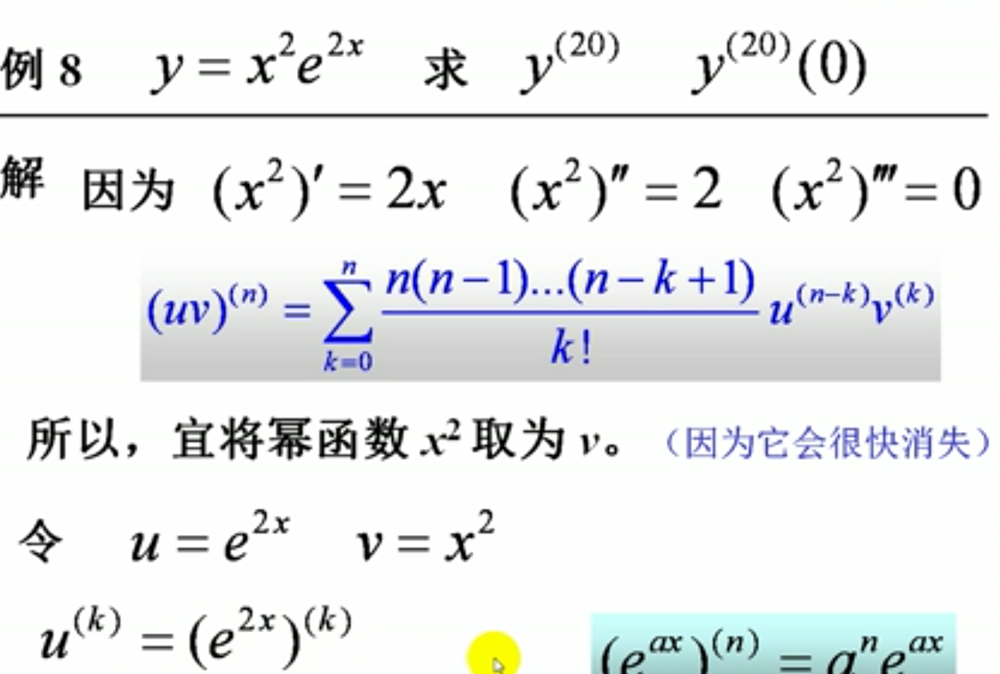
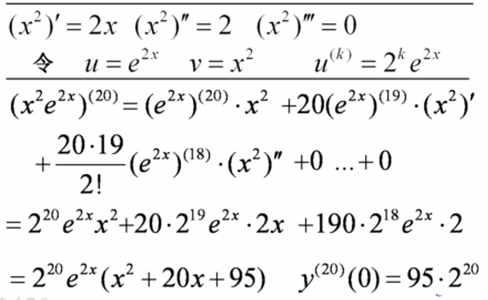

## 1、高阶导数
### 定义：二阶以及二阶以上的导数称为高阶导数。
### 记号：
> #### $f''(x)=[f'(x)]'$
> #### $\frac{d^2y}{dx^2}=\frac{d}{dx}(\frac{dy}{dx})$
> #### $y^{(n)}$,$f^{n}(x)$,$\frac{d^ny}{dx^n}$

### 常见的高阶导数
> #### $(x^n)^{(n)}=n!$
> #### $(a^x)^{(n)}=a^x(\ln a)^n$
> #### $(e^x)^{(n)}=e^x$
> #### $(sinx)^{(n)}=sin(x+n \cdot\frac{\pi}{2})$
> #### $(cosx)^{(n)}=cos(x+n \cdot\frac{\pi}{2})$
> #### $(\frac{1}{ax+b})^{(n)}=(-1)^n\frac{a^nn!}{(ax+b)^{n+1}}$
> #### $(\frac{1}{x+1})^{(n)}=(-1)^n\frac{n!}{(x+1)^{n+1}}$
> #### $(\frac{1}{x})^{(n)}=(-1)^n\frac{n!}{n^{n+1}}$
> #### $[\ln(1+x)]^{(n)}=(-1)^{n-1}\frac{(n-1)!}{(1+x)^n}$
> #### $(xe^x)^{(n)}=(x+n)e^x$

### 常规的解题技巧:将给出的函数算出前几阶，然后找到规律，归纳出n阶。

## 2、高阶导数的运算法则
### 高阶导数的线性性质
> #### $(u \pm v)^{(n)}=u^{(n)} \pm v^{(n)}$
> #### $(Cu)^{(n)}=Cu^{(n)}$
### 函数乘积的高阶导数公式
> ### 例
