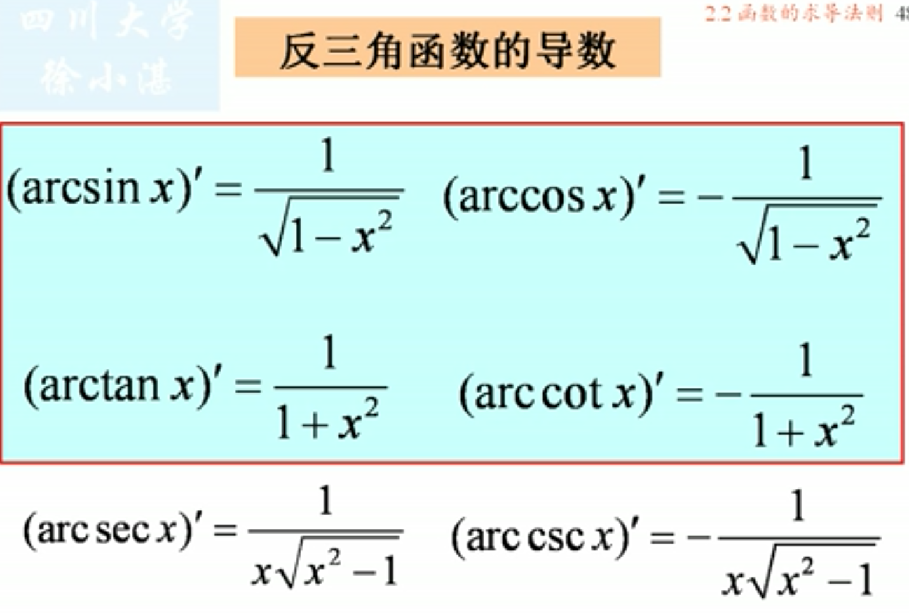

## 1、导数的四则运算
> #### $[u(x) \pm v(x)]'=u'(x) \pm v'(x) $
> #### $[u(x)v(x)]'=u'(x)v(x)+u(x)v(x)'$
> #### $[\frac{u(x)}{v(x)}]'=\frac{u'(x)v(x)-u(x)v'(x)}{v^2(x)}$
### 根据四则运算的一些推广形式
> #### $[(x)]'=Cu'(x)$
> #### $(C_1u_1+C_2u_2+.....C_nu_n)=C_1u_1'+C_2u_2'+...+C_nu_n'$(线性组合的导数=导数的线性组合)
> #### $(uvw)'=u'vw+uv'w+uvw'$

> #### 

- #### 关于分段函数的求导方法：
> #### 左右的极限都按照公式来求。对分段点处，用定义来求。
> #### 在已知函数的连续性的情况下，有以下的简便的处理过程。

## 2、反函数的求导法则
- ### 定理2：(反函数的求导法则)设单调函数y=f(x)在点x处可导，且$f'(x) \neq 0$，则其反函数$x=f^{-1}(y)$在点y=f(x)处可导，且导数为:$(f^{-1})'(y)=\frac{1}{f'(x)}$

> ### 
> ### 

## 3、复合函数的求导法则
- ### 定理3：(复合函数的求导法则)设函数$u=g(x)$在点x可导，而函数$y=f(u)$在点$u=g(x)$可导,则复合函数y=f(g(x))在点x可导，且有导数。
> ### $$\frac{dy}{dx}=f'(x)g'(x)$$或者$$\frac{dy}{dx}=\frac{dy}{du}\frac{du}{dx}$$
### 推广：链式法则

> ### 例

## 4、补充扩展：抽象函数的求导与双曲函数的导数。
### (1)抽象函数：只给出f'(x)而没给出具体表达的函数。不需要具体求出，只需要给出最好导数的表达式即可。
> ### 例
> ### 注意：$[f(x)]'$与$f'(x)$的区别,
> - ### $[f(x)]'$是对f(x)进行求导
> - ### $f'(x)$是指f(x)在x这一点的导数

### (2)双曲函数的导数

## 5、f(x)与f'(x)的关系
- ### 奇函数的导数是偶函数
- ### 偶函数的导数是奇函数
- ### 周期函数的导数仍是周期函数
