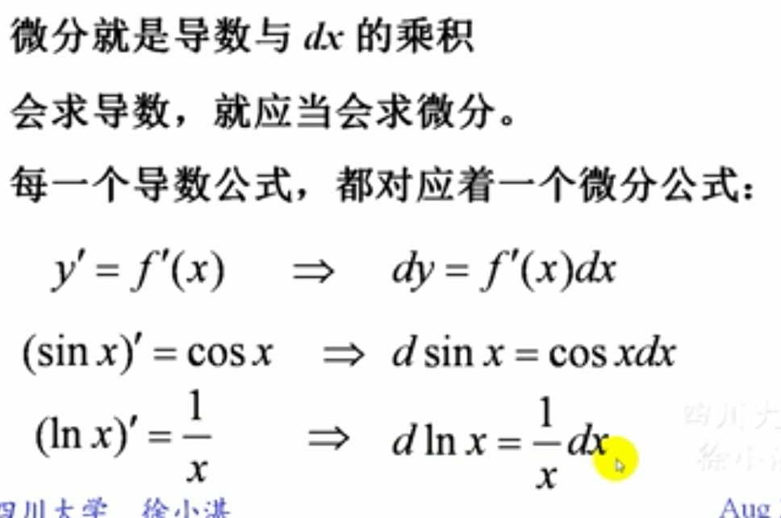
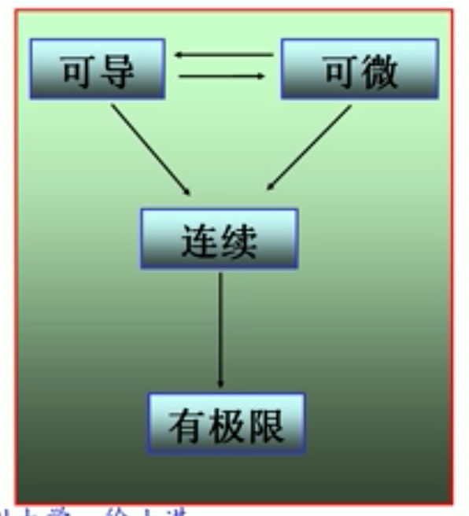
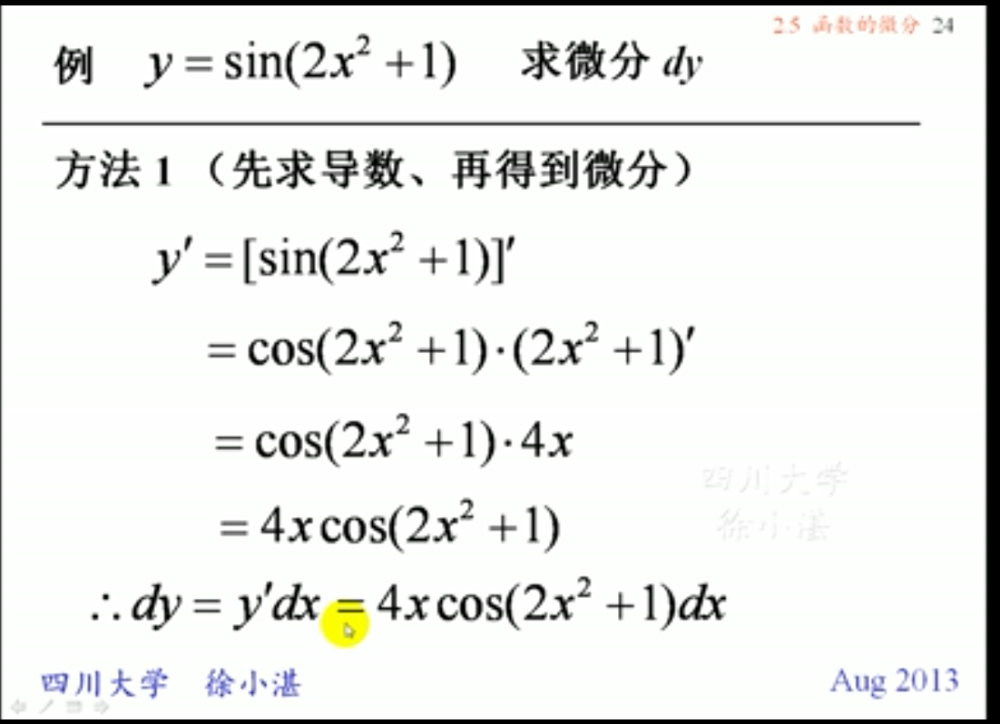
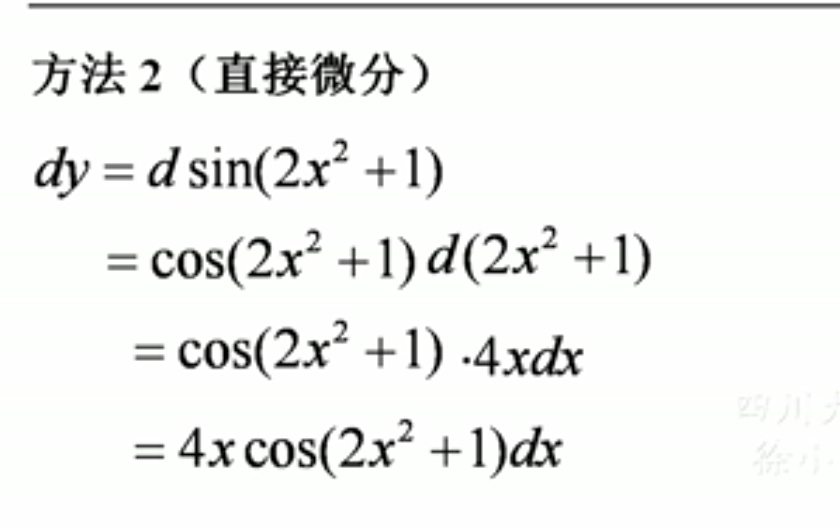
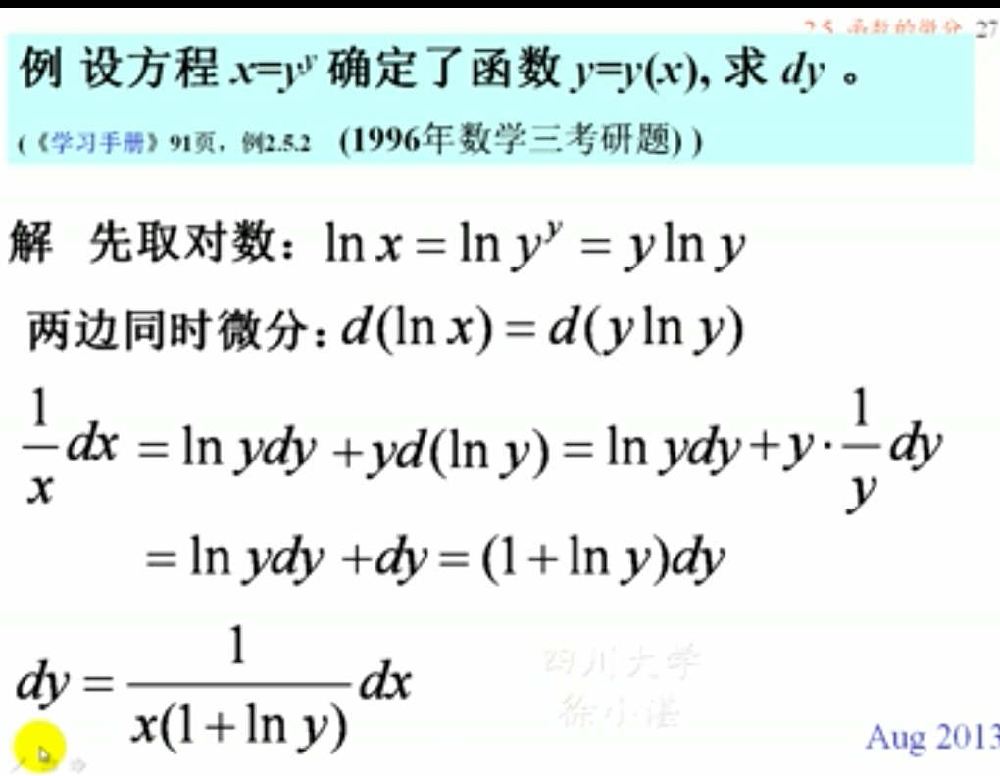
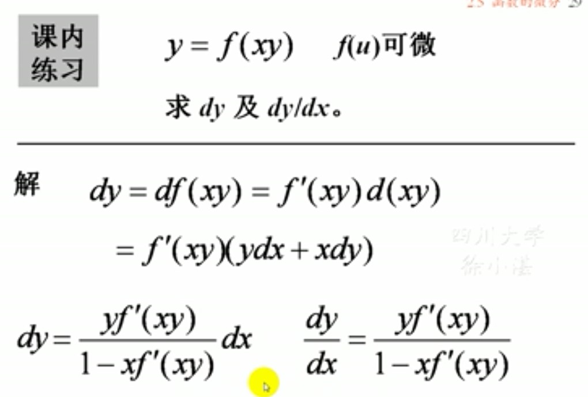
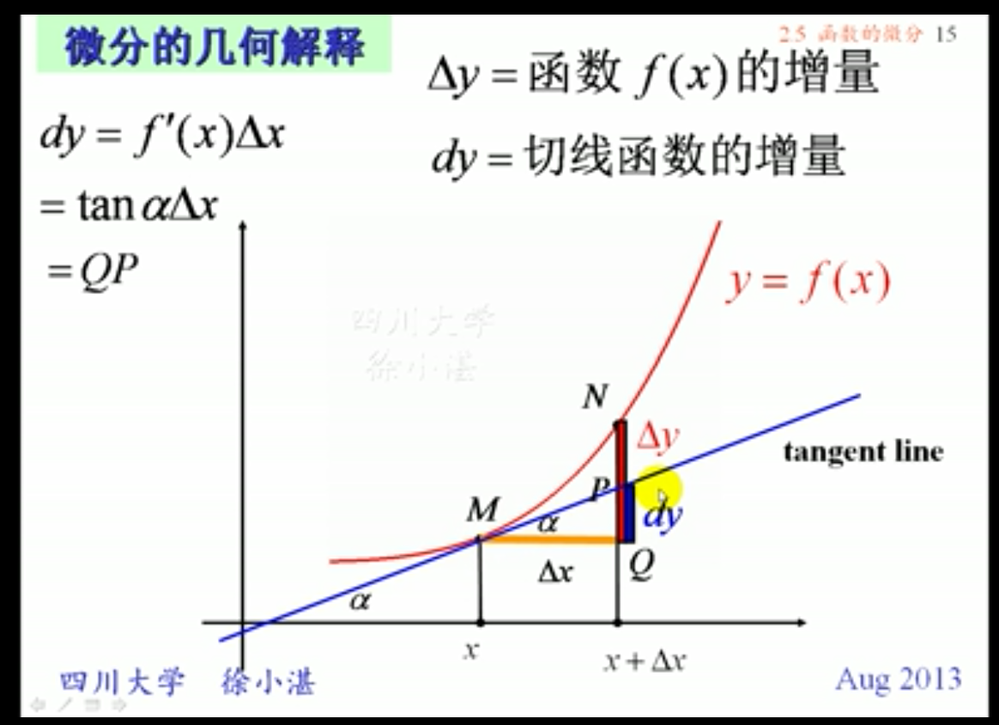
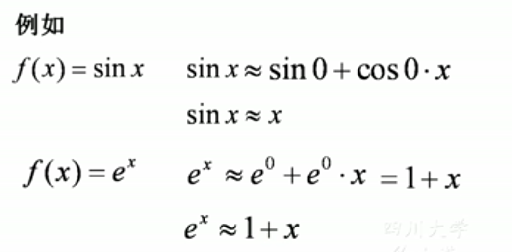

## 1、微分的概念
### 定义:设在一点x处，$$\Delta y=f(x+\Delta x)=f(x) $$如果，$\Delta y=A\Delta x+o(\Delta x)$则称函数f(x)在点x处可微。记作$dy$.
### 计算公式：$$dy=f'(x)dx$$
### 运算法则：和导数的四则运算法则完全一样
### 复合函数的微分：微分形式不变性。
### 可微可导连续有极限的关系
> #### 例
> #### 

> #### 

## 2、微分的几何意义（切线函数的增量）

## 3、微分公式，微分运算法则

## 4、微分在近似计算中的应用
### (1)*函数增量*的近似计算公式$$\Delta y \approx f'(x_0)\Delta x$$
### (2)*函数值*的近似计算公式$$f(x_0+\Delta x) \approx f(x_0)=f'(x_0)\Delta x$$
### (3)*x=0附近值*的计算公式$$f(x) \approx f(0)+f'(0)x$$
