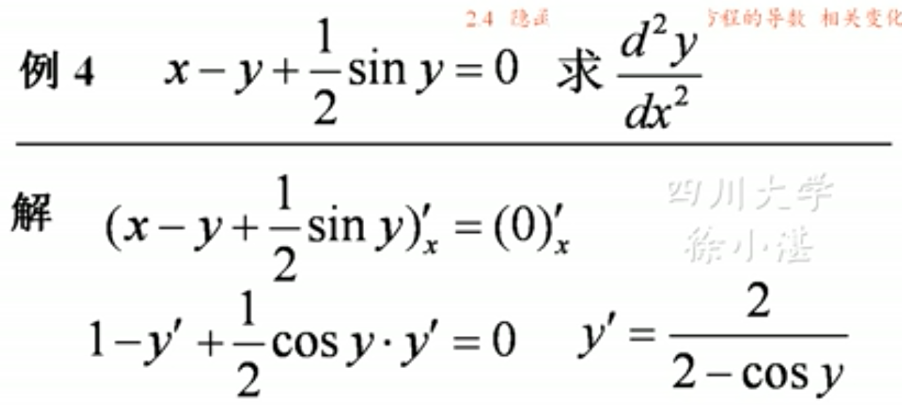

## 1、隐函数的导数
### (1)定义：无法用直接表示因变量y的函数。
> #### $y^2 + x^2=1$是隐函数
> #### $y=\pm \sqrt{1-x^2}$是显函数

### (2)隐函数的求导：①隐函数化成显函数来求导。②把y看做y(x)来求导。
> ### 例

> ### 对隐函数的某个点求导：先求出导函数，再带入点。

> ### 对隐函数求二阶导数：先求一阶导数，再根据一阶导数求二阶导数。最后在二阶导数中带入一阶导数进行化简。
> ### 对隐函数的二阶导数的某个点求导：

## 2、对数求导法
### 对象：①幂指函数②因子比较多的函数
### 根据对数的性质：化积为和，化商为差，化幂为系数。
### 步骤：①取对数②求导数③解y'

> ### 例：幂指函数

> ### 例：较多乘积因子的函数的导数

> ### 例：利用对数的性质化简求导

## 3、由参数方程所确定的函数的导数
> ### $x =\varphi(t)$, $y= \psi(t)$
> ### $$\frac{dy}{dx}=\frac{\psi'(t)}{\varphi'(t)}$$或 
> ### $$\frac{dy}{dx}=\frac{y'(t)}{x'(t)}$$
> #### 例

## 4、由参数方程所确定的函数的高阶导数
> ### $x =\varphi(t)$, $y= \psi(t)$
> ### 二阶导数$$\frac{d^2y}{dx^2}=\frac{[\frac{\psi'(t)}{\varphi'(t)}]'}{\varphi'(t)}$$
> ### 三阶导数$$\frac{d^3y}{dx^3}=\frac{[\frac{d^2y}{dx^2}]'}{\varphi'(t)}$$
> #### 例 

## 5、相关变化率
