## 一、引例

## 二、定积分的定义
### 定义：
  - #### (1)任意划分区间：任意插入n-1分点将区间划分为n个小区间.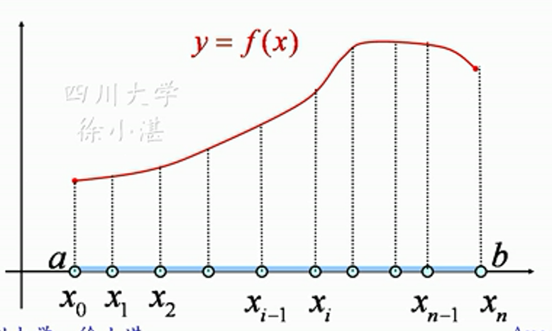
  - #### (2)任意取点:在每一个小区间任意取一点$\xi$得到：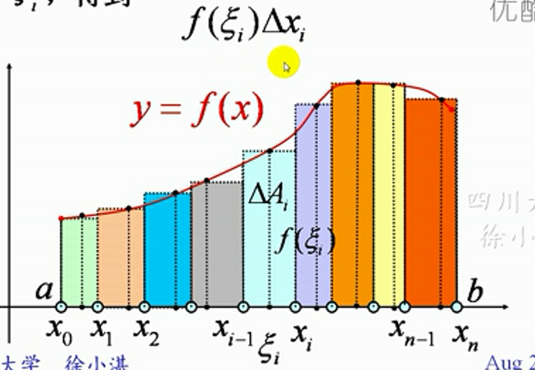
  - #### (3)取极限：$$\lim_{\lambda \to 0}\sum_{i=1}^{n} f(\xi_i)\Delta x=I,\lambda=max\{\Delta x_1,...\Delta x_n\}$$,如果这个极限值I与区间[a,b]的划分方式及点$\xi_i$的取法无关，则称函数f(x)在区间[a,b]上*可积*，该极限值称为函数f(x)在区间[a,b上的定积分。记作:$$\int_{a}^{b} f(x)dx=\lim_{\lambda \to 0}\sum_{i=1}^{n} f(\xi_i)\Delta x=I$$
### 各部分：
- #### :a：积分下限。b：积分上限。
- #### :$f(x)$：被积函数
- #### :$f(x)dx$：被积表达式
- #### :$dx$中的x：积分变量
- #### :$\lim_{\lambda \to 0}\sum_{i=1}^{n} f(\xi_i)\Delta x$，积分和

### 定积分和不定积分的区别:
  #### 定积分：是一个实数。$$\int_{a}^{b} f(x)dx=\lim_{\lambda \to 0}\sum_{i=1}^{n} f(\xi_i)\Delta x$$
  #### 不定积分：是一个函数。$$\int f(x)dx$$

### 定积分的几何意义：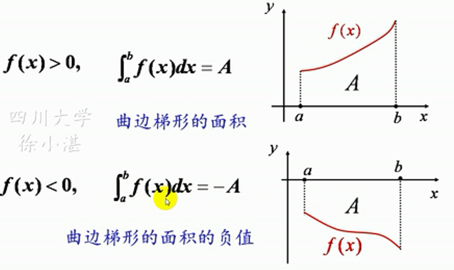

### 定积分的可积性
 - #### ：在闭区间上连续的函数是可积的 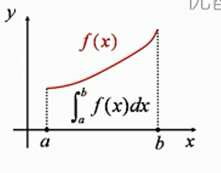
 - #### ：在闭区间上有界，且只有有限个间断点的函数是可积的 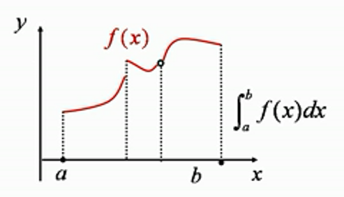
 - #### 单调有界函数永远可积

## 三、定积分的简单计算

## 四、定积分的性质
### 性质一：$$\int_{a}^{b}[f(x) \pm  g(x)]dx=\int_{a}^{b}f(x)dx \pm \int_{a}^{b}g(x)dx$$

### 性质二：$$\int_{a}^{b}kf(x)dx=k\int_{a}^{b}f(x)dx$$

### 性质三：定积分的区间可加性 $$\int_{a}^{b}f(x)dx=\int_{a}^{c}f(x)dx+\int_{c}^{b}f(x)dx$$

### 性质四：$$\int_{a}^{b}dx=b-a$$

### 性质五：$$f(x) \geq 0,(a \leq x \leq b)$$,则$$\int_{a}^{b}f(x)dx \geq 0,(a \leq b)$$

#### 推论1：积分不等式：$f(x) \leq g(x),(a \leq x \leq b)$,则$\int_{a}^{b}f(x)dx\leq \int_{a}^{b}g(x)dx,(a < b )$

#### 推论2：$$|\int_{a}^{b}f(x)dx|\leq \int_{a}^{b}|f(x)|dx,(a \leq b)$$

### 性质六：积分估值定理:$m\leq f(x) \leq M ,(a \leq x \leq b)$,$$m(b-a) \leq \int_{a}^{b}f(x)dx \leq M(b-a)$$

### 性质七：积分中值定理$$\int_{a}^{b}f(x)dx=f(\xi)(b-a),(a \leq \xi \leq b)$$

## 练习
### 1、比较积分的大小
- #### 同一区间上比较积分的大小：函数值大的积分就大
#### 例：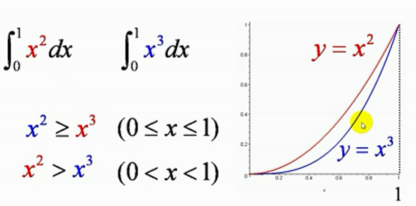
#### 例：引入一个中间值来比较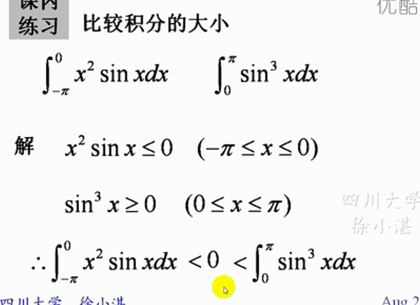

### 2、定积分的估值定理的应用：
#### 例：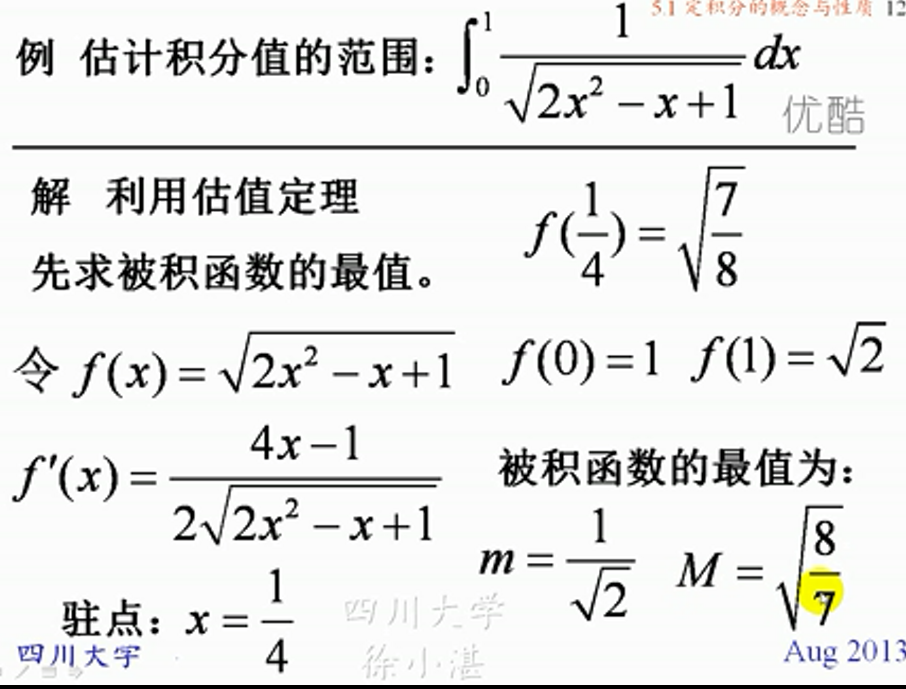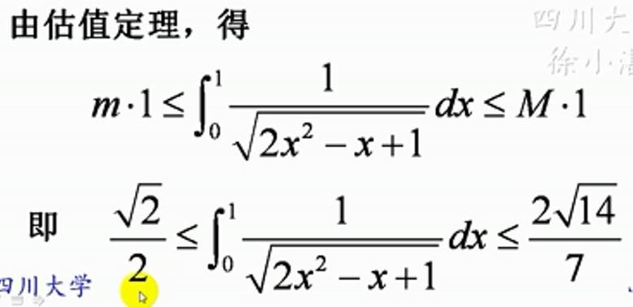

### 3、积分中值定理：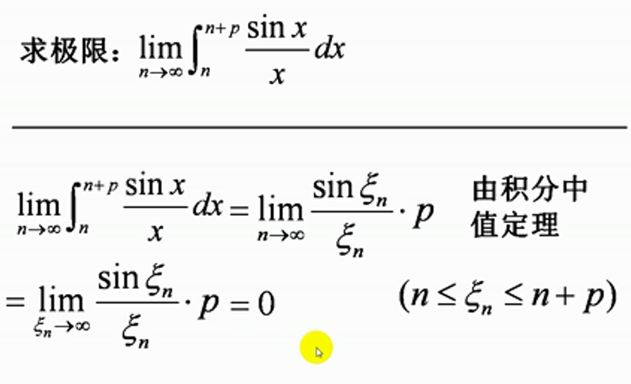

### 4、其他性质的一些应用：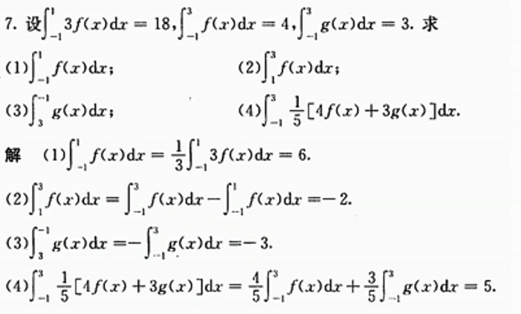
