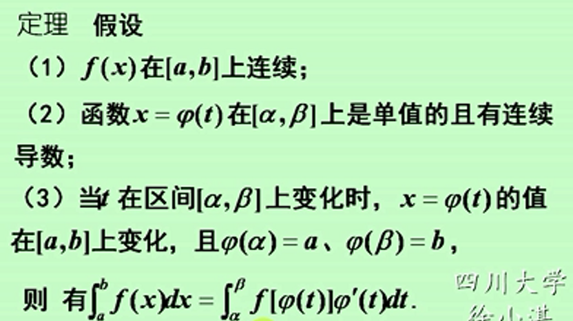
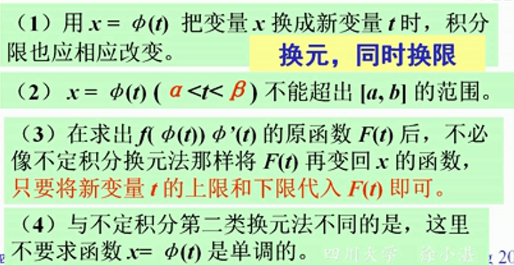
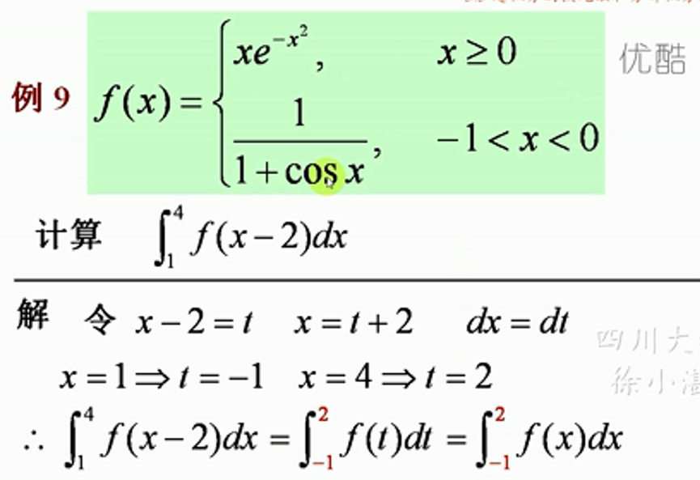
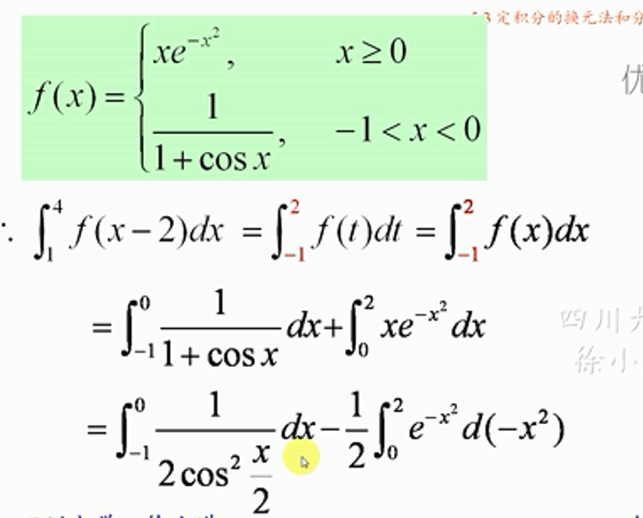
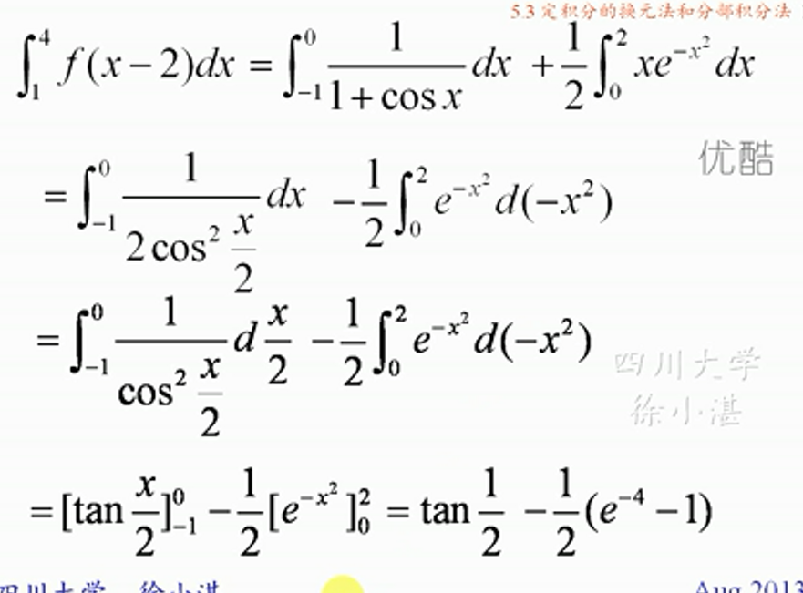
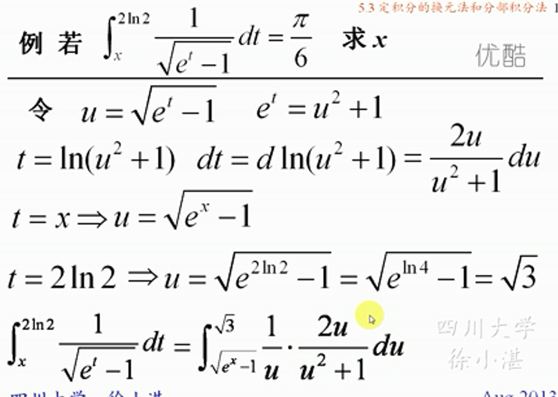
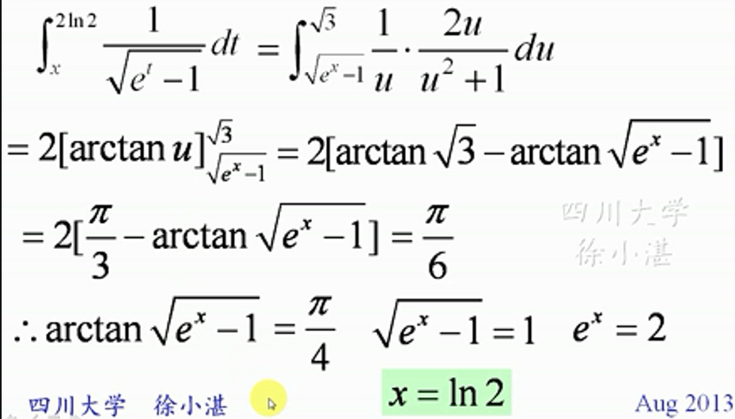
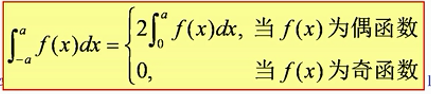
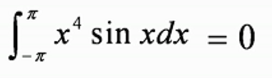

## 一、定积分换元法

###  注意：

### 例子：

### 例：

### 函数的奇偶性对积分的影响

### 例：

### 周期函数的定积分：$$\int_{a}^{a+T}f(x)dx=\int_{0}^{T}f(x)dx$$,$$\int_{a}^{a+nT}f(x)dx=n\int_{0}^{T}f(x)dx$$

### 函数与原函数奇偶性：
- #### 函数的原函数（不定积分）是偶函数
- #### 偶函数的原函数（不定积分）一般都不是奇函数
