##

## 二、积分上限函数及其导数
### 定义：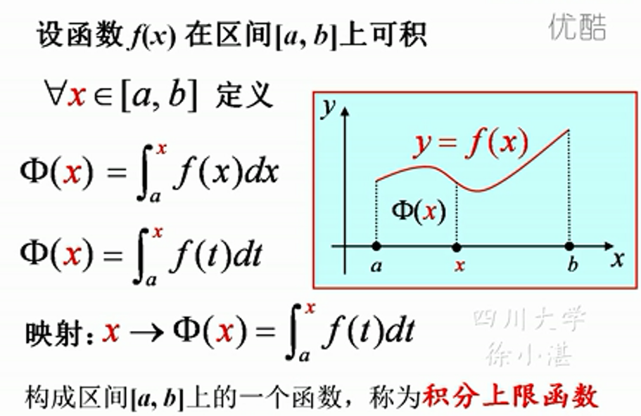

### 定理一：积分上限函数的导数：设函数f(x)在区间[a,b]上连续，则积分上限函数$\phi(x) $在区间[a,b]上可导 ，且$$\varphi'(x)=[\int_{a}^{x}f(t)dt]'=f(x)$$

### 定理二：原函数存在定理：设函数f(x)在区间[a,b]上连续，则上限函数$$\varphi(x)=\int_{a}^{x}f(t)dt$$,就是f(x)在区间[a,b]上的一个原函数。

## 三、牛顿-莱布尼茨公式
### 定理三：微积分基本定理：设函数f(x)在区间[a,b]上的一个原函数，则$$\int_{a}^{b}f(x)dx=F(b)-F(a)$$
### 三种记法：
  - #### $\int_{a}^{b}f(x)dx=F(x)|_{a}^{b}$
  - #### $\int_{a}^{b}F'(x)dx=F(x)|_{a}^{b}$
  - #### ：$\int_{a}^{b}F'(x)dx=F(b)-F(a)$
### 例：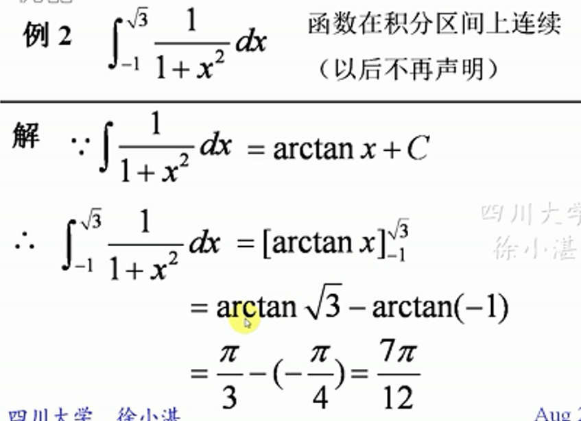
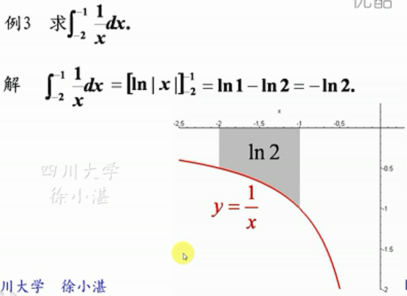
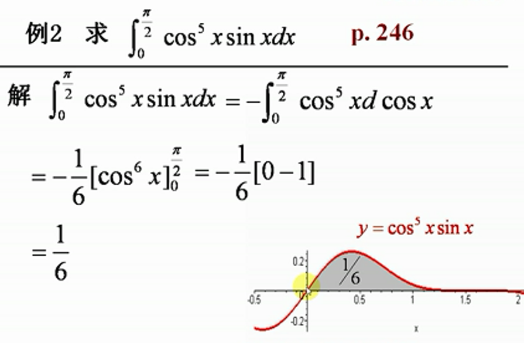
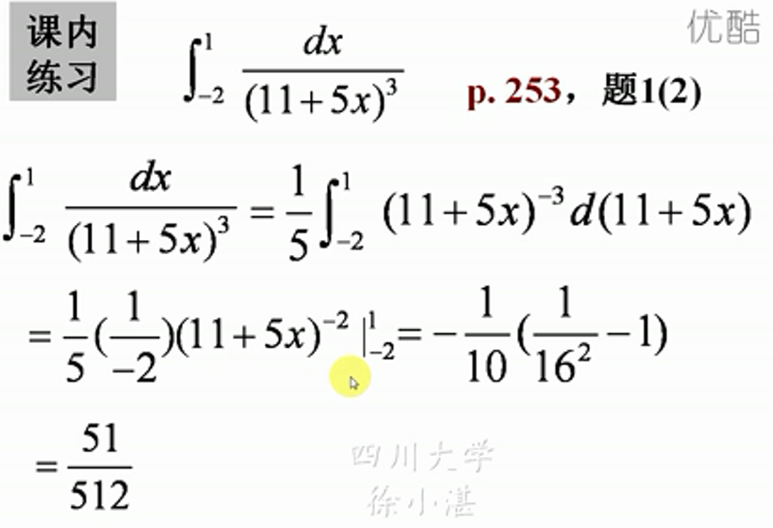

### 例：对分段函数：分段分别求积分：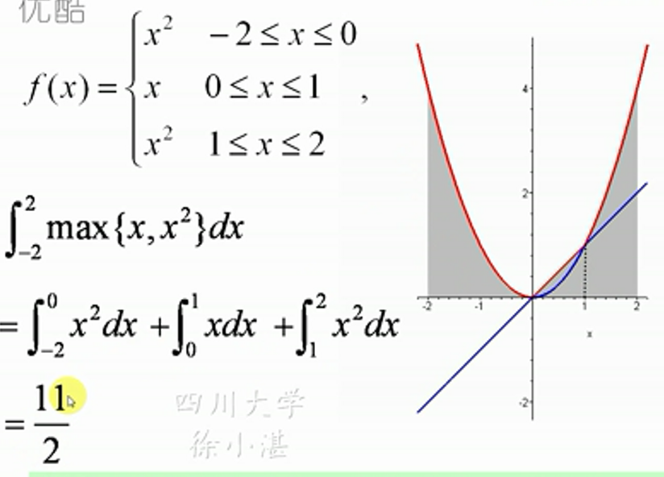

### 上下限函数的导数的求导公式：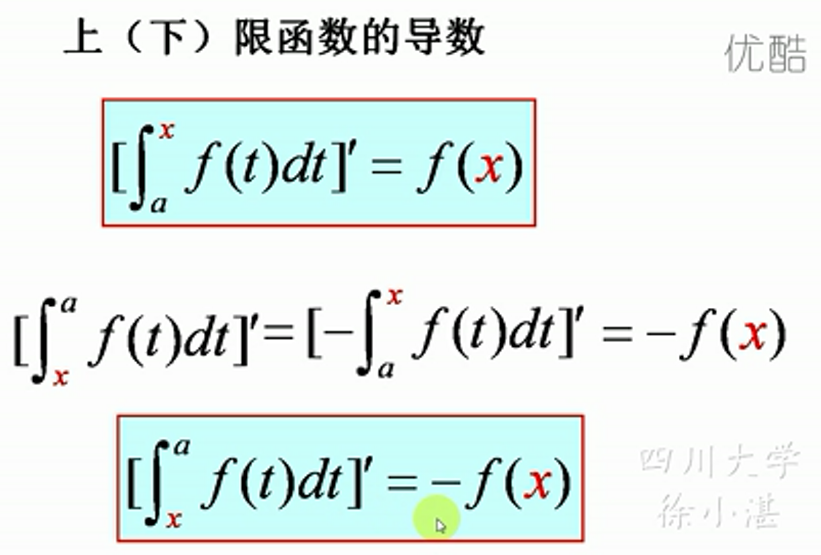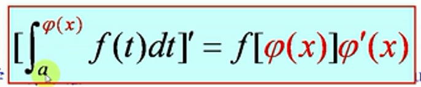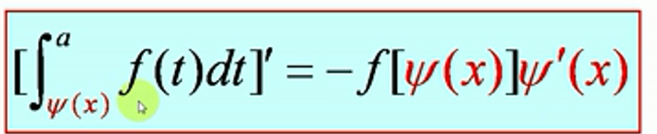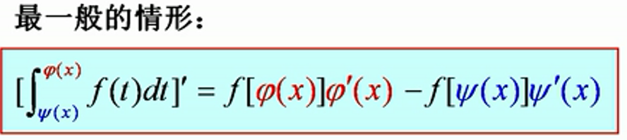
### 例：上限函数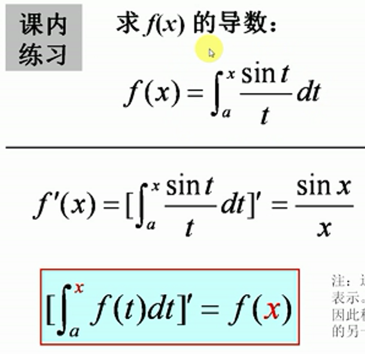

### 例：上限函数：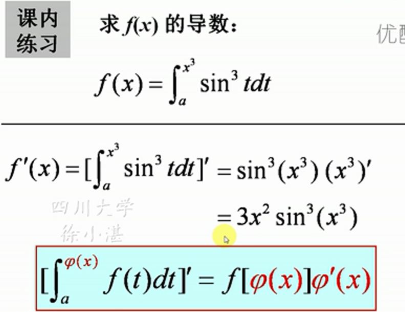
### 例：一般形式：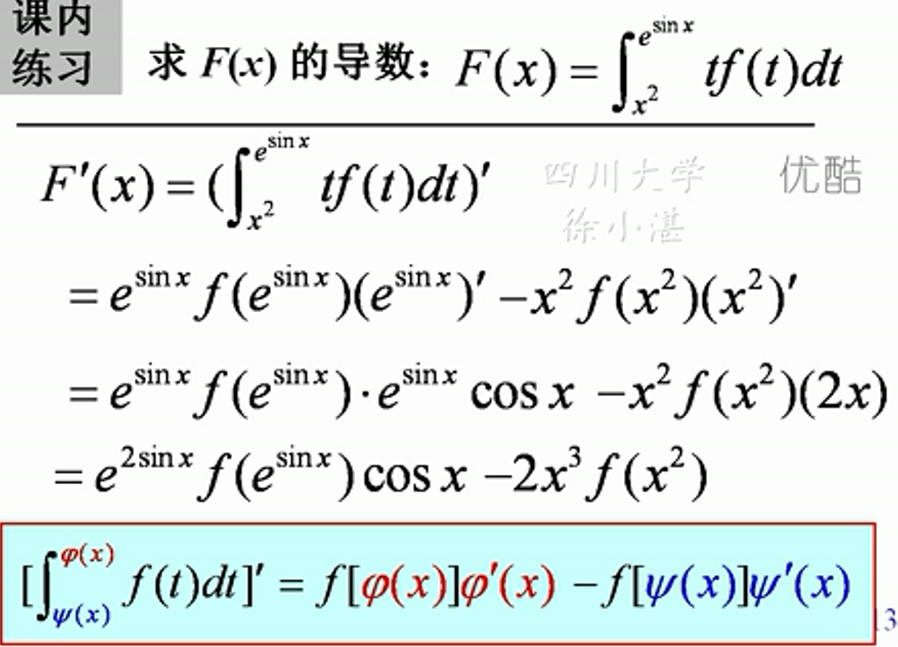

### 例：将与变量无关的量视为常数：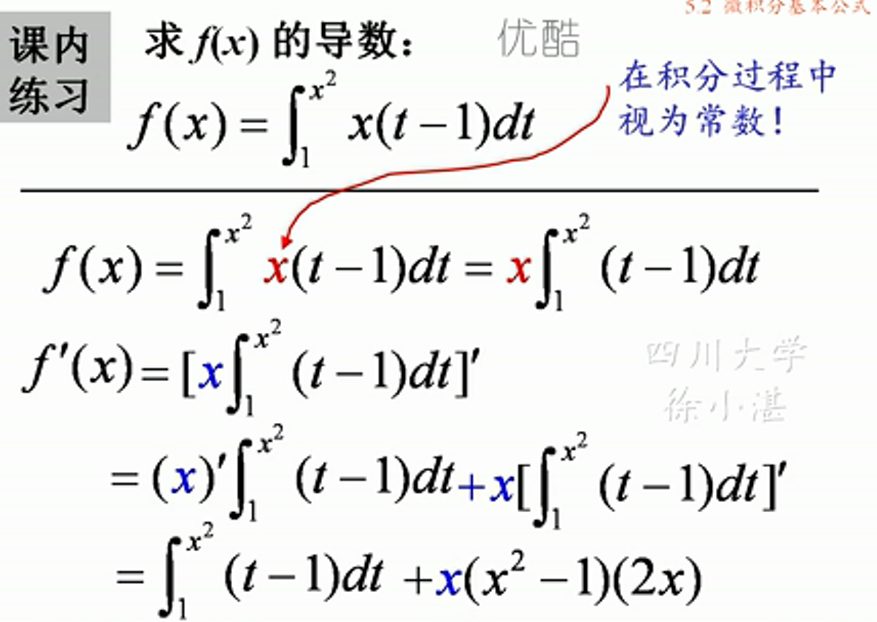
