## 一、无穷区间上的反常积分
### 定义：$$\int_{a}^{+\infty}f(x)dy=\lim_{b \to +\infty}\int_{a}^{b} f(x)dx$$,如果以上极限存在，则称反常积分收敛，其极限值为反常积分的积分值如果极限不存在则反常积分发散。（和普通积分相比，只是上限或者下限为无穷）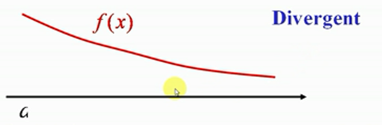
### 第二种：$$\int_{-\infty}^{b}f(x)dy=\lim_{a \to -\infty}\int_{a}^{b} f(x)dx$$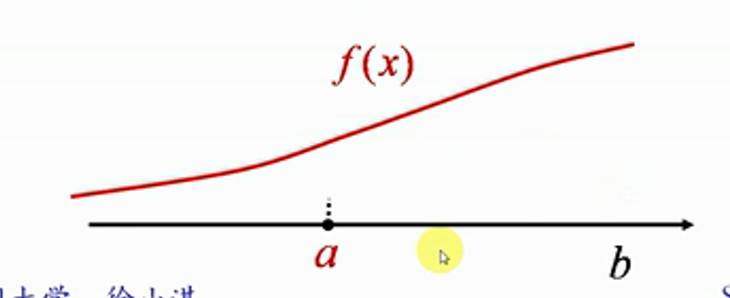

### 第三种：$$\int_{-\infty}^{+\infty}f(x)dy=\int_{-\infty}^{c}f(x)dx+\int_{c}^{+\infty}f(x)dx$$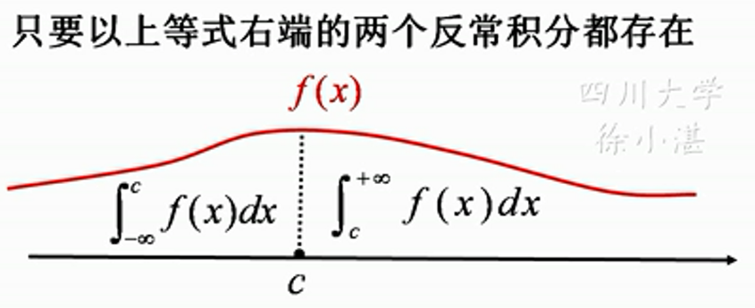

### 例：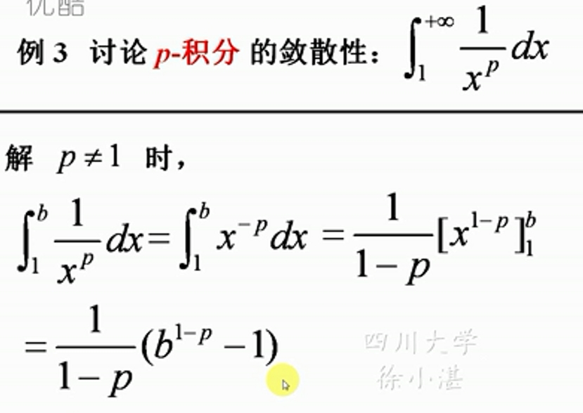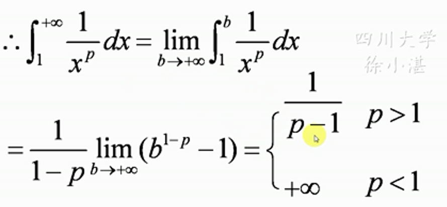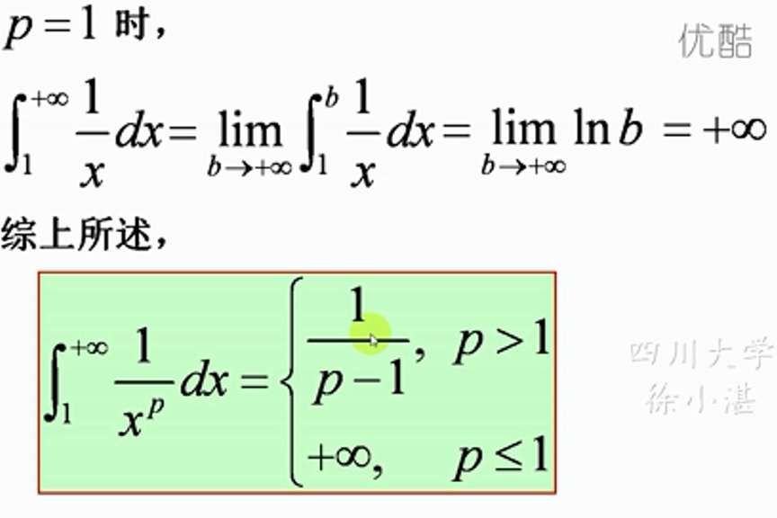更一般的结论：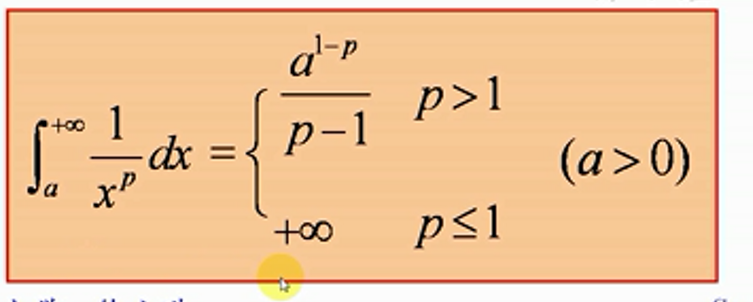

### 例：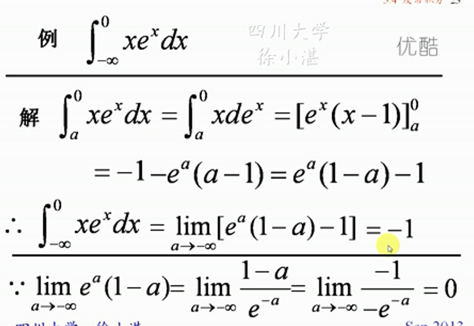同时使用分部积分法和洛必达法则
### 该类题的简单形式解法：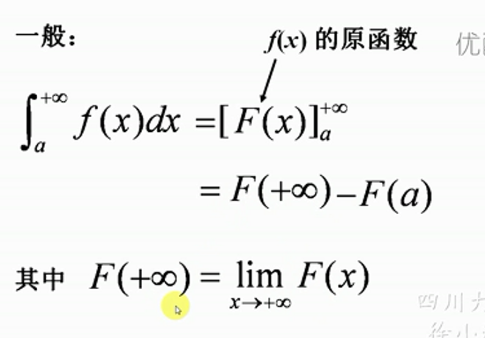即：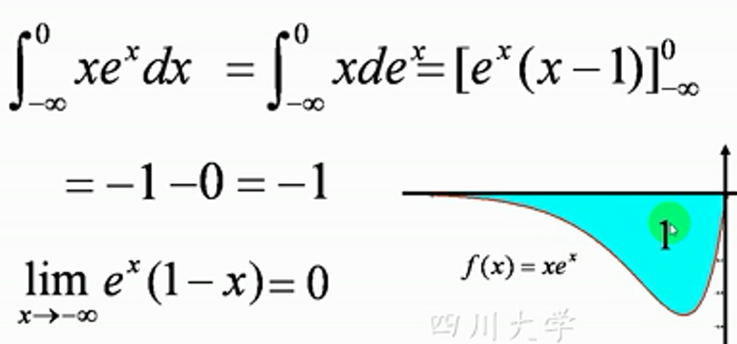
### 例：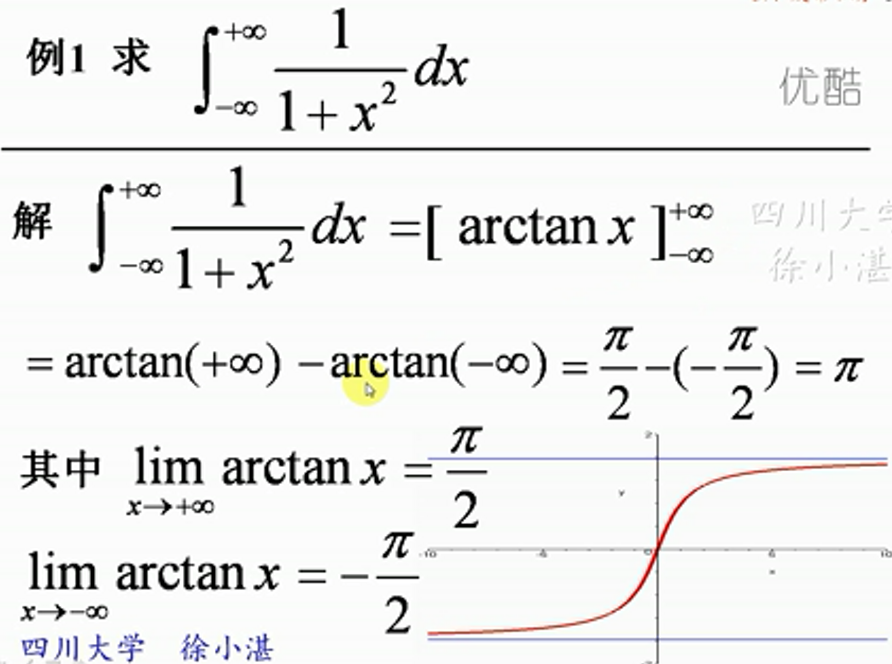

### 两个重要的反常积分: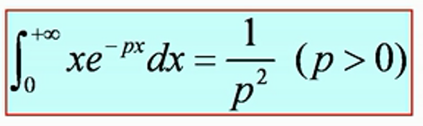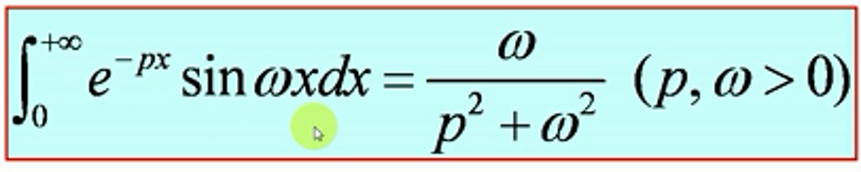
