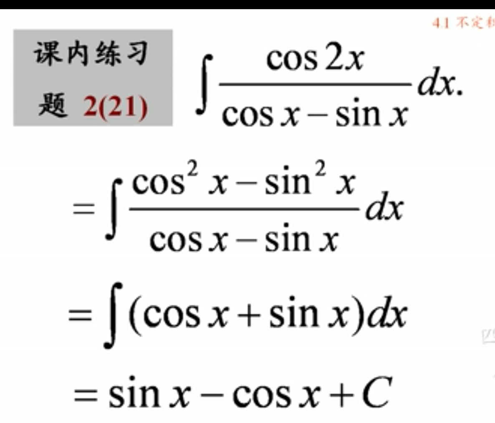

## 一、原函数与不定积分的概念

### (1) 不定积分的定义：在区间I内，函数f(x)的带有任意常数项的原函数(带有常数)称为f(x)在区间I内的不定积分，记为$\int f(x)dx$,$$\int f(x)dx=F(x)+C$$
- #### $\int$,积分号
- #### $f(x)$，被积函数
- #### $dx$，积分变量
- #### $f(x)dx$，被积表达式
- #### $F(x)$，原函数
- #### $C$，任意常数
#### 例

### (2) 不定积分的基本性质:微分运算与求不定积分的运算是互逆的。$$d \int f(x)dx=f(x)dx$$ $$\int dF(x)=F(x)+C$$，
#### 例

## 二、基本的积分公式

#### 例：

## 三、不定积分的运算性质
- ### $$\int [f(x) \pm g(x)]dx=\int f(x)dx \pm \int g(x)dx$$

- ### $$\int kf(x)dx=k\int f(x)dx (k \neq 0)$$

#### 例：
