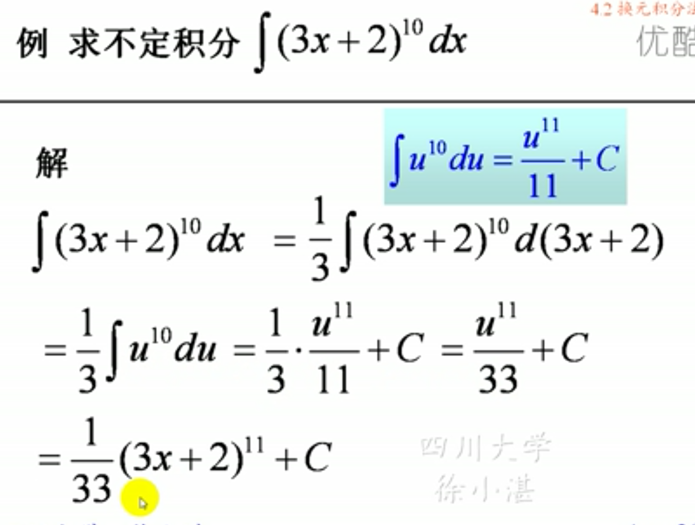
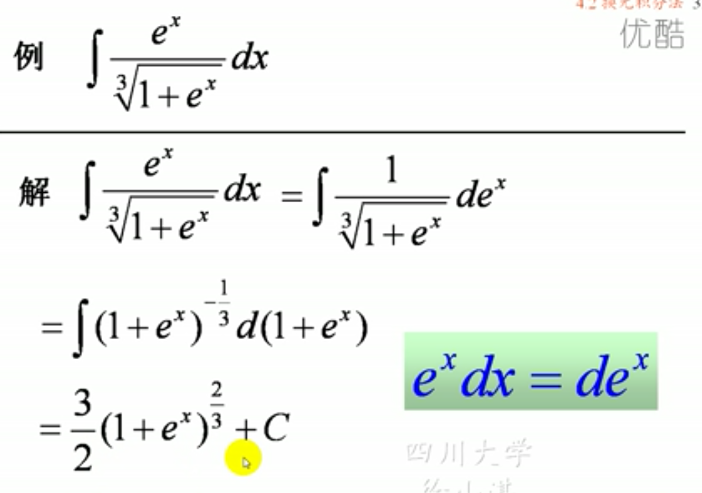
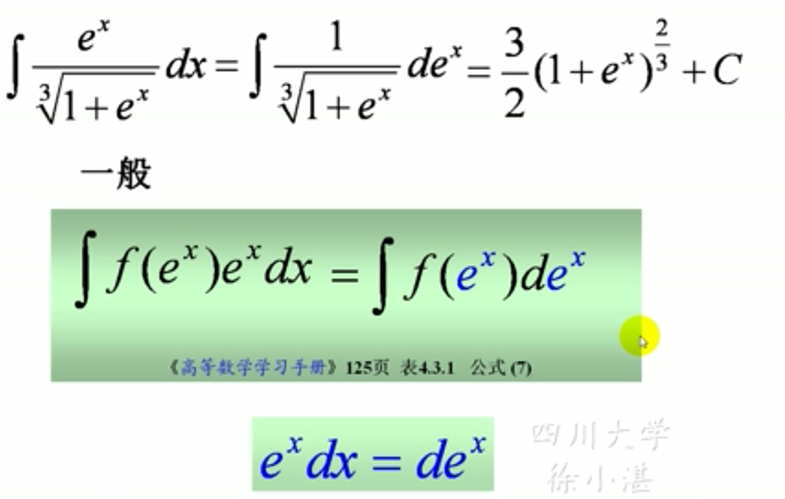
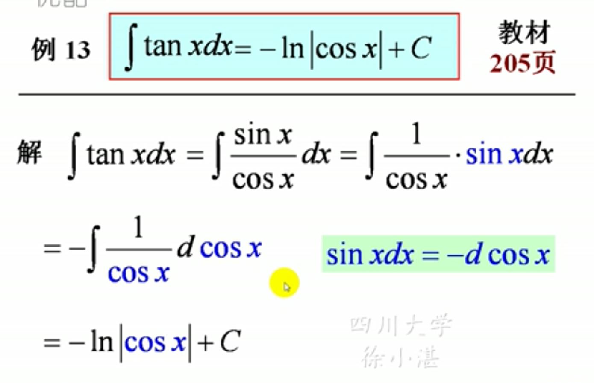

## 一、第一类换元积分法
### 定理一：凑微分法。设$\int f(u)du=F(u)+C$,则$$\int f[\varphi(x)]\varphi'(x)dx=F[\varphi(x)]+C=[\int f(u)du] $$
### 步骤：

### 一些常见的形式和例子：

### 类型一：，导出一般公式

### 其他类型总结：

### 推广幂函数的一种凑法

## 二、第二类换元积分法
### 1、有理代换：关于根号的换元。
### 一般换法：

### 2、三角代换
####  
### 例：
### 将结论直接当共使用

### 3、双曲变换

### 4、倒数变换

## 第二批积分公式：
