## 一、引例
### 大化小，常代变，近似和，去极限。

## 二、二重积分的定义与可积性
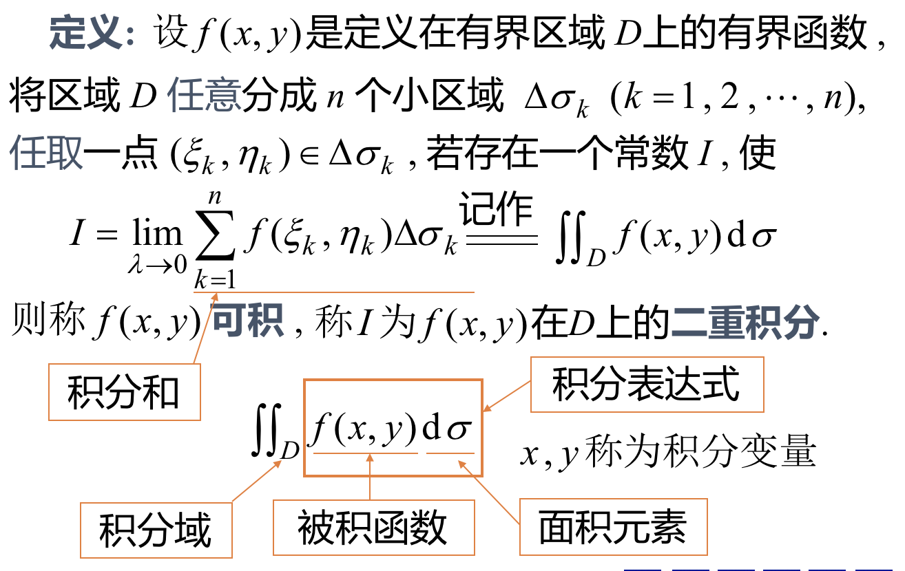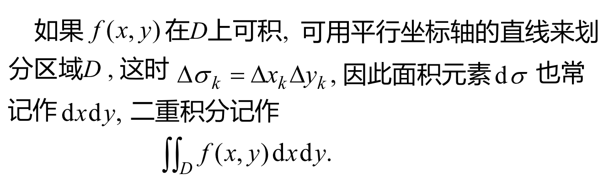

### 二重积分存在定理：
- #### 定理一：若函数$f(x,y)$在有界闭区域D上连续，则$f(x,y)$在D上可积。
- #### 定理二：若有界函数f(x,y)在有界闭区域D上除去有限个点或者有限个光滑曲面外都连续，则f(x,y)在D上可积。

## 三、二重积分的性质
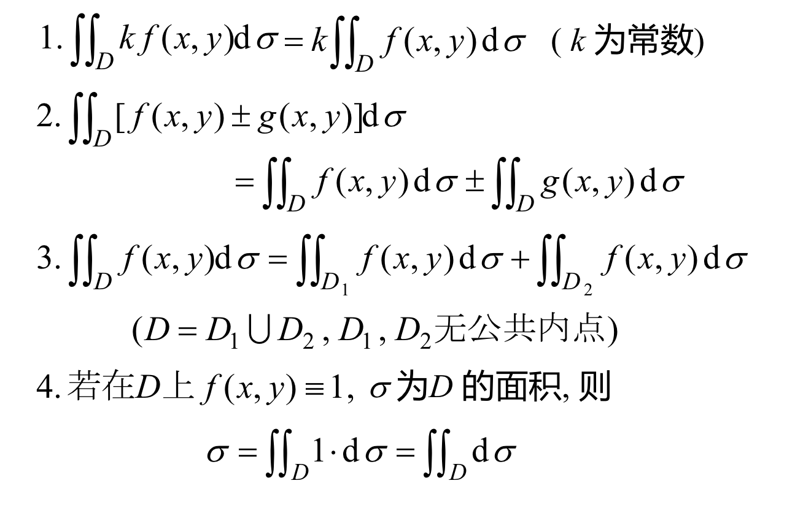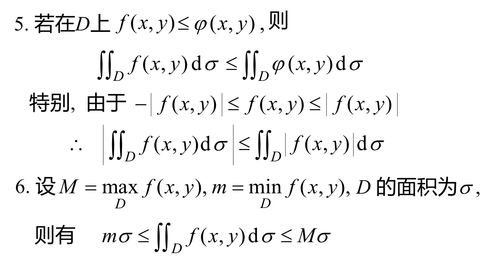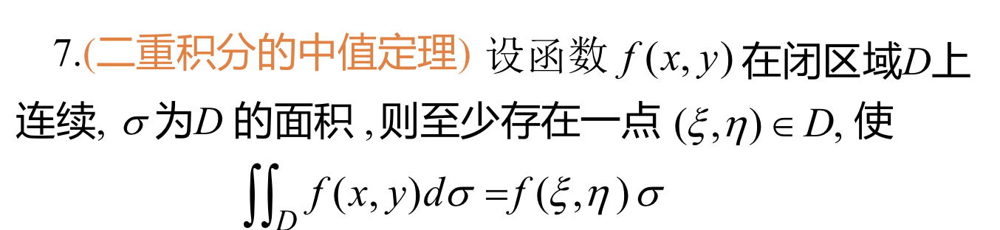

### 例：利用性质5
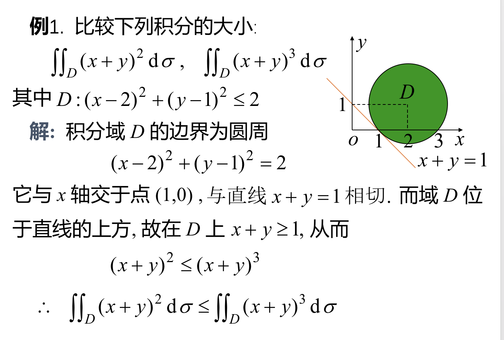

### 例：性质6，求近似值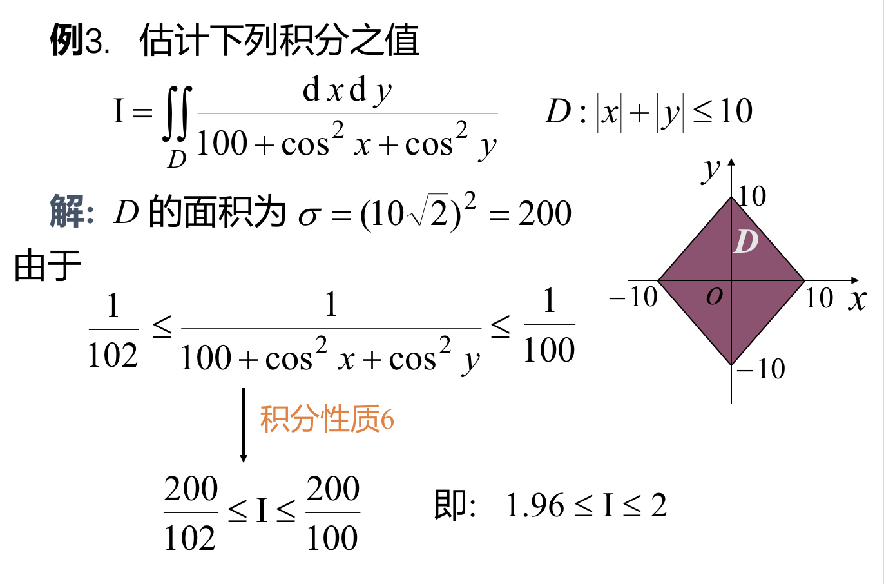

### 函数奇偶性对积分的影响
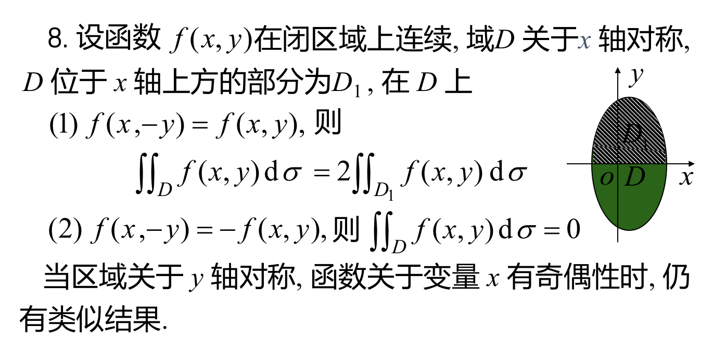

## 四、曲顶柱体体积的计算
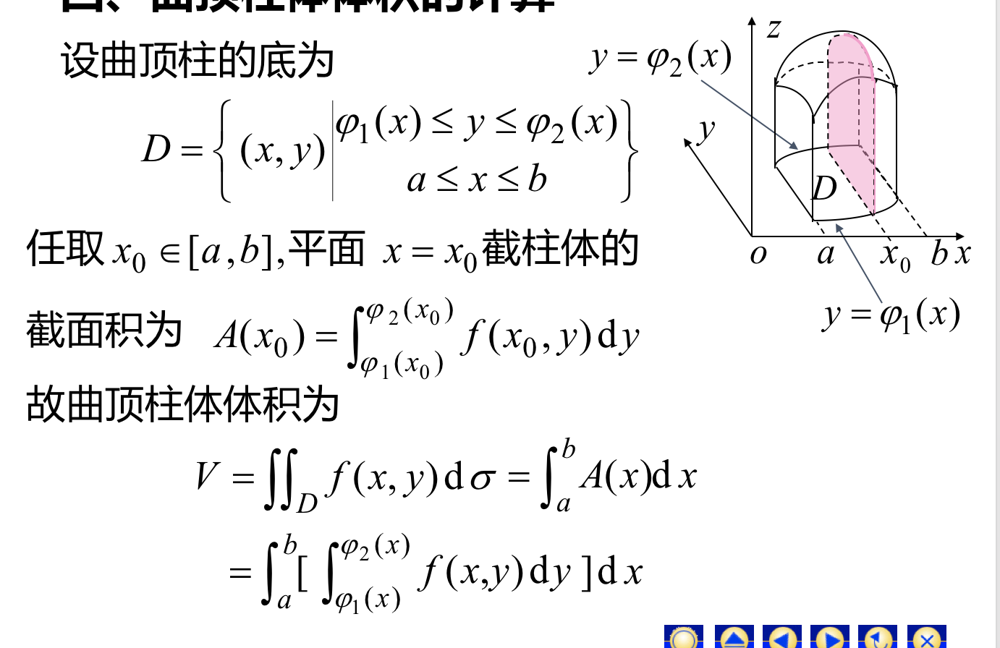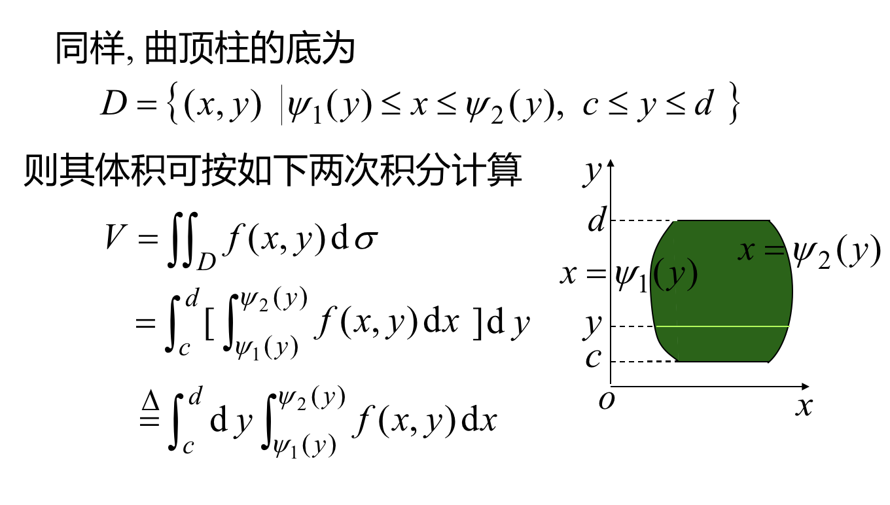

### 总体的思路是：分别对底和高求积分。

### 例：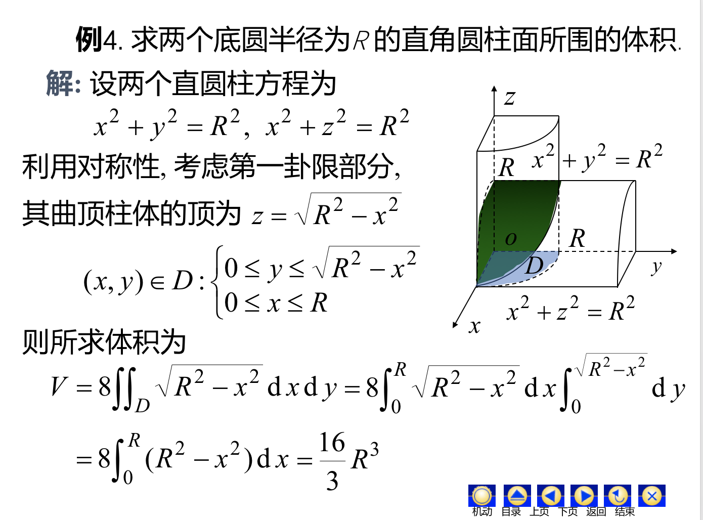
