## 一、利用直角坐标计算二重积分
### 定义：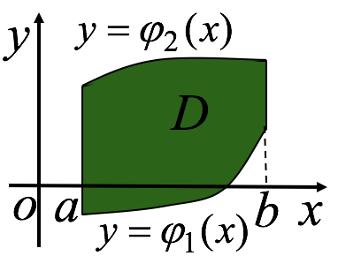由曲顶柱体体积的计算可知, 当被积函数$f(x,y) \geq 0$，且在D上连续时，若D为X-型区域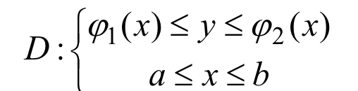则$$\int\int_Df(x,y)dxdy=\int_{a}^{b}dx\int_{\varphi_1(x)}^{\varphi_2(x)}f(x,y)dy$$
### 若D为Y-型区域：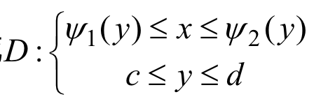则$$\int\int_Df(x,y)dxdy=\int_{c}^{d}dy\int_{\psi_1(x)}^{\psi_2(x)}f(x,y)dx$$

### 若积分区域既是X-型又是Y-型区域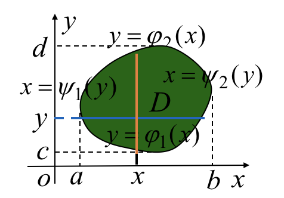，则有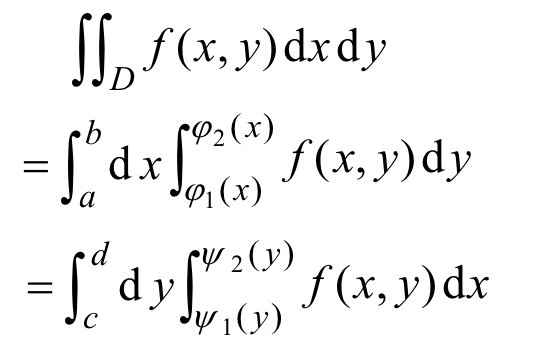为了方便计算可*选择积分序*，必要时还可以*交换积分序*。
### 若积分域复杂，可将它分成若干X-型域或Y-型域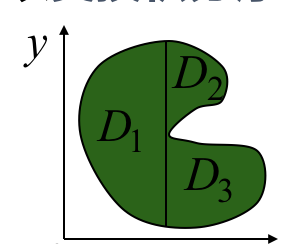则：$$\int\int_D=\int\int_{D1}+\int\int_{D2}+\int\int_{D3}$$

### 例1：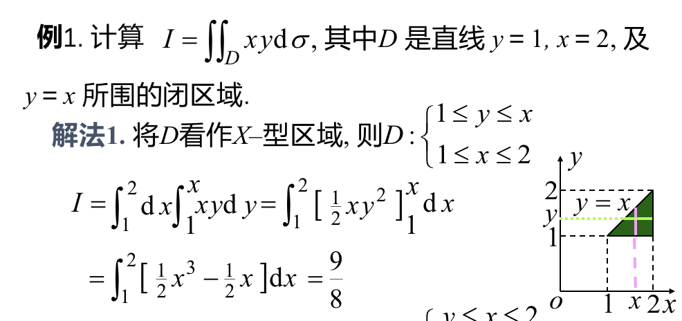如果看成X-型区域：首先就是从垂直于X轴的方向进行扫描。内部积分的下限是y=1，上限是y=x(线到线)。外部积分的上下限是x=1,x=2。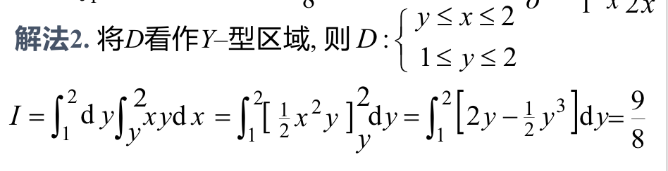如果看成Y-型区域：首先就是从垂直于Y轴的方向进行扫描。内部积分的下限是x=y(注意此时使用y来表示x)，上限是y=2。外部积分的上下限是y=1,y=2。

### 例2：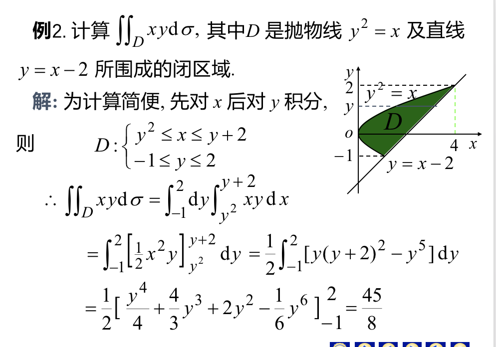这个题特殊的地方是：如果看成X-型的，那么x的会因为所在区间的不同而有不同的表达式，必须要分部计算。所以看成Y-型会方便计算。

### 例3：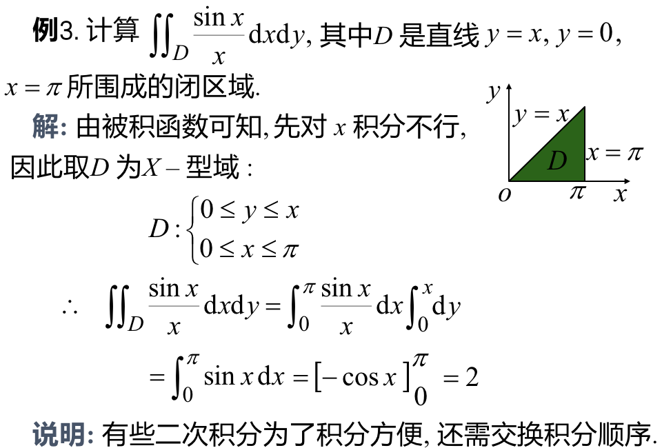

### 例4：交换积分顺序：
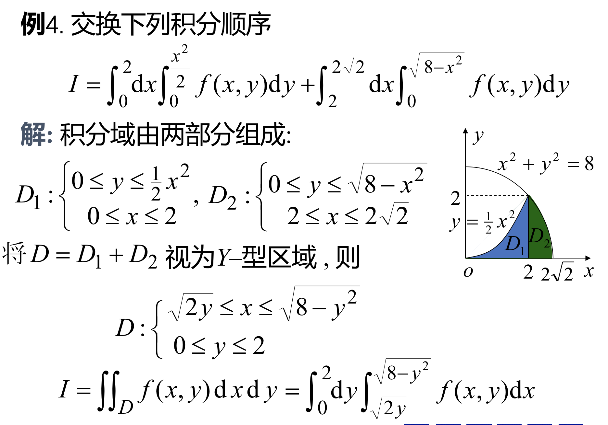思路：将两个积分拼接起来，重新确定上下限
## 二、利用极坐标计算二重积分
### 定义：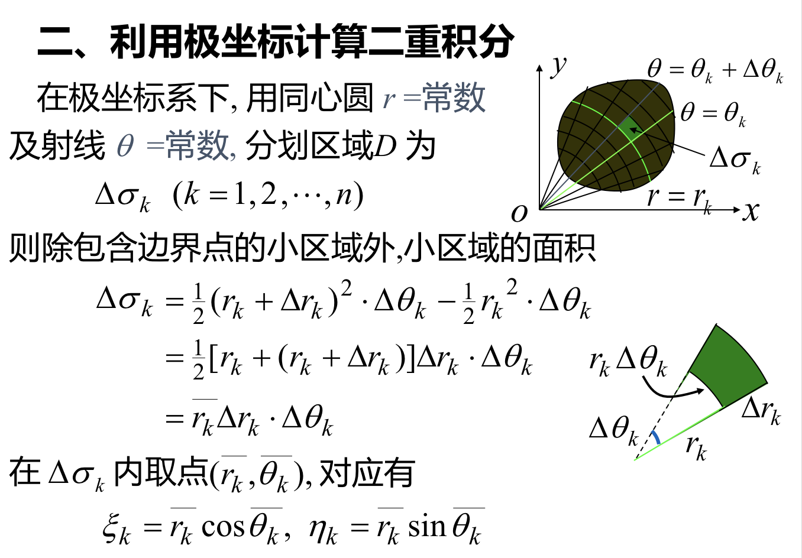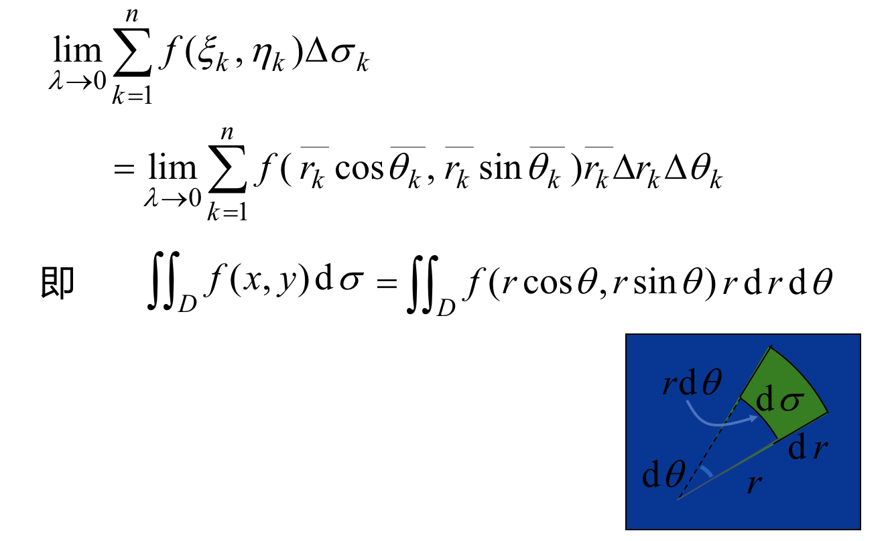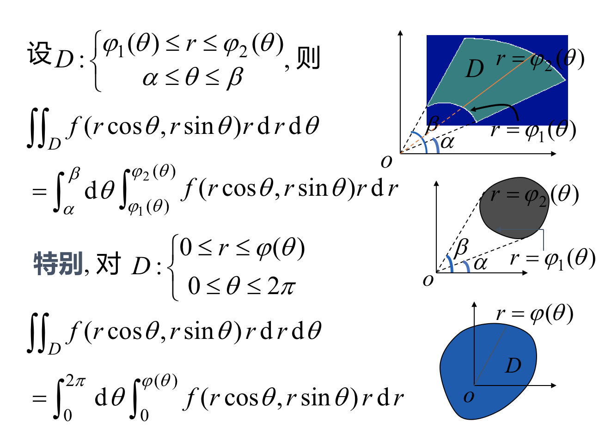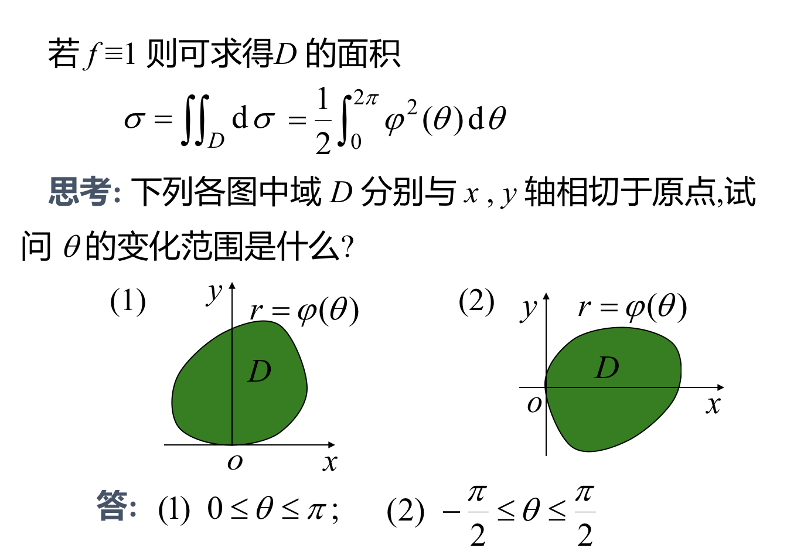

### 例：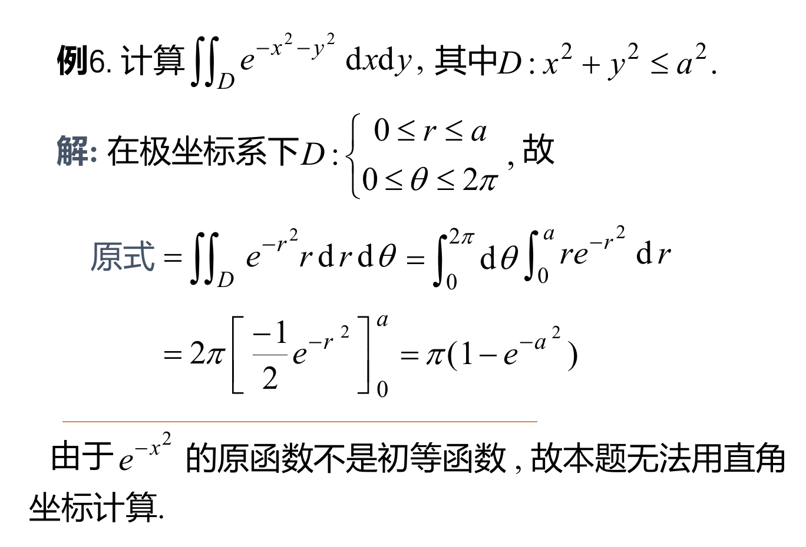

## 三、二重积分的换元法
