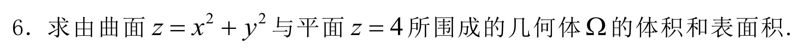
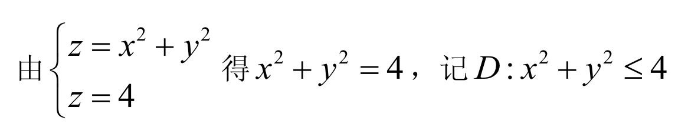
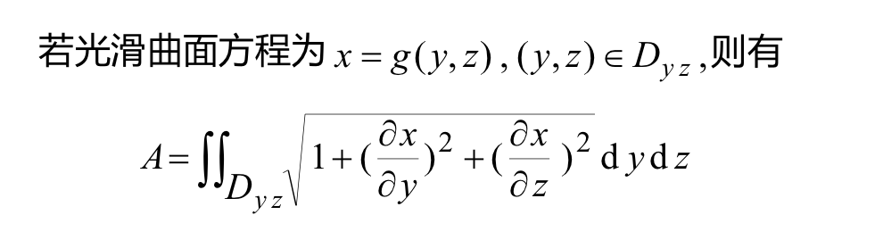
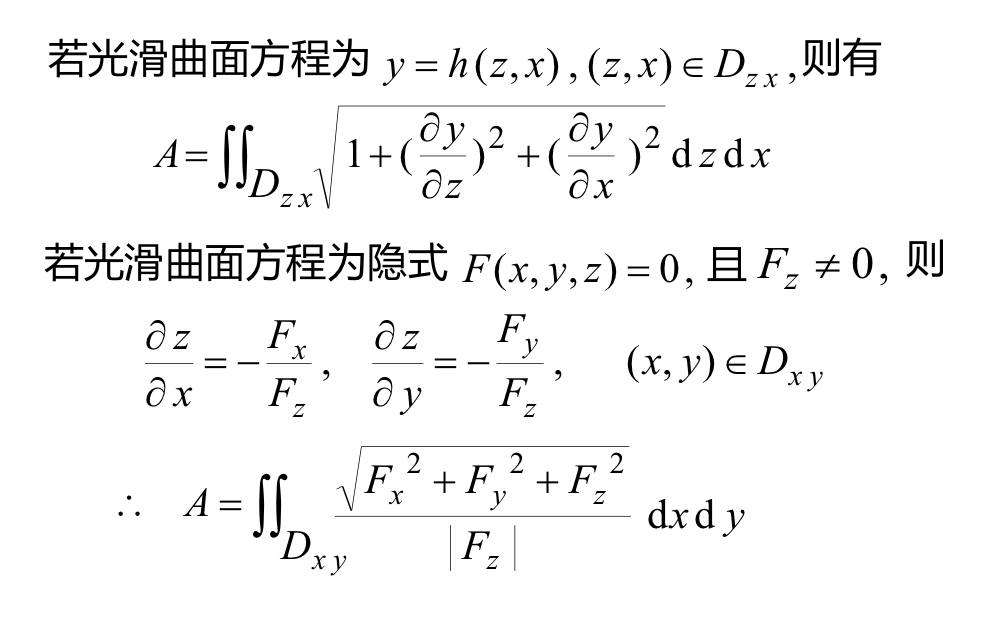
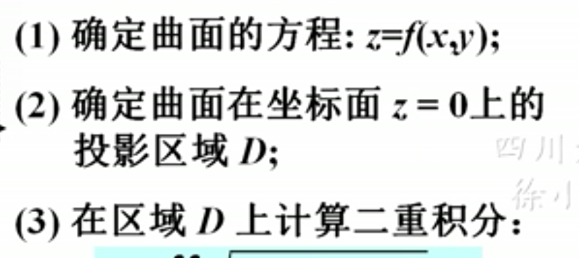
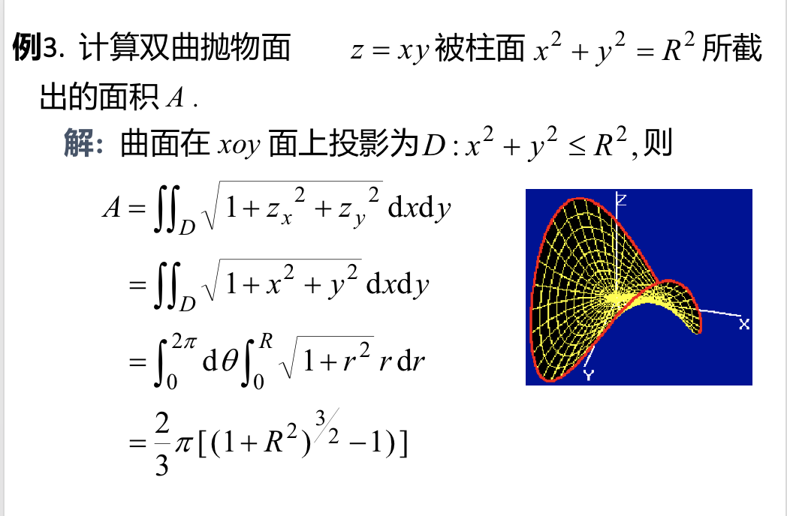

## 一、立体的体积
### (1)利用二重积分算体积：$$V=\int \int_D f(x,y)dxdy$$
### 主要是要找出f(x,y)的表达式。以及积分的区域D，也就是投影面。

#### 例：
#### 解：
> #### (1)首先根据两个式子确定出要求的图形。该题是一个抛物面和一个平面组合成的开口向上的曲顶柱面。
> #### (2)根据图形和给出的式子计算出积分区域D
> #### (3)(由下向上看)此时的图形的体积=以z=4为顶的圆柱体的体积-以$z=x^2+y^2$为顶的曲面柱体的体积。至此，积分区域上的f(x,y)确定：$f(x,y)=4-x^2-y^2$
> #### (4)通过二重积分，根据D和f(x,y)列式:$$V = \int \int_D 4-x^2-y^2 dxdy$$
> #### (4)解二重积分。V=8PI

### (2)利用三重积分算体积
$$V=\int \int \int     dxdydz$$

### (3)极坐标下算体积

## 二、曲面的面积
### 思路：做投影面，用投影面上的二重积分近似代替要求的曲面的面积。(所以第一步要先把投影面找出来)
### 公式$$\int \int_D\sqrt{1+(\frac{\partial z}{\partial x})^2+(\frac{\partial z}{\partial y})^2}dxdy$$
### 在其他两个面上的投影的时候

### 例注意其中D是怎么的出来的。(主要就是要把D找出来)
