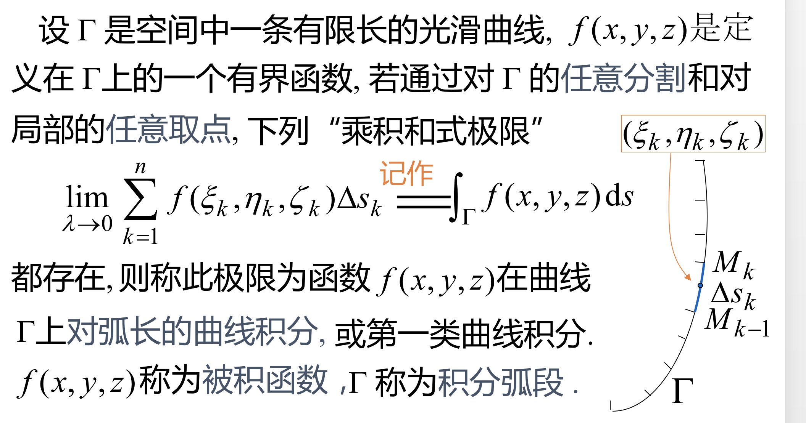
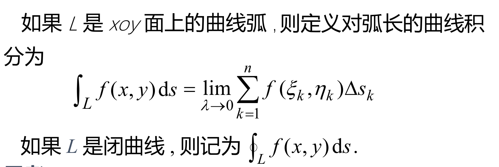
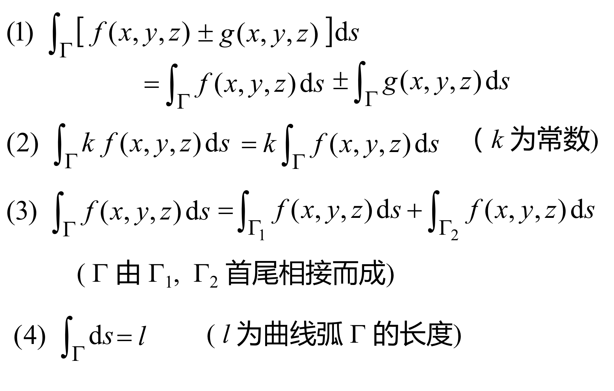
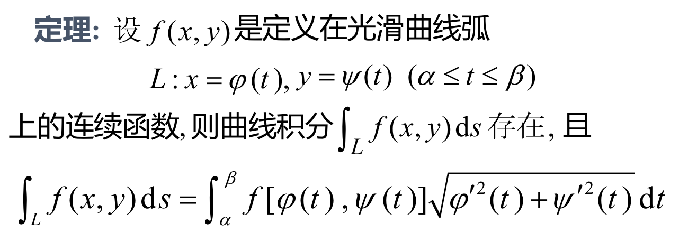
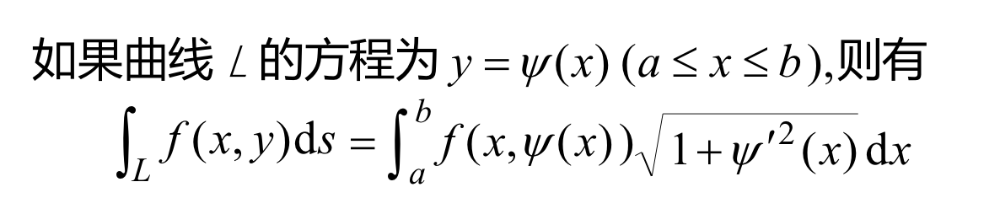
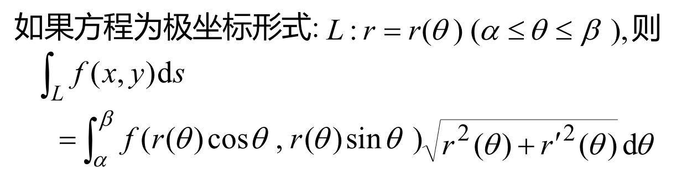
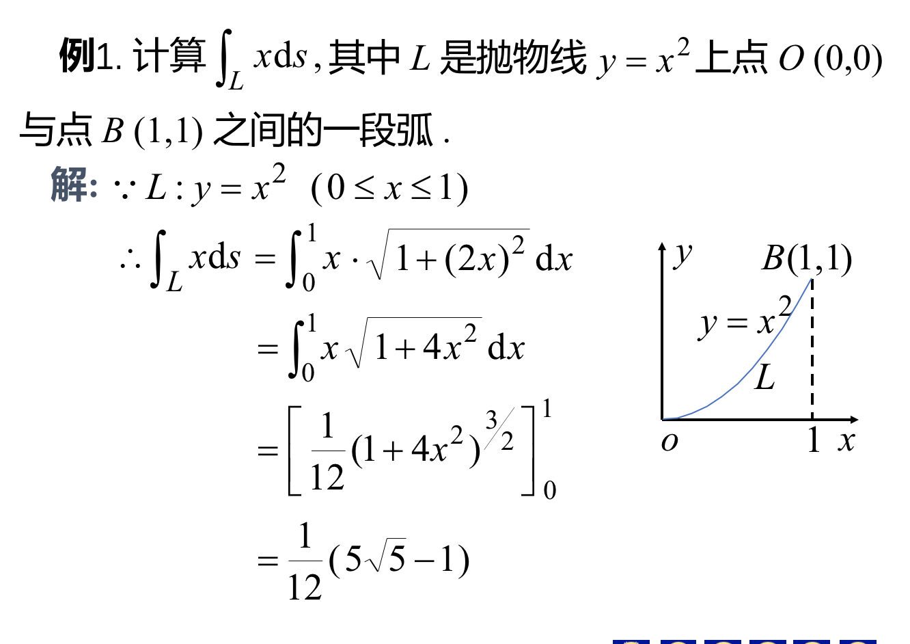
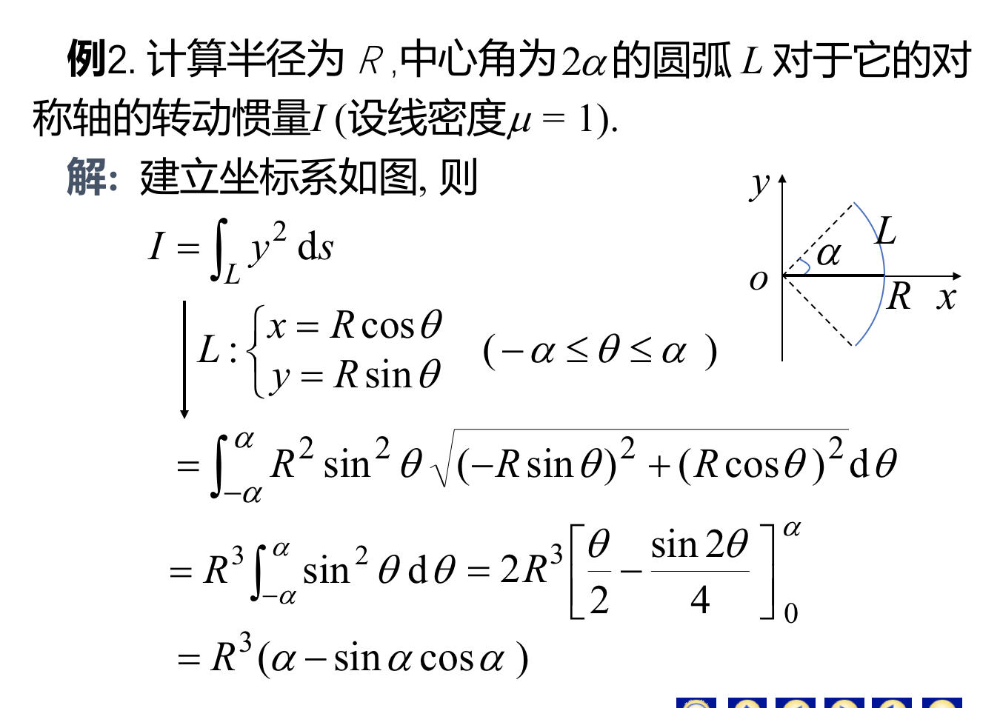
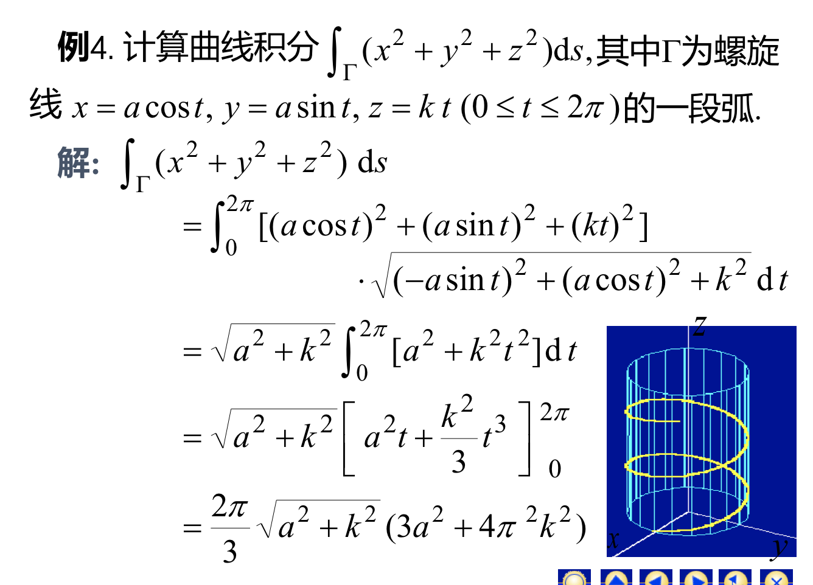

## 对弧长的曲线积分
### 一、对弧长的曲线积分的性质和概念
### 定义：

### 性质：

### 二、对弧长的曲线积分的计算法
### 基本思路：求曲线积分--->计算定积分

### 根据此定理，可以将x，y参数化。然后曲线积分就变成了定积分。就可以计算了。(注意，参数化之后有3个地方需要换：积分上下限，被积函数，积分对象)
### 三种特殊情况
- ### 其中，当y可以用x表示时，
- ### 或者x可以用y表示
$$ \int_L f(x,y)ds=\int_{y_0}^{Y}f[\varphi(y),y] \sqrt {1+\varphi'(y)}dy$$
- ### 

### 例题：

## 关于弧长的曲线积分的计算：
### 核心是换成定积分来计算。需要根据积分曲线的形式来确定处理方式。
#### 1、参数方程型

#### 2、显函数给出y=y(x)

#### 3、显函数给出x=x(y)

#### 4、极坐标形式

#### 5、空间曲线形式
