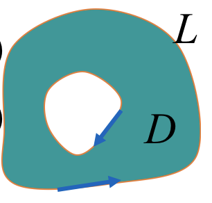
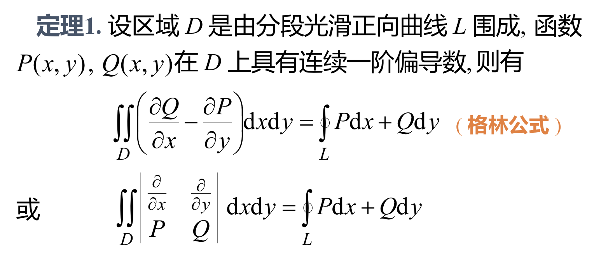
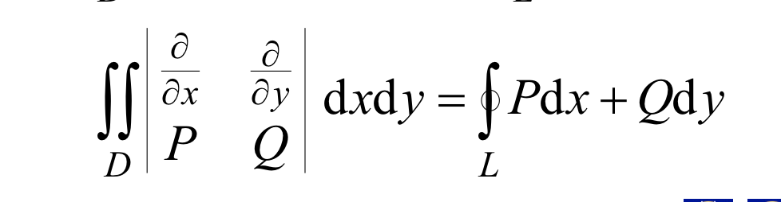
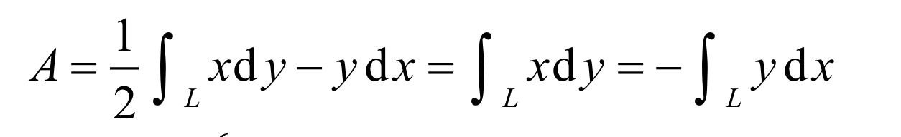
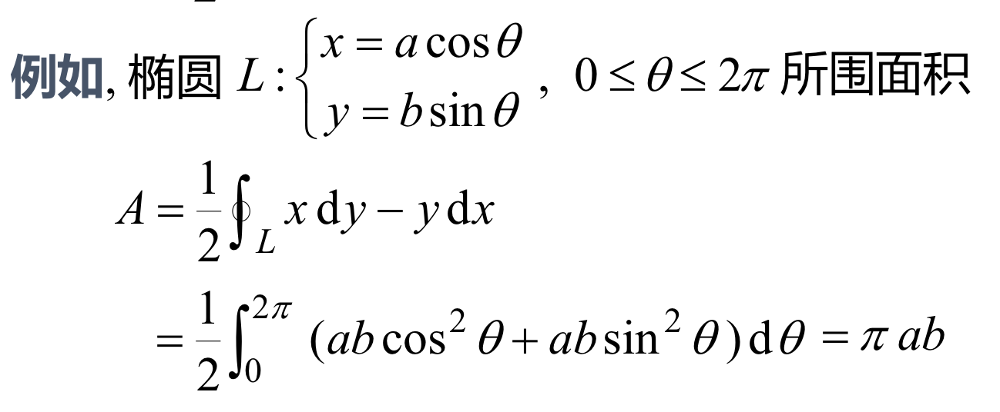
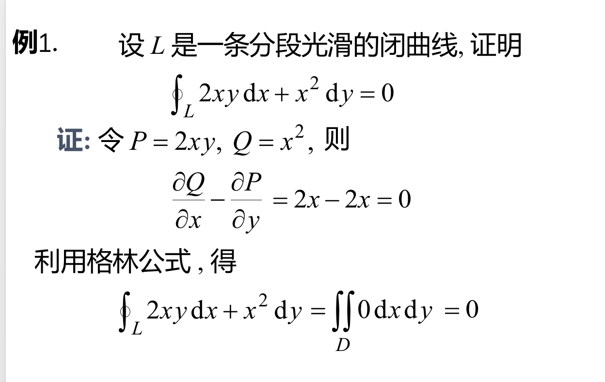
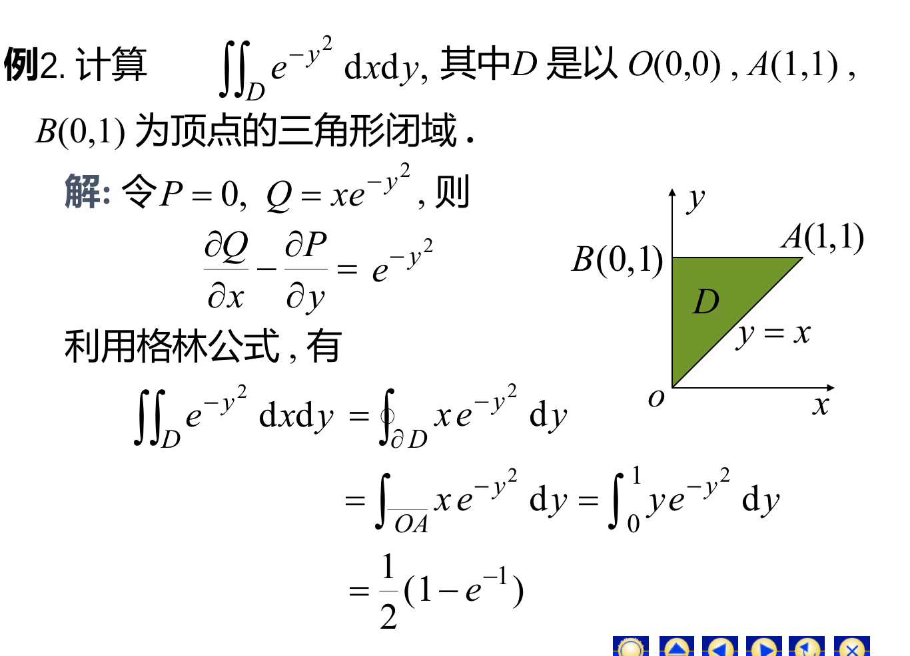
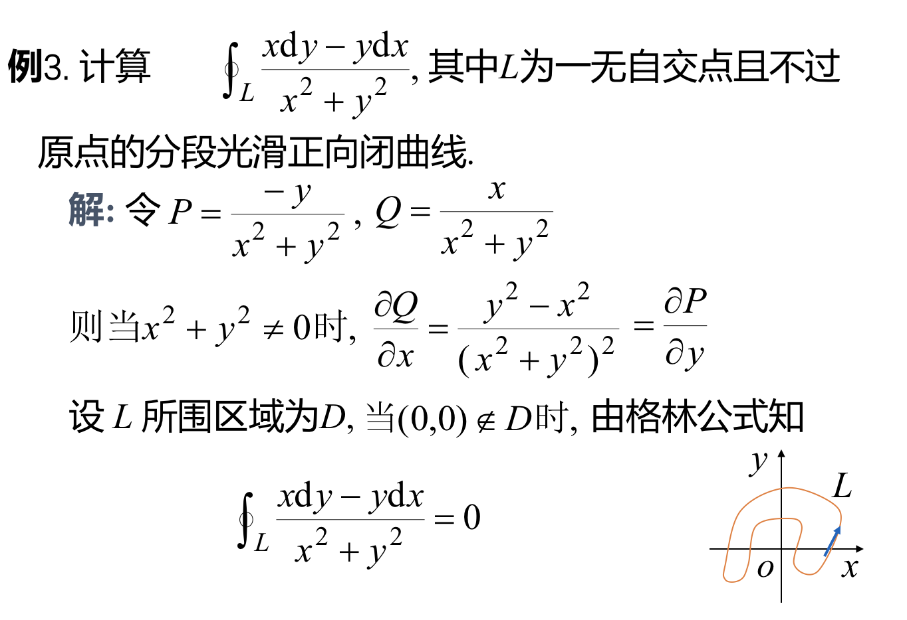
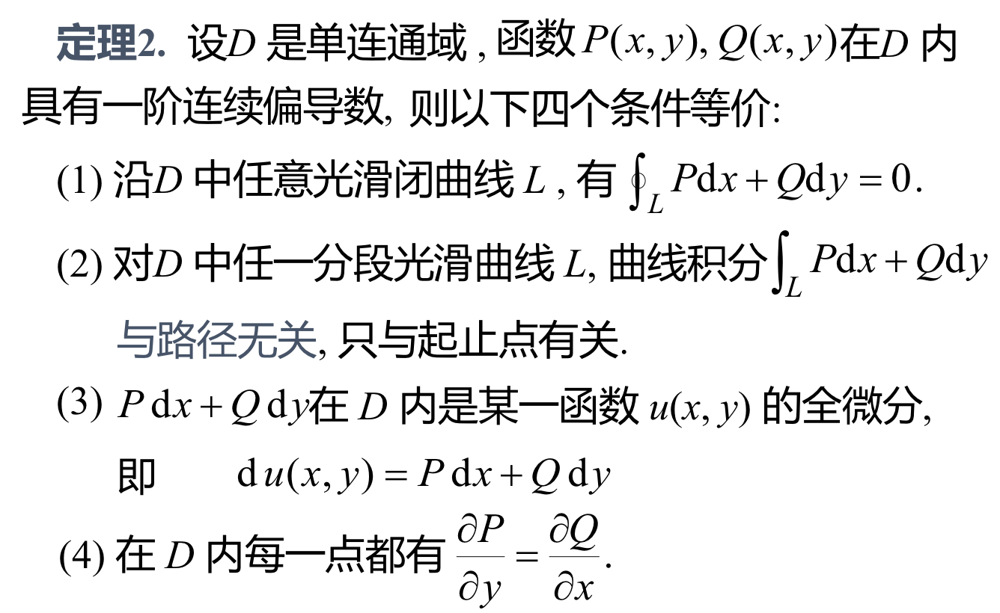

## 格林公式及其应用

## 一、格林公式
### 1、区域的分类：其中，在外部逆时针是正方向，在内部顺时针是正方向。或者格林公式的意义是，可以将一个对坐标的曲线积分转换成二重积分。（或者把二重积分转换成第二类曲线积分）格林公式的用法是：如果对坐标的曲线积分计算比较困难，则转换成二重积分计算，反之亦然。（哪个不好算就不算哪个，用另一种方式计算）
### 格林公式的推论：计算正向闭曲线L所围成的的区域D的面积。

### 例1：
### 例2：
### 例3：

## 二、平面上曲线积分与路径无关的等价条件
