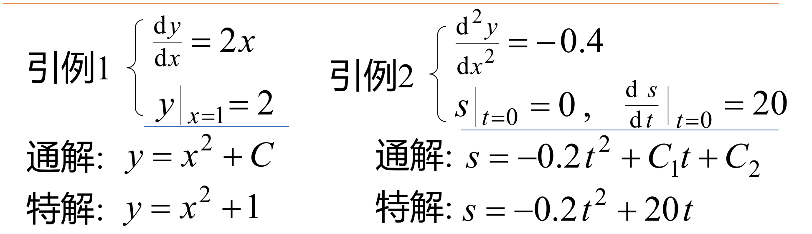
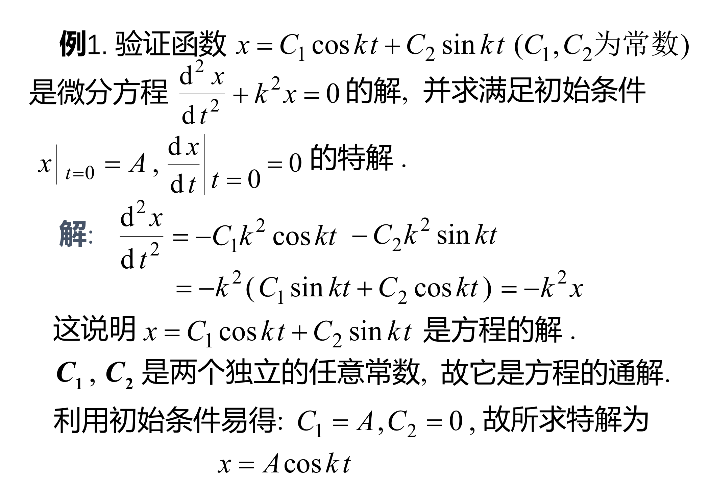

# 微分方程的基本概念

## 微分方程：含有**未知方程及其导数**的方程叫做微分方程

## 微分方程的阶：方程中含未知函数的导数的最高阶数

## n阶微分方程的两种形式( $y^{(n)}$ 为要求的微分方程)：$$ F(x,y,y',....,y^{(n)})=0 $$ ,$$y^{(n)}=f(x,y,y',...,y^{(n-1)})$$（微分方程的显式形式）

## 微分翻方程的解：(使方程称为恒等式的函数)

### 微分方程的通解：（任意常数的个数与阶数相同）

### 微分方程的通解：（不含任意常数）

### 例