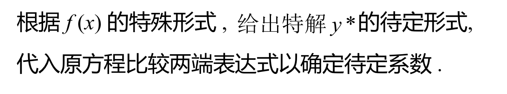
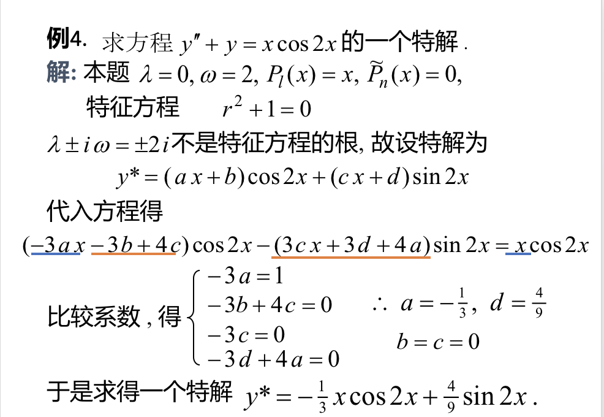

## 一、$f(x)=e^{\lambda x}P_m(x)$型
### 1、二阶常系数线性非齐次微分方程:$$y''+py'+qy=f(x)$$(p,q为常数)

### 2、解法思路：
### 使用待定系数法：

### 待定系数法大概的推导过程：

### 总结其结论为：也就是说，特解的形式为:$$y^* = x^kQ_m(x)e^{\lambda x}$$

### 例：

### 基本步骤
- #### (1)根据微分方程的右侧得出 $\lambda$
- #### (2)写出特征方程
- #### (3)由特征方程和$\lambda$得出k
- #### (4)根据k,$\lambda$,m，设一个特解$y^* $(其中m为微分方程右侧的x的最高次系数)
- #### (5)求出$y''$,$y'$，带入原方程中
- #### (6)整理，对比两侧，得到特解的系数。

## $f(x)=e^{\lambda x}[P_l(x)\cos \omega x+P_n(x)\sin \omega x]$型
### 说明：其中$P_l(x)\cos \omega x,P_n(x)\sin \omega x$这两个为共轭的

### 1、相关的形式：
#### (1)判断$\lambda$的值 $$y''+py'+qy=e^{\lambda x}[P_l(x)\cos \omega x+P_n(x)\sin \omega x]$$

#### (2)判断m的值:m为右侧的式子中的x的最高次系数。这个地方需要注意的是：是x的最高次而不是$\cos x$或者$\sin x$的最高次。比如：最高次为0而不是1。

#### (3)用这个和特征方程的根对比，就得出k(k=0,1)。$$\lambda \pm \omega i$$

#### (4)特解的形式：

### 2、解法：
#### (1)根据公式得出$\lambda$,$\omega $,m的值
#### (2)根据给出的方程写出特征方程。
#### (3)将$\lambda \pm \omega i$带入特征方程，验证其是否是特征方程的根($i^2=-1$)。据此得出k。
#### (4)根据k,$\lambda$,m,$\omega$来设出特解。
> ##### $R_m$的形式的问题:
> - ##### m=0 : $R_m=a$
> - ##### m=1: $R_m=ax+b$
> - ##### m=2 : $R_m=ax^2+bx+c$

#### (5)求特解的$y',y''$然后代回到原方程去整理。
#### (6)根据待定系数法，解出$y^* $

### 3、两个例题的完整的解法。

