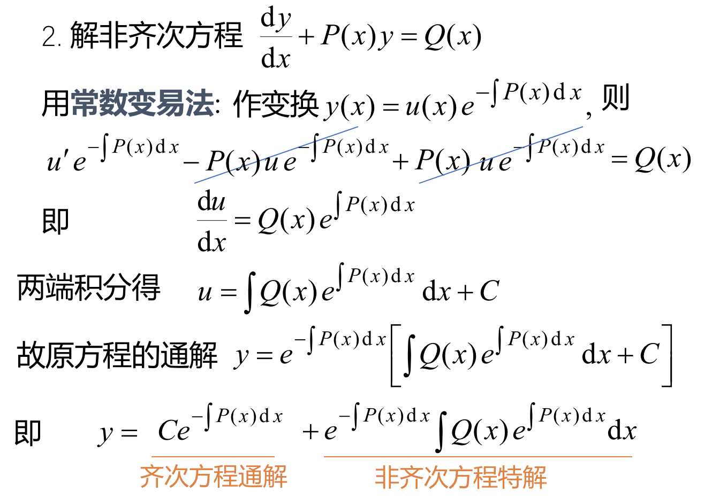

## 一、一阶线性微分方程
### 1、一阶线性微分方程的标准形式：$$\frac{dy}{dx}+P(x)y=Q(x)$$

- #### 若Q(x)=0,称为一阶线性齐次方程
- #### 若Q(x)$\neq$0，则称为一阶线性非齐次方程

### 2、解齐次方程的方法：
> 

### 齐次方程的通解（重要）：$$y=Ce^{\int -P(x)dx}$$

### 3、解非齐次方程方法:

### 非齐次方程的通解=齐次方程的通解+非齐次方程的特解。公式：$$y=Ce^{-\int P(x)dx}+e^{-\int P(x)dx}\int Q(x)e^{\int P(x)dx}dx$$
### 化成这个形式更好算:$$ e^{-\int P(x)dx}\{C+\int Q(x)e^{\int P(x)dx}dx\}$$

### 例：(这个题直接带公式就可以做)

## 二、伯努利方程

