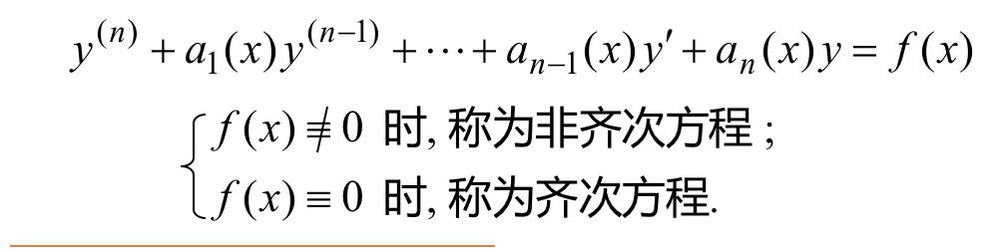
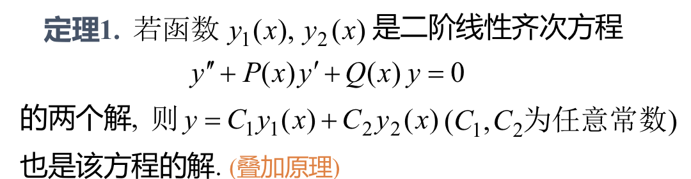
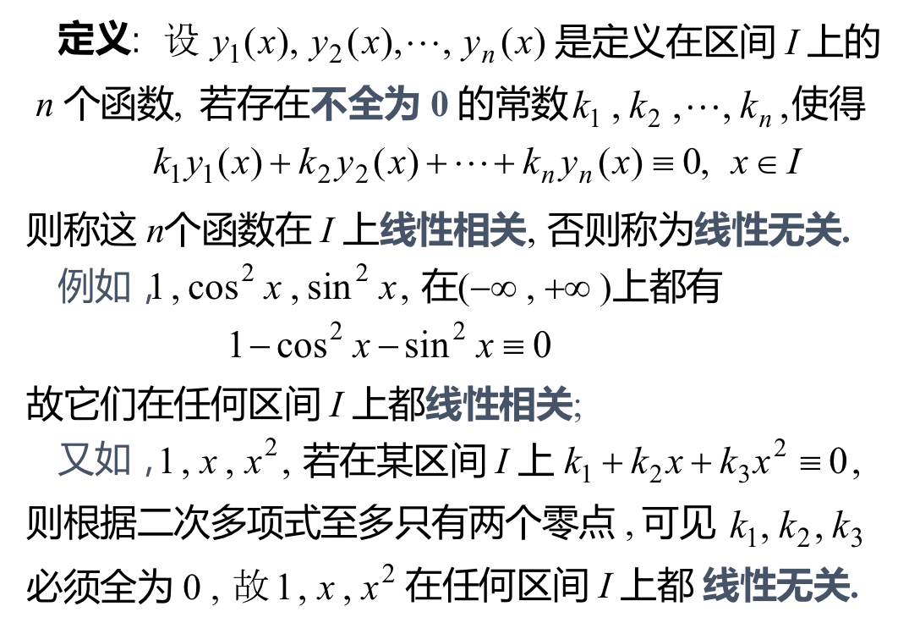
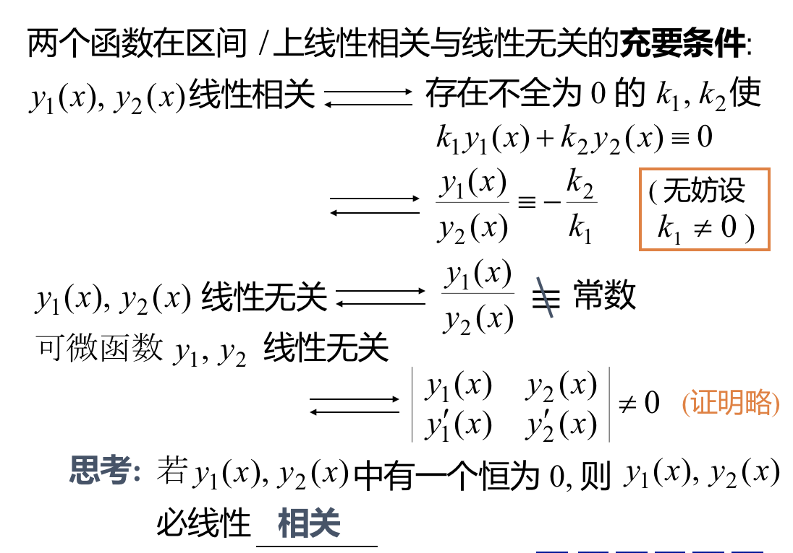
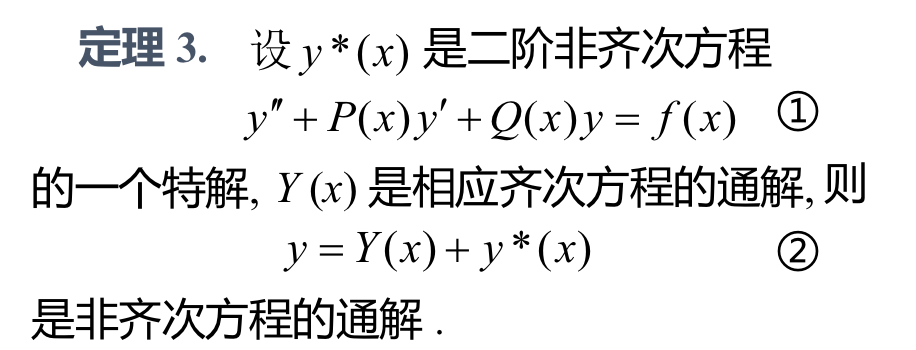
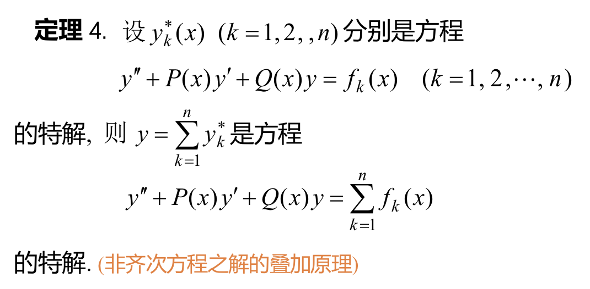
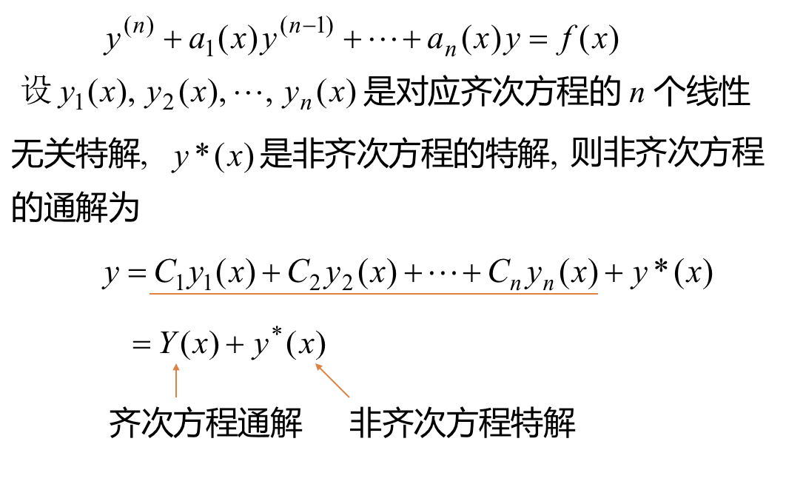
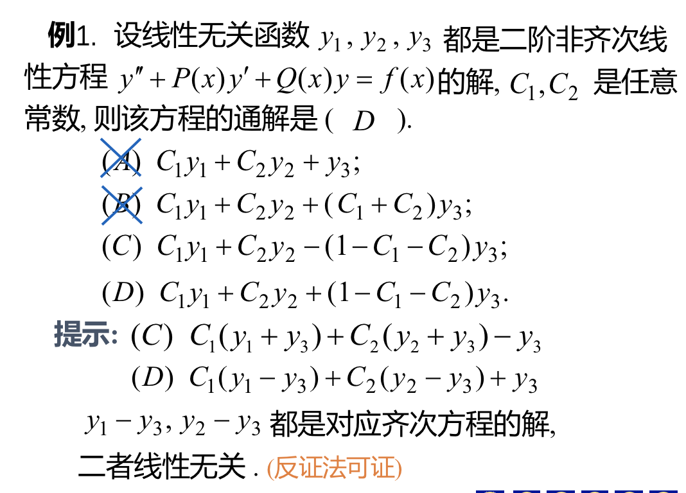
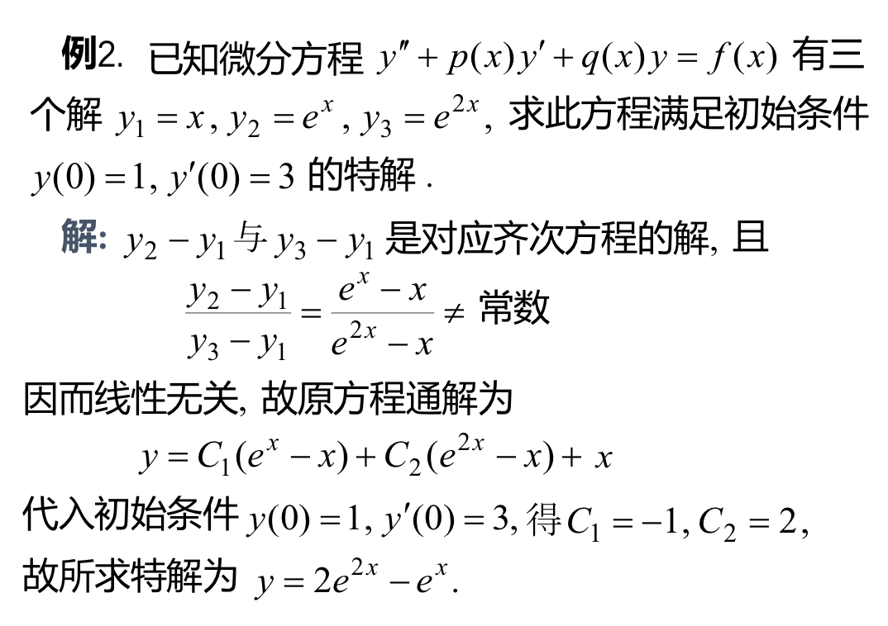

## 一、高阶线性微分方程
### 二阶线性微分方程:$$y''+p(x)y'+q(x)y=f(x)$$
### n阶线性微分方程的一般形式：

## 二、线性齐次方程解的结构
### 定理1：叠加原理
### 但是，当y1(x)与y2(x)是成比例的时候，此时y不是微分方程的通解。所以为了判断是否为通解，所以引入线性与非线性的概念。

### 定理2：（关于通解的判断）若y1(x),y2(x)是二阶线性齐次方程的两个线性无关解，则y=C1y1(x)+C2y2(x)是该方程的通解。

## 三、线性非齐次方程解的结构
### 定理3：线性非齐次方程解的结构。

### 定理4：非齐次方程之解的叠加原理。

### 定理5：n阶非齐次线性方程的通解的结构。
### 例：思路：y1,y2,y3都是特解，所以AB形式就成了特解+特解，形式都不对。y1-y3,y2-y3，相减后，将非线性的地方减去了，得到了对应线性方程的通解。

### 例非齐次线性方程的解相减可以得到一个对应齐次方程的解。
