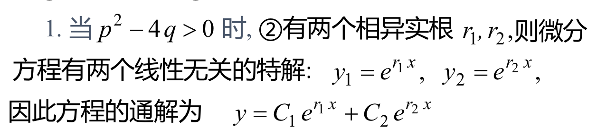
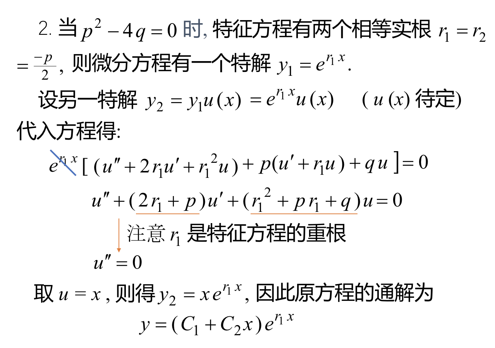
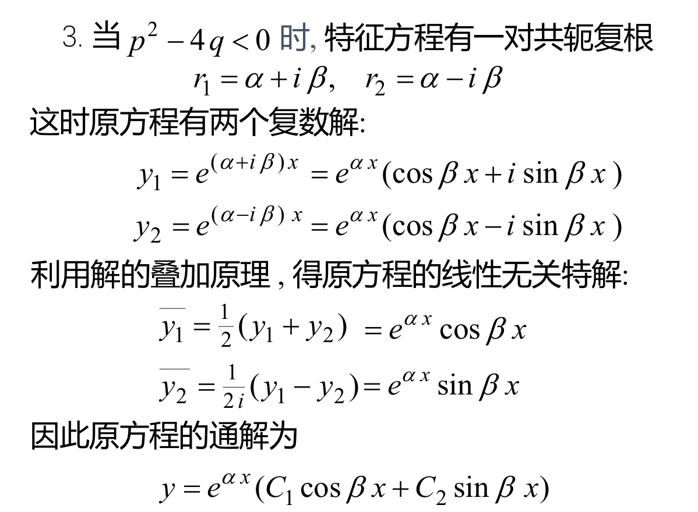
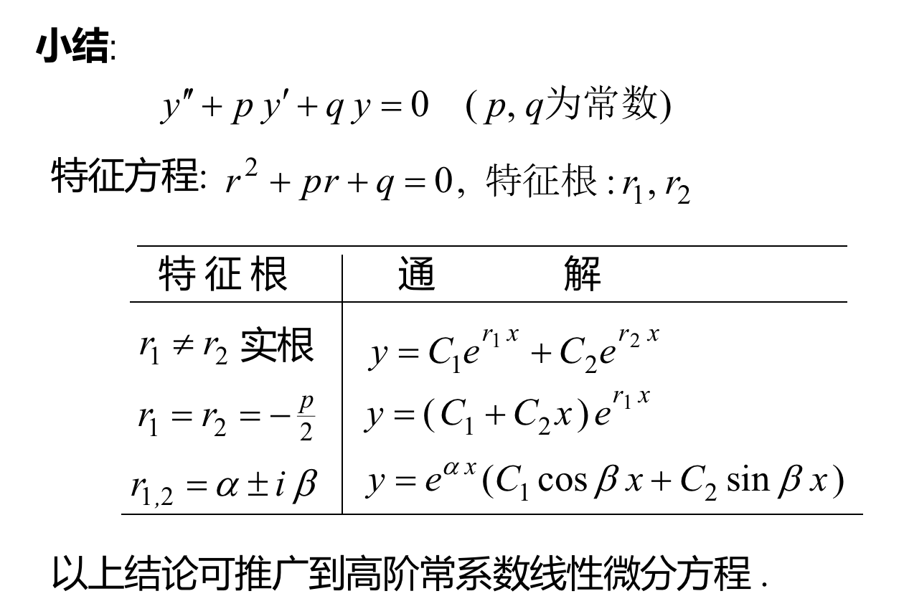
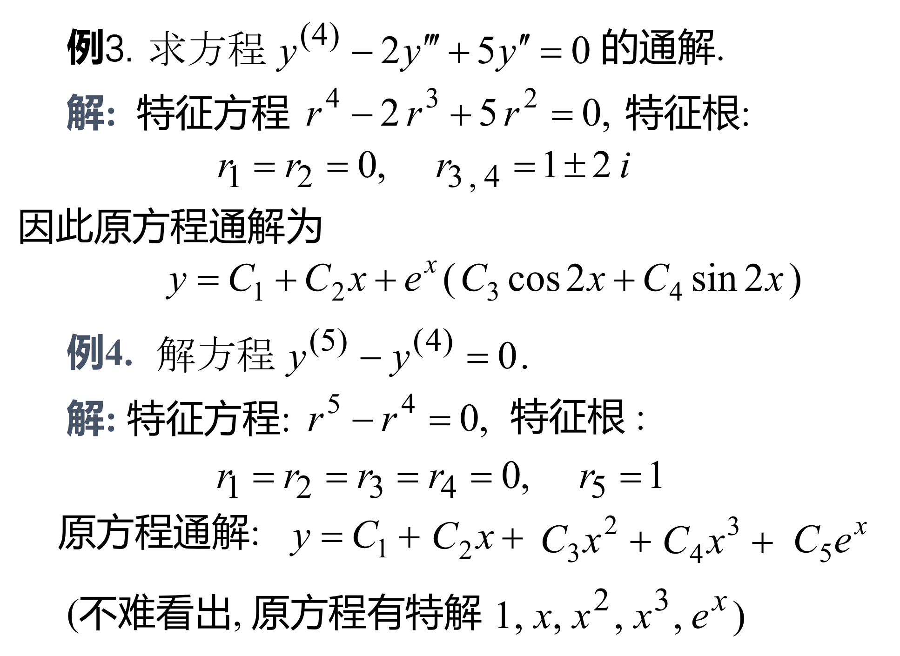
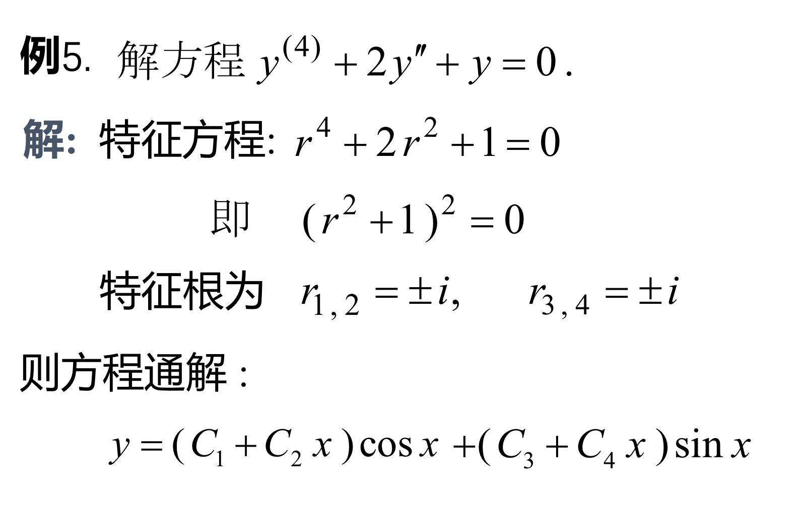

## 常系数线性齐次微分方程
### 1、形式：$$y''+py'+qy=0$$(其中p，q为常数)

### 2、解法：
> #### 我们令原方程的解为$y=e^{rx}$，（r为待定常数）
> #### 带入原方程得$$(r^2+pr+q)e^{rx}=0$$，此时$e^{rx}$始终是大于等于0的，所以只有$(r^2+pr+q)=0$时，才能解出r。从而得到原微分方程的解。

### 3、解的三种情况
 - #### (1)
 - #### (2)
 - #### (3)其中共轭复根的求法为$$\frac{-b \pm \sqrt{4ac-b^2}·i}{2a}$$

### 高阶的情况

