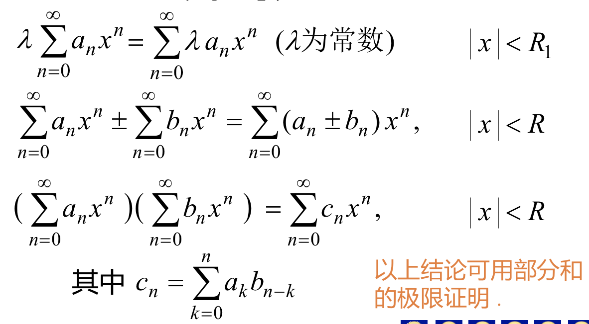
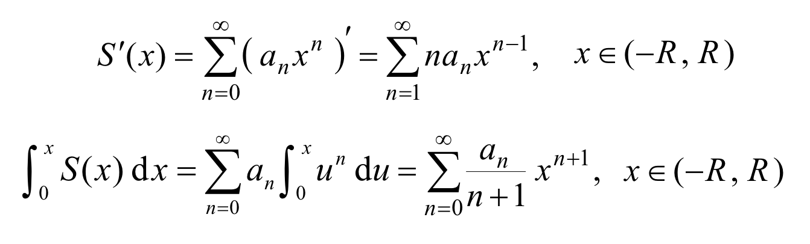
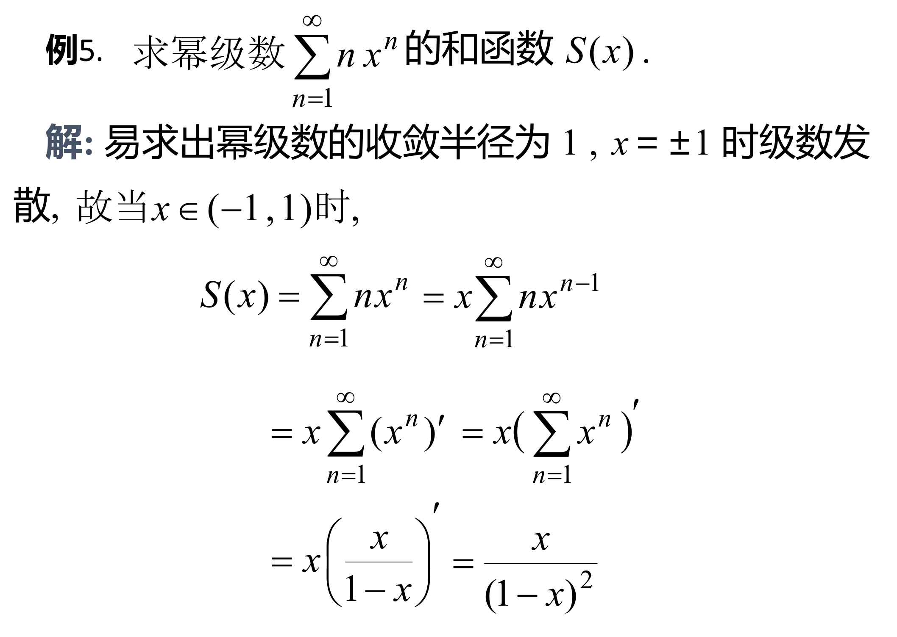
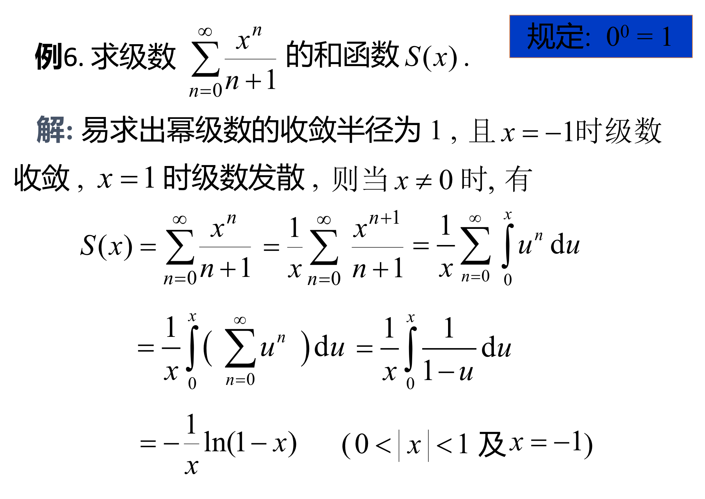
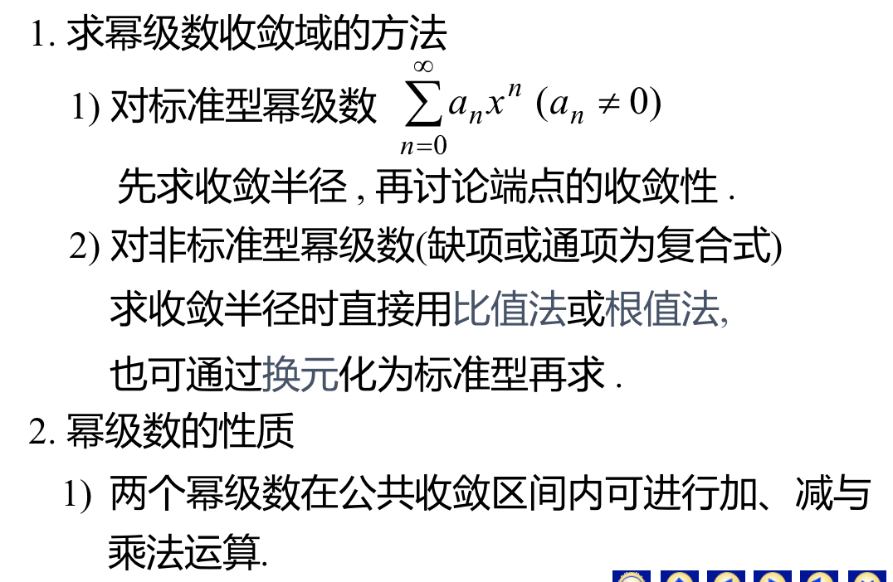
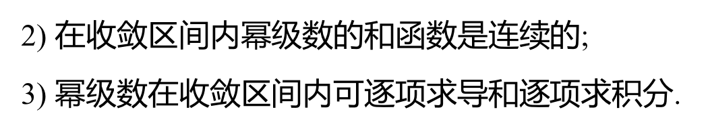

# 2、幂级数
## 2.1 函数项级数的概念
 - #### （1）函数项级数：设$u_n(x)(n=1,2,...)$为定义在区间I上的函数，称 $\sum_{n=1}^{\infty}u_n(x)=u_1(x)+u_2(x)+...+u_n(x)+...$ 为定义在区间I上的*函数项级数*（和常数项级数的区别就是每一项由常数变为函数。）

 - #### （2）收敛点：对于$x_0 \in I$,若常数项级数(x确定后由函数项级数变为常数项级数) $\sum_{n=1}^{\infty}u_n(x_0)$ 收敛，则称$x_0$为其*收敛点*
 - #### （3）收敛域：所有收敛点的全体称*收敛域*
 - #### （4）发散点：若 $\sum_{n=1}^{\infty}u_n(x_0)$ 发散，则称$x_0$为*发散点*
 - #### （5）发散域：所有发散点的全体
 - #### （6）和函数：在收敛域上，函数项级数的和是x的函数S(x)，称它为级数的的*和函数*，写成 $S(x)=\sum_{n=1}^{\infty}u_n(x)$,用$S_n(x)$来表示函数项级数的前n项和，即 $S_n(x)=\sum_{k=1}^{\infty}u_k(x)$
 - #### （7）余项：$r_n(x)=S(x)-S_n(x)$(和函数-前n项和),在收敛域上有 $\lim_{n \to \infty}S_n(x)=S(x)$，即 $\lim_{n \to \infty}r_n(x)=0$
 > #### 例：等比级数 $\sum_{n=0}^{\infty}x^n=1+x+x^2+...x^n+...$ 的收敛域为(-1,1)（怎么推出来的？？？），当 $x \in (-1,1)$ 时，有和函数 $\sum_{n=0}^{\infty}x^n=\frac {1}{1-x}$(？？？)，它的发散域为($-\infty$,-1]及[1,$+\infty$),或写作 $\mid x \mid \geq1$

## 2.2 幂函数及其收敛性
#### （1）幂级数：形如称为*幂级数*
#### （2）系数：其中数列$a_n$（n=0,1....）称为幂级数的*系数*
 - #### 定理1 阿贝尔定理如图所示，，可知 $\sum_{n=0}^{\infty}a_nx^n$的收敛域是以远点为中心的*对称*的区间
 - ##### 收敛半径与收敛区间
 - #### 定理2 比式法 若 $\sum_{n=0}^{\infty}a_nx^n$的系数满足 $\lim_{n \to \infty}\mid \frac{ a_{n+1}} {a_n} \mid=\rho$则据此定理得*比式法*求收敛半径

 - #### 定理3 根式法。若  $\sum_{n=0}^{\infty}a_nx^n$的系数满足 $\lim_{n \to \infty}\sqrt[n]{|a_n|}=\rho$则据此定理得*根式法*求收敛半径

> ### *求幂级数收敛域的一般步骤*:(1)根据比式法和根式法求出收敛半径（2）根据收敛半径找到收敛域的端点，带入两个端点，求出两个端点处的常数项级数的敛散性（3）得出幂级数的收敛域
> #### 例1
> #### 解 (1)求收敛半径    $R=\lim_{n \to \infty}|\frac{a_n}{a_{n+1}}|=\lim_{n \to \infty}\frac{\frac{1}{n}}{\frac{1}{n+1}}=1$，所以收敛半径R=1
> #### （2）判断收敛半径的两个端点处的情况
> - #### 对端点处 x=1，带入，得到x=1时的一个常数项级数 $\sum_{n=1}^{\infty}(-1)^{n-1}\frac{1}{n}$，此级数为交错级数，收敛。
> - #### 对端点处x=-1,带入，得到x=-1时的常数项级数 $\sum_{n=1}^{\infty}\frac{-1}{n}$，调和级数，发散
> #### (3)根据收敛半径和端点处的敛散性情况，得出收敛域:(-1,1]

> #### 例2

> #### 例3(4$x^2$为什么和1比较，1哪里来的：根据定理5比值法判别常数项级数的敛散性，所以和1比较)

> #### 例4解：令t=(x-1)，此时原式转化为 $\sum_{n=1}^{\infty}\frac{t}{2^nn}$,此时系数为 $\frac{1}{2^nn}$
> #### $R=\frac{|a_n|}{|a_{n+1}|}=2$，注意此时的自变量不是x而是t，t=x-1也就是说此时的收敛半径如果用x来表示的话，不是1以0为远点对称，而是以1对称。（当然如果以t来看的话还是以原点为对称的。）
> #### 带入t=2，得级数 $\sum_{n=1}^{\infty}\frac{1}{n}$,调和级数，所以发散。
> #### 带入t=-2,得级数 $\sum_{n=1}^{\infty}\frac{-1^n}{n}$，此级数条件收敛。
> #### 得级数的收敛域为 $-2\leqslant t<2$,因此原级数的收敛域为 $-1\leqslant x <3$

## 2.3 幂级数的运算
#### 定理4：设幂级数$\sum_{n=0}^{\infty}a_nx^x$以及$\sum_{n=0}^{\infty}b_nx^x$的收敛半径分别为$R_1$,$R_2$,R为两者之间的小者，则有：

#### 定理5：若幂函数$\sum_{n=0}^{\infty}a_nx^n$的收敛半径R>0,则其和函数S(x)在收敛域上连续，且在收敛域区间内*可逐项求导与逐项求积分*,运算前后收敛半径相同：注:逐项求积分后端点处的敛散性可能变好（原来不收敛变得收敛），逐项求导端点处的敛散性可能会变差（原来收敛求导后不收敛）
> ### 求和函数题型：目前只有*等比级数的和函数*是可以通过公式直接求得的，所以该类题型的步骤是：（最最开始先求出收敛半径）首先通过定理5对原有的级数进行处理，之后根据“求和与求导（求积分）的顺序可变”的原理进一步将原级数转化为一个等比级数，最后由等比级数的求和公式得到解。

> ### 也就是说，通过定理5，构造等比级数积分或导数的形式。然后调整求导，积分，求和的顺序，将等比级数通过等比级数求和公式来表示。然后得到结果。

> #### ：
解释下过程：通过变换形式凑了一个导数的形式出来，这个时候就得到了等比级数的形式$x^n$,之后利用定理5，将顺序从县求导在求和改成先求和在求导。先求和的话就可以直接把使用等比级数的求和公式把$x^n$变成$\frac{1}{1-x}$

> #### 
解释：这个题是求导和积分一起用的。处理的时候先求导后积分。（《学习手册》p318上的例子可以解释）

## 本章小结：
