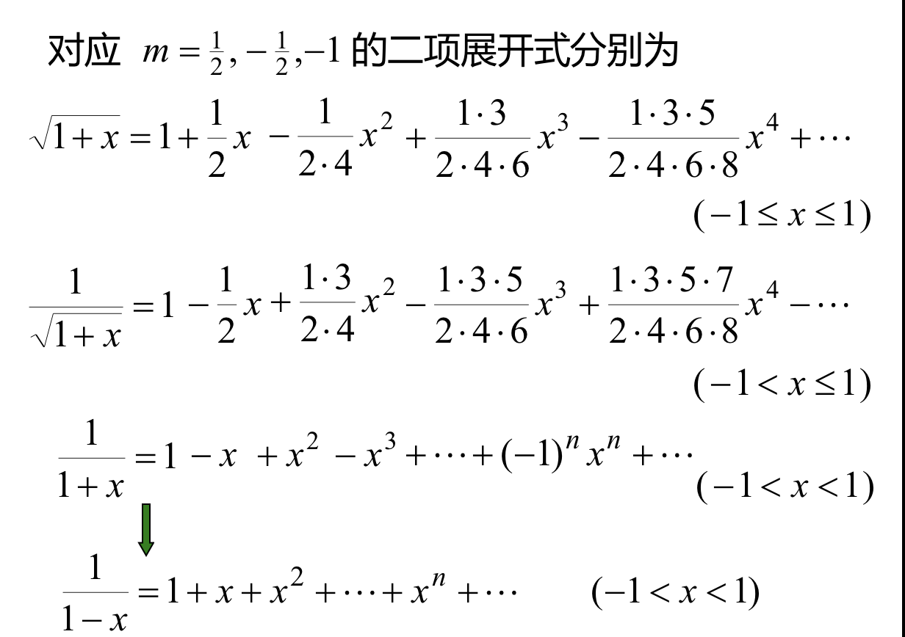
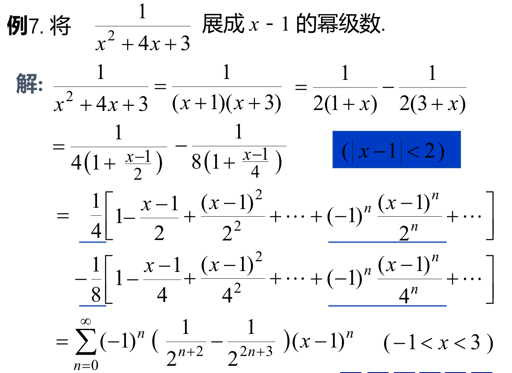

## 1、Taylor级数
### （1）n阶泰勒公式：若函数f(x)在$x_0$的某邻域内具有n+1阶导数，则在该邻域有$$f(x)=f(x_0)+f'(x_0)(x-x_0)+\frac{f''(x_0)}{2!}(x-x_0)^2+....+\frac{f^{(n)}(x_0)}{n!}(x-x_0)^n+R_n(x)$$此式称为*f(x)的n阶泰勒公式*,
### （2）拉格朗日余项:其中$$R_n(x)=\frac{f^{n+1}(\xi)}{(n+1)!}(x-x_0)^{n+1}$$($\xi$在x与$x_0$之间)
### （3）泰勒级数：若函数f(x)在$x_0$的某领域内具有任意阶导数，则称$$f(x_0)+f'(x_0)(x-x_0)+\frac{f''(x_0)}{2!}(x-x_0)^2+...\frac{f^n(x_0)}{n!}(x-x_0)^n+...$$,为f(x)的泰勒级数。
### （4）麦克劳林级数：当$x_0=0$时，泰勒级数又称为麦克劳林级数

- ### 定理一：

- ### 定理二：

## 2、函数展开成幂级数
> ### 展开方法
> - ### 直接展开法：利用泰勒公式
> - ### 间接展开法：利用已知级数展开式的函数展开（转换成已知级数展开式的函数）
### （1）直接展开法：
> ### 步骤：
> - #### ①求函数以及其各阶导数在x=0处的值；
> - #### ②写出麦克劳林级数，并求出其收敛半径
> - #### ③判别在收敛区间(-R,R)内$\lim_{n \to \infty}R_n(x)$是否为0

### 例题：
> ### 例一:
> ### 例二：：

> ### 例三：关于二项式展开

> - ### 二项展开式：，常见的二项展开式：

### (2)直接展开法：将函数转换成已知展开式的函数。常用的函数的幂级数展开式：
> ### 例4：

> ### 并不是很明白这几个例题：
> ### 
