## 1、曲面方程的概念
### 定义1：如果曲面S与方程F(x,y,z)=0有：
> ### (1)曲面S上的任意点的坐标都满足此方程
> ### (2)不在曲面S上的点的坐标都不满足此方程
### 则F(x,y,z)=0叫做曲面S的方程，曲面S叫做方程F的图形
> ### 已经一曲面作为点的集合轨迹-->曲面方程
> ### 已知方程-->研究其几何形象

> ### 1. 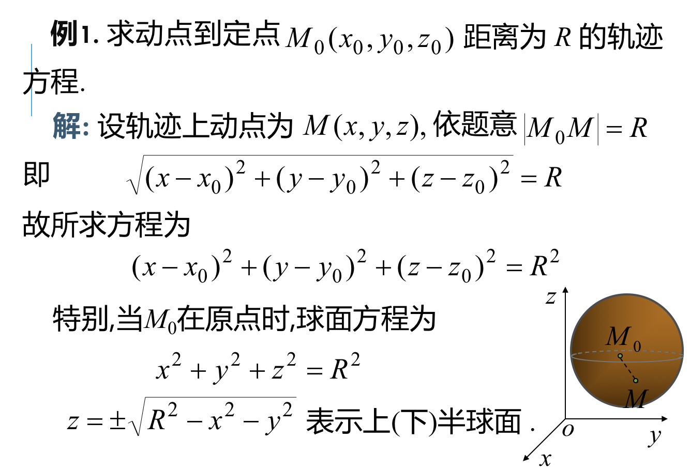
> ### 2.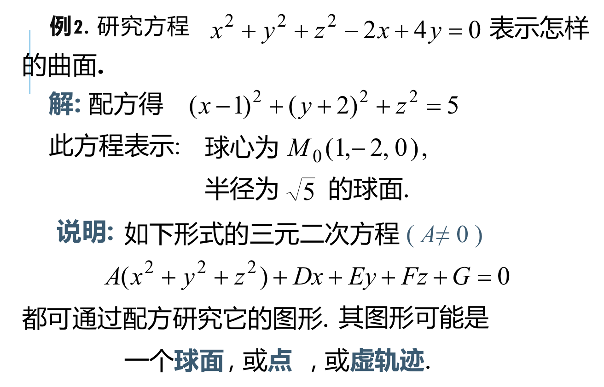

## 2、旋转曲面
### 旋转曲面：一条平面曲线绕其平面上一条定直线旋转一周形成的曲面。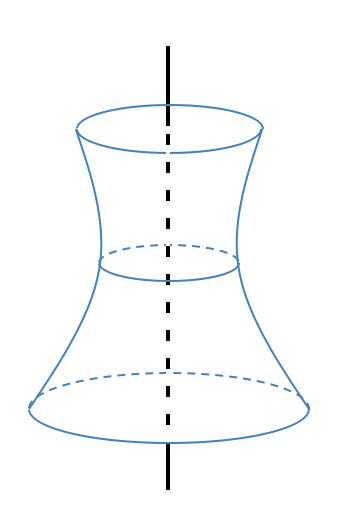
### 旋转曲面方程：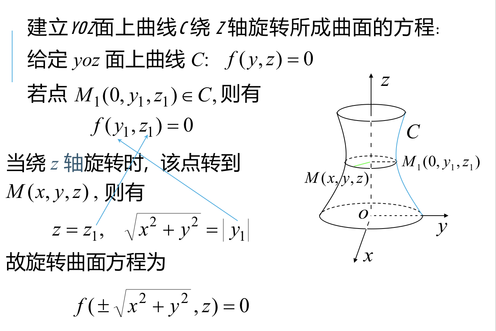以此为例，绕着哪一个轴转动，哪一个轴的不变，用该轴和另一个圆作为变量，来表示曲面方程。即$f(\pm \sqrt{x^2+y^2},z)=0$

> ### 例：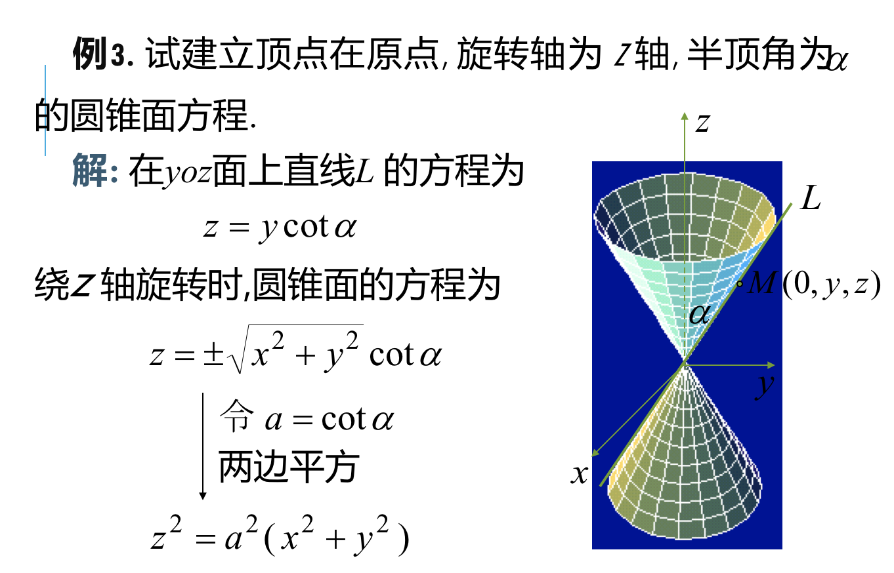

> ### 例：旋转双曲面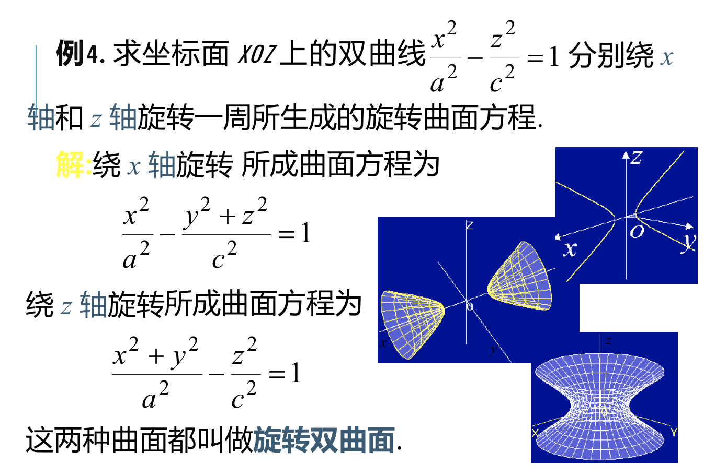

## 3、柱面
### 定义：平行定直线并沿定曲线C移动的直线l形成的轨迹叫做柱面，C叫准线，l叫做母线。
> ### (1)方程F(x,y)=0表示柱面，母线平行于z轴，准线是xoy面上的曲线l1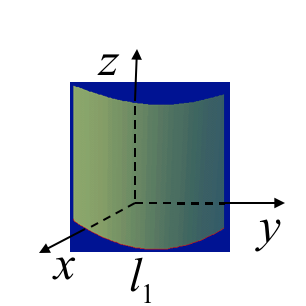

> ### (2)方程G(y,z)=0表示柱面，母线平行于x轴；准线为yoz面上的曲线l2。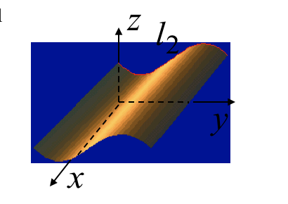

> ### (3)方程H(z,x)=0表示柱面，母线平行于y轴；准线是xoz面上的曲线l3.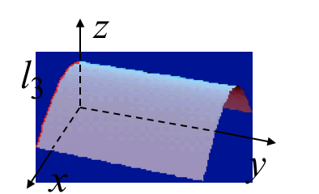

## 4、二次曲面
### 二次曲面:
> #### 三元二次方程：$$Ax^2+By^2+Cz^2+Dxy+Eyz+Fzx+Gx+Hy+Iz+J=0$$(二次项系数不全为零)的图形为二次曲面，基本类型有：椭球面，抛物面，双曲面，锥面。

### (1)椭球面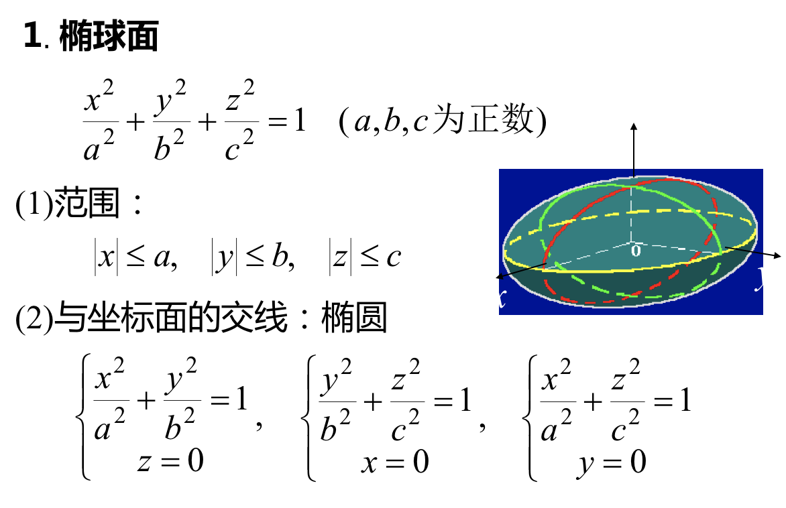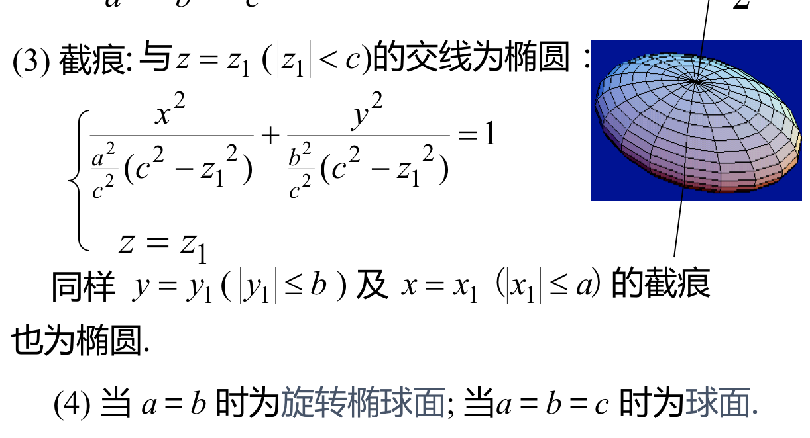

### (2)抛物面
> #### 椭圆抛物面 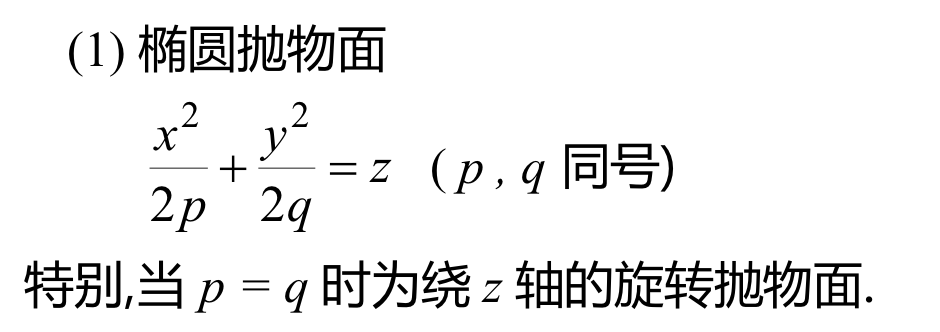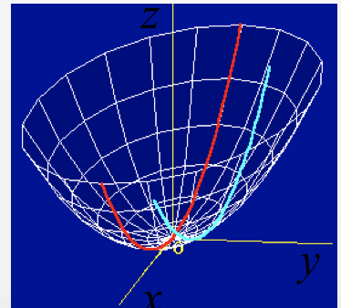

> #### 双曲抛物面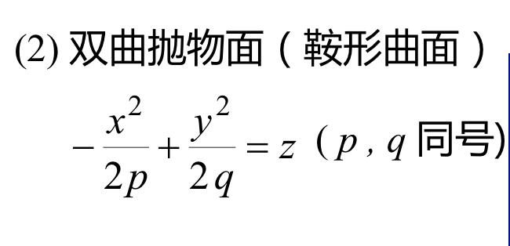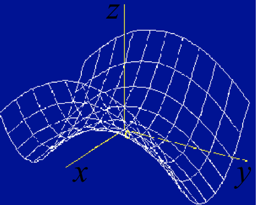

### (3)双曲面
> #### 单页双曲面 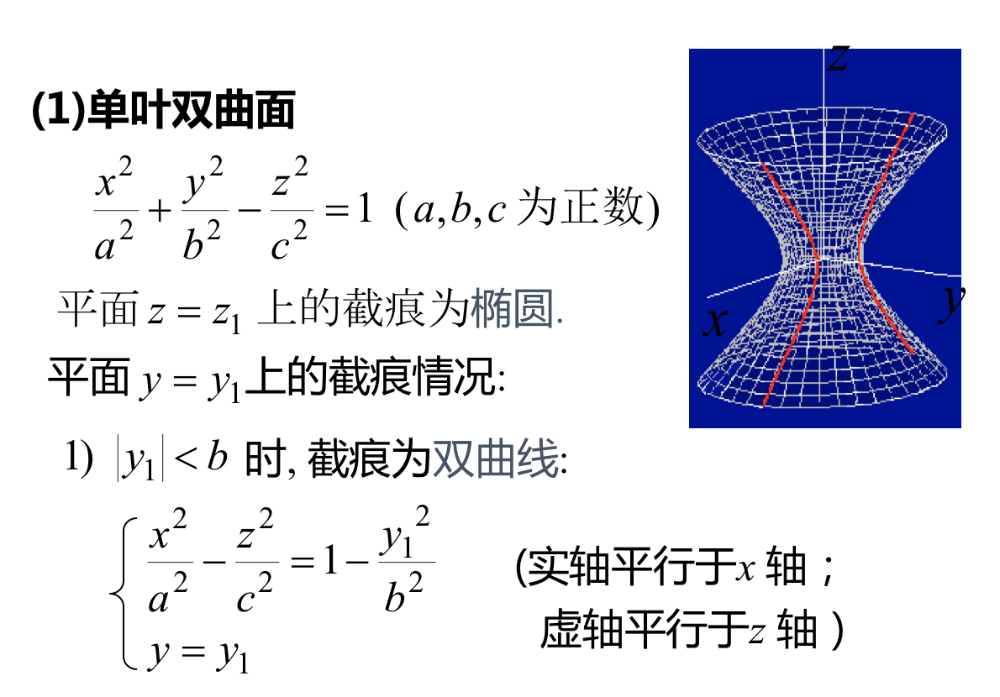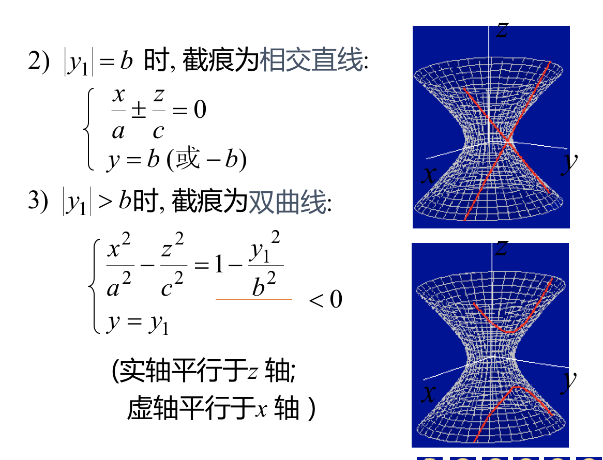

> #### 双叶双曲面 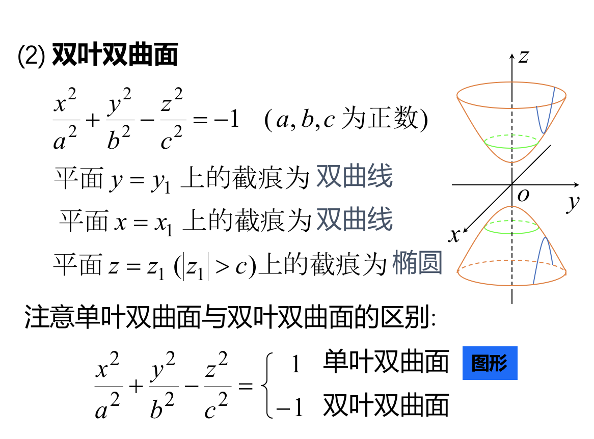

### (4)椭圆锥面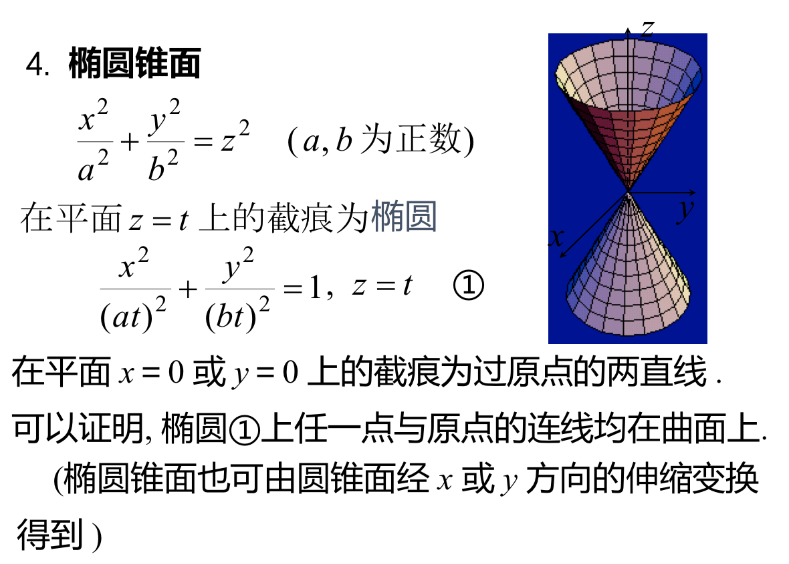

## 5、单元小结 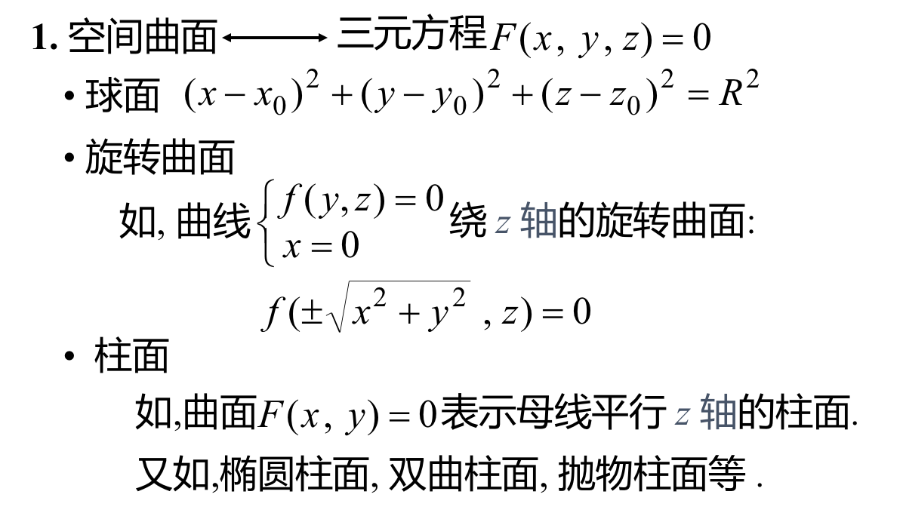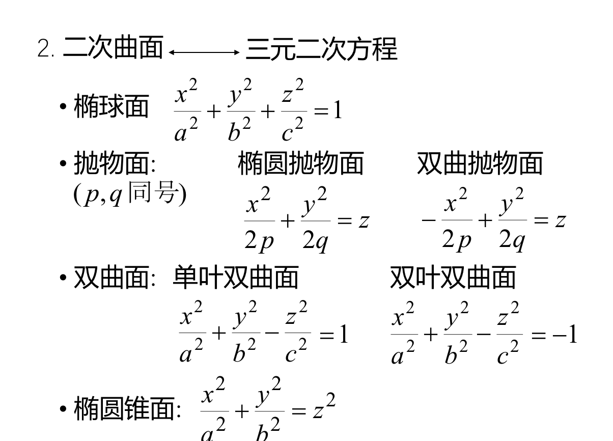
