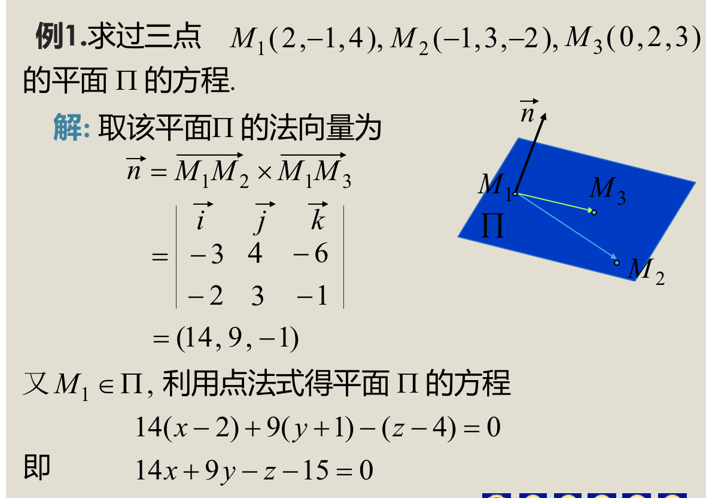
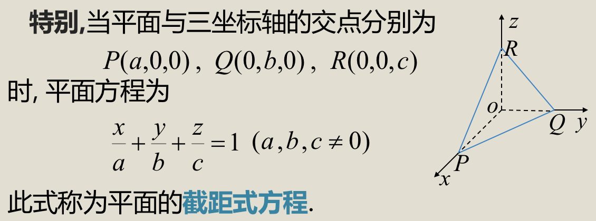
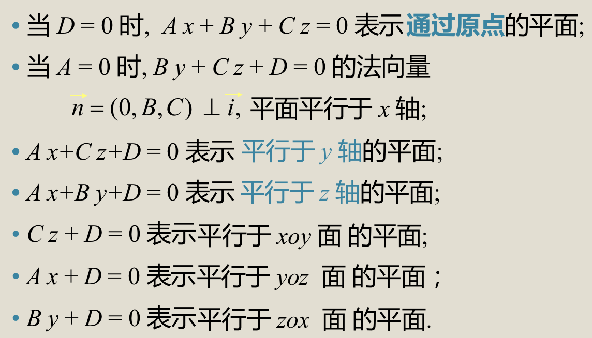
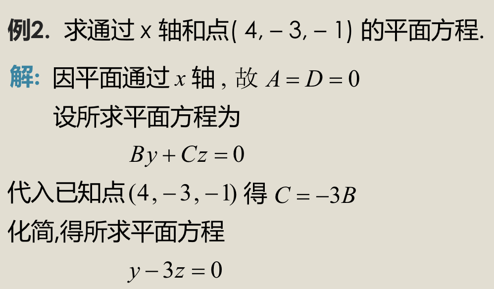
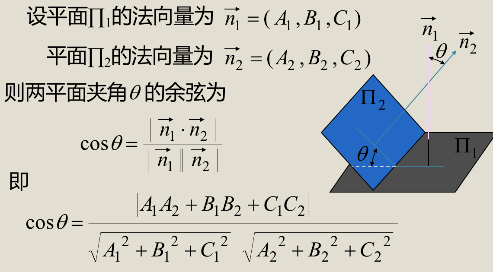
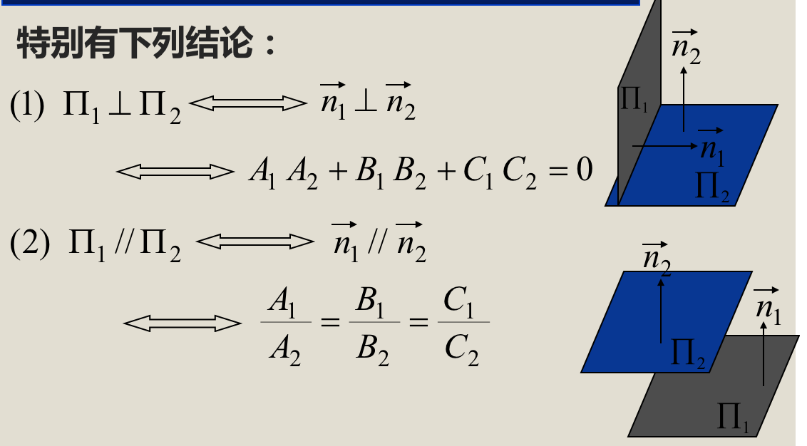
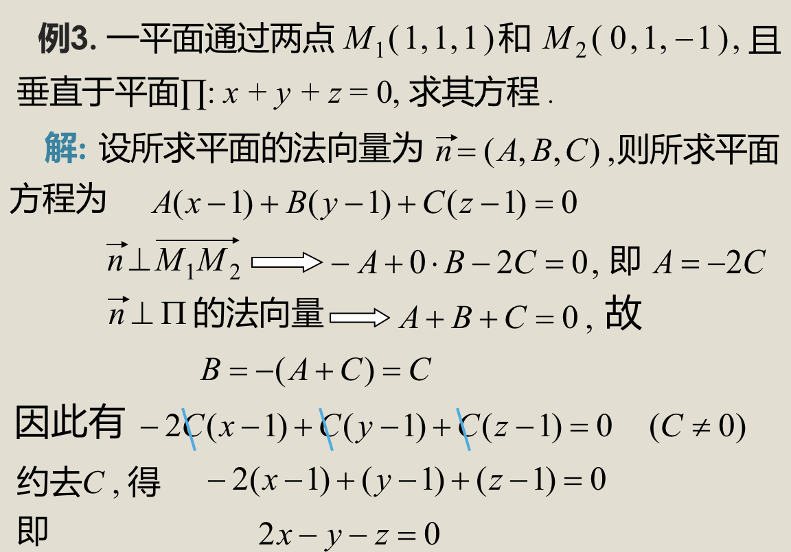

## 平面及其方程
### 1、平面的点法式方程
- #### 定义：设以平面通过已知点$M_0(x_0,y_0,z_0)$，且有法向量$\vec n=(A,B,C)$，则平面的方程为$$A(x-x_0)+B(y-y_0)+C(z-z_0)=0$$

> ### 例

### 2、截距式方程
- #### 定义

### 3、平面的一般方程
> ### $$Ax+By+Cz+D=0(A^2+B^2+C^2)$$
> ### 

> ### 

### 4、两平面的夹角
- #### 两平面的夹角定义：两平面法向量的夹角（一般为锐角）

> ####  例

### 5、点到平面的距离公式
- #### $$d = \frac{|Ax_0+By_0+Cz_0+D|}{\sqrt{A^2+B^2+C^2}}$$
