## 1、向量的数量积
### (1)定义
> ### 设向量$\vec a$,$\vec b$的夹角为$\theta$,称$|\vec a||\vec b|\cos\theta=\vec a \cdot \vec b$为$\vec a $与$\vec b$的*数量积(点积)* 点积最后的结果是一个数，而不是向量。
### 当$\vec a \neq \vec 0$时，$\vec b$在$\vec a $上的投影为$$|\vec b |\cos\theta=Prj_{\vec a}\vec b$$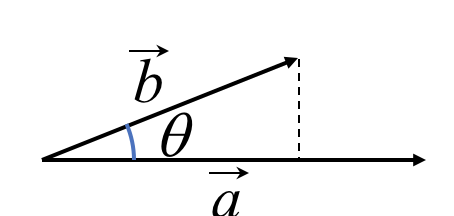

### (2)性质
> ### $\vec a \cdot \vec a = |\vec a |^2$
> ### $\vec a$，$\vec b $为两个非零向量，则有$\vec a \cdot \vec b=0$等价于$\vec a \bot \vec b$

### (3)运算律
> ### 交换律 $\vec a \cdot \vec b= \vec b \cdot \vec a$
> ### 结合律 （$\lambda,\mu$为实数）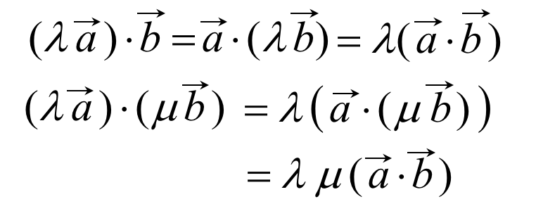
> ### 分配率 $(\vec a + \vec b)\cdot \vec c=\vec a \cdot \vec  c + \vec b \cdot \vec c$
> #### 例：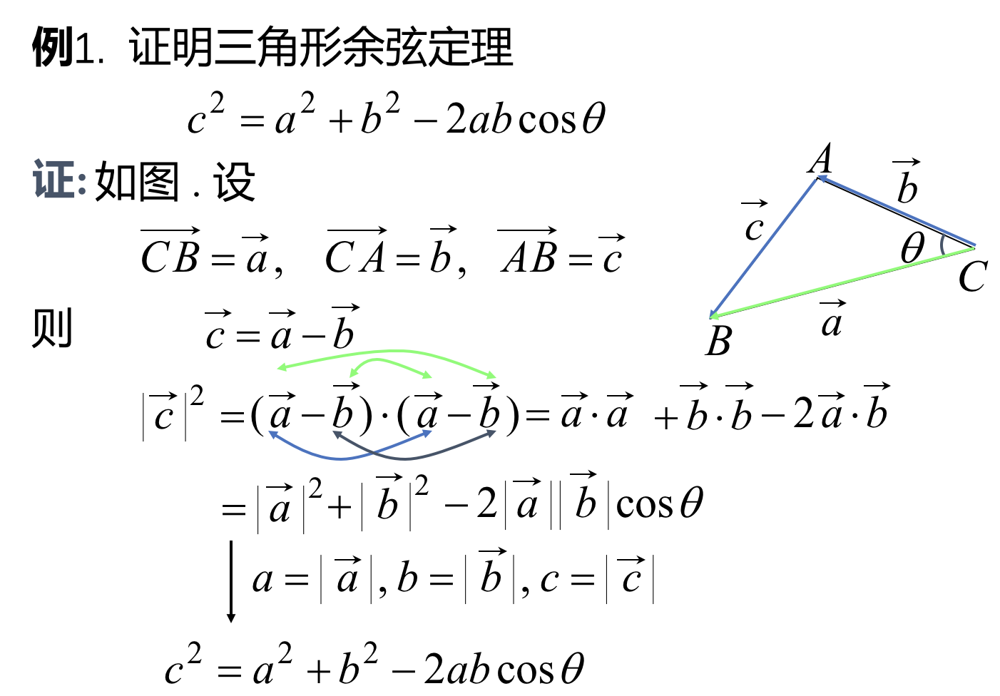

### (4)数量积的坐标表示
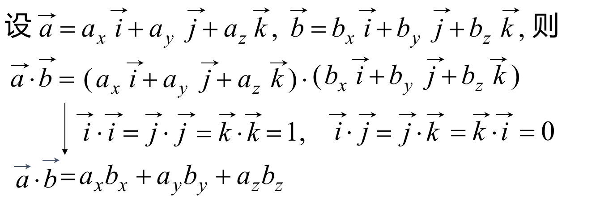

> ### 两向量的夹角公式，当$\vec a $ ,$\vec b $为非零向量时，由于$\vec a \cdot \vec b=|\vec a | |\vec b|\cos \theta$，得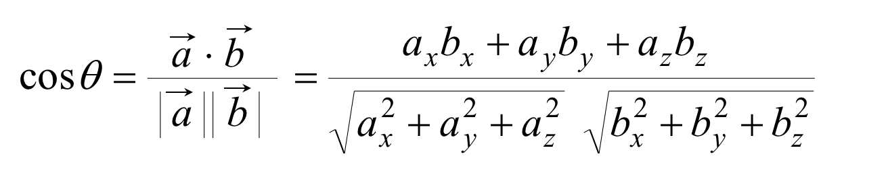

> #### 例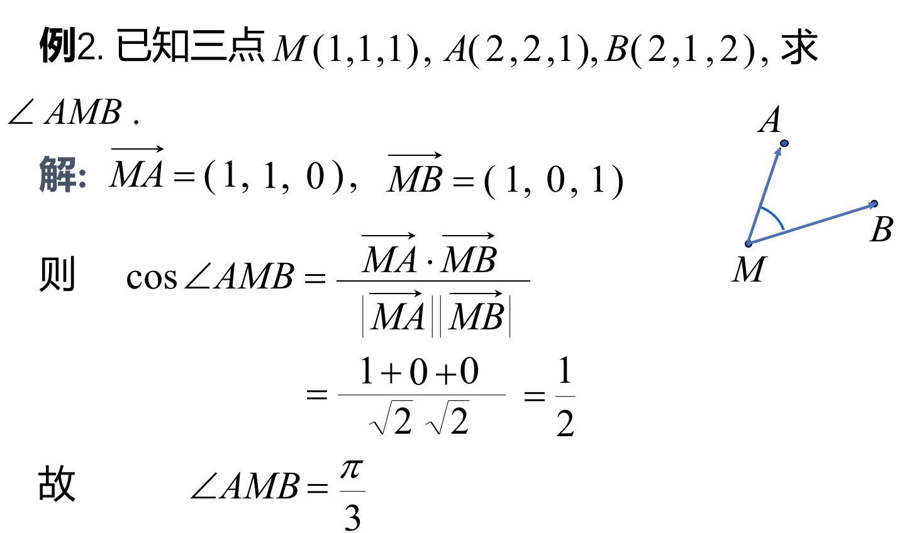

## 2、向量的向量积
### (1)定义:设$\vec a$,$\vec b$,的夹角为$\theta$，定义称$\vec c $为向量$\vec a$与$\vec b$的*向量积(叉积)* (表示以a，b为边的平行四边形的面积)，记作$$\vec c = \vec a \times \vec b$$
> #### 右手定则：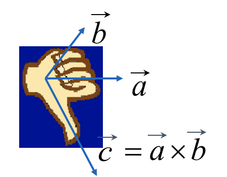

### (2)性质
> ### $\vec a \times \vec b=\vec 0$
> ### $\vec a \vec b$为非零向量，则$\vec a \times \vec b = \vec 0\longleftrightarrow\vec a \parallel \vec b$

### (3)运算律
> ### $\vec a \times \vec b= -\vec b \times \vec a$
> ### 分配律 $(\vec a + \vec b) \times \vec c = \vec a \times \vec c + \vec b \times \vec c $
> ### 结合律 $(\lambda \vec a)\times \vec b=\vec a \times (\lambda\vec b)=\lambda (\vec a \times \vec b)$

### (4)向量积的坐标表示式（行列式计算法）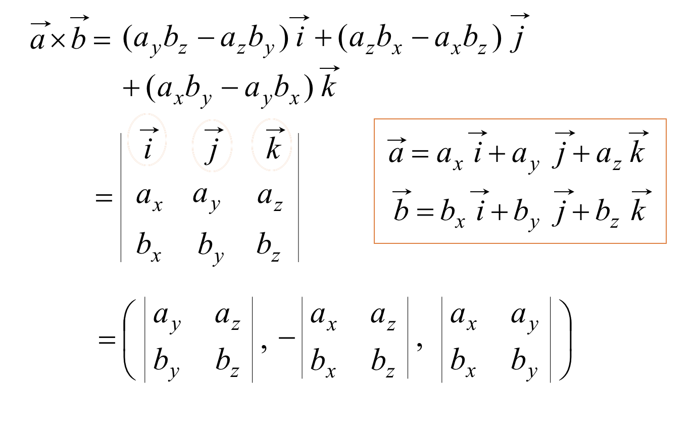

> #### 例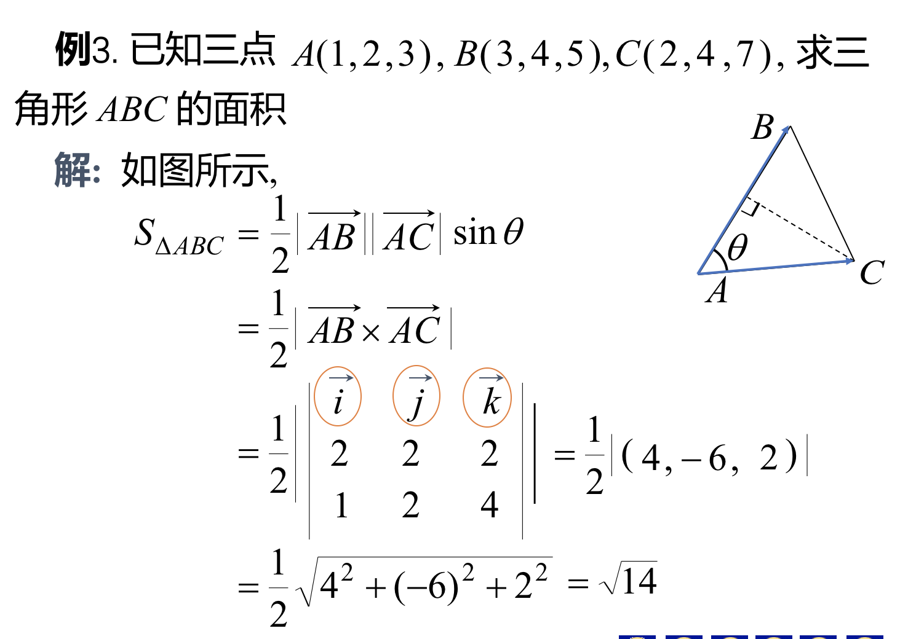

## 3、向量的混合积

### (1)定义：已知三个向量$\vec a ,\vec b ,\vec c$，称$$(\vec a \times \vec b) \cdot \vec c = [\vec a \vec b \vec c]$$为$\vec a ,\vec b ,\vec c$的混合积。
> #### 集合意义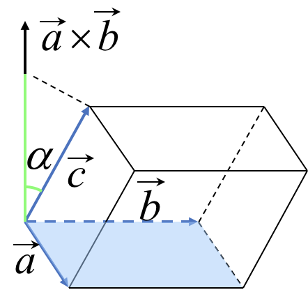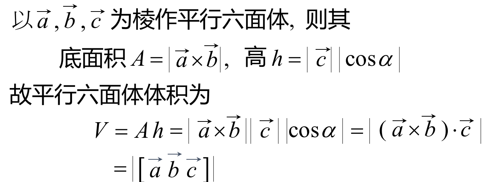

### (2)混合积的坐标表示
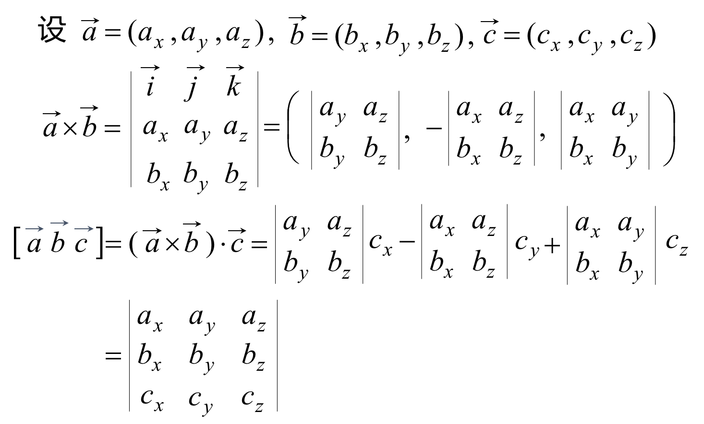

### (3)性质
> ### 三个非零向量$\vec a ,\vec b ,\vec c$共面的充要条件是$[\vec a \vec b \vec c]=0$

> ### 轮换对称性：$[\vec a \vec b \vec c]=[\vec c \vec a \vec b]=[\vec b \vec c \vec a]$(其实就是把三个向量的名字换掉)

> 例：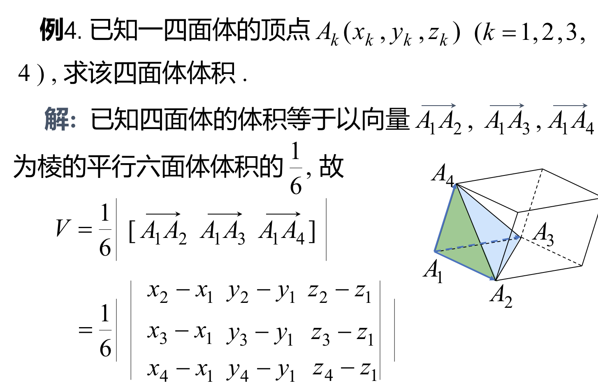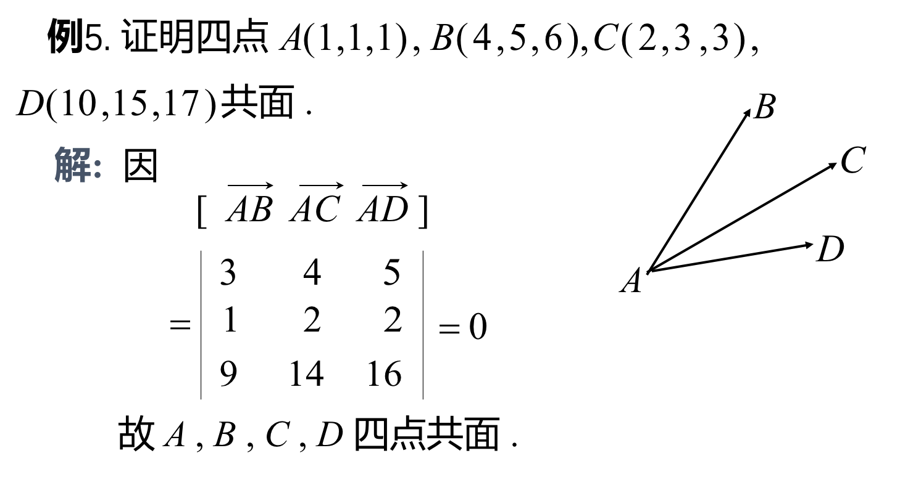
