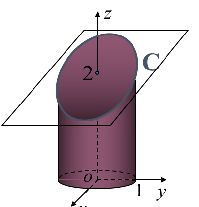
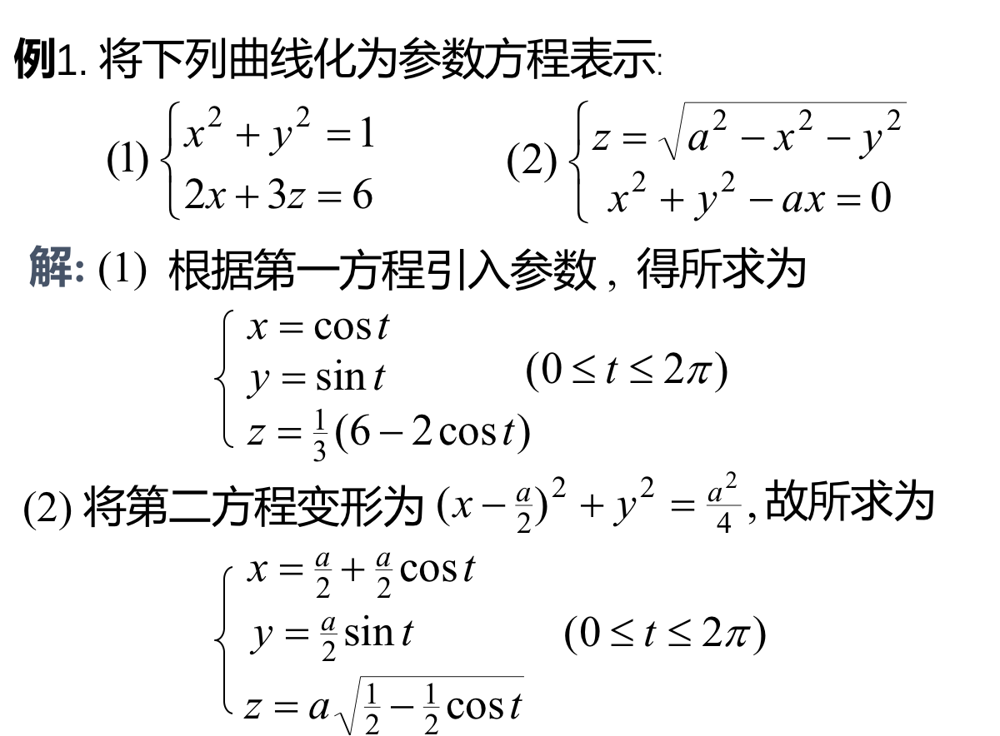
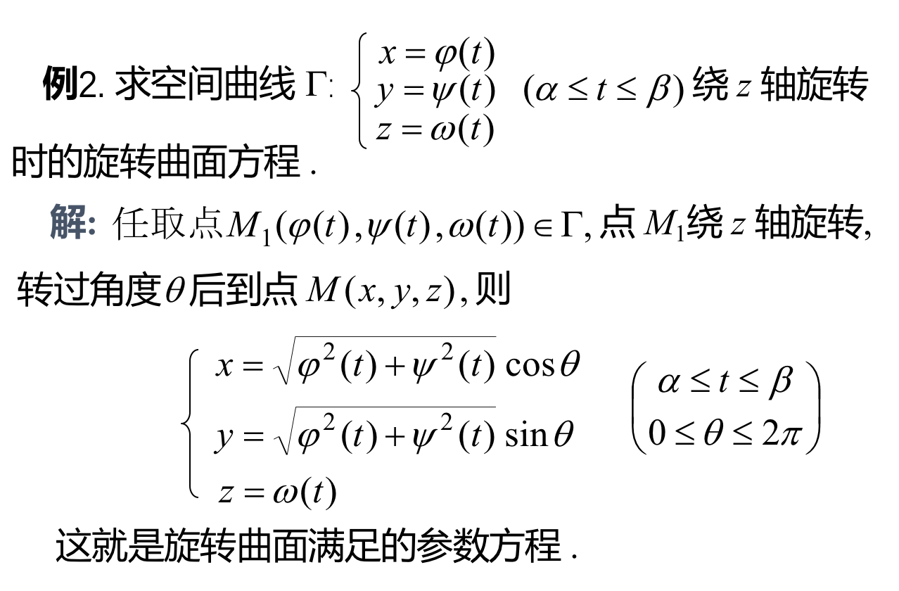
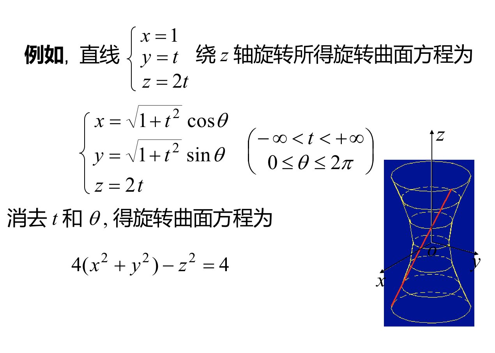
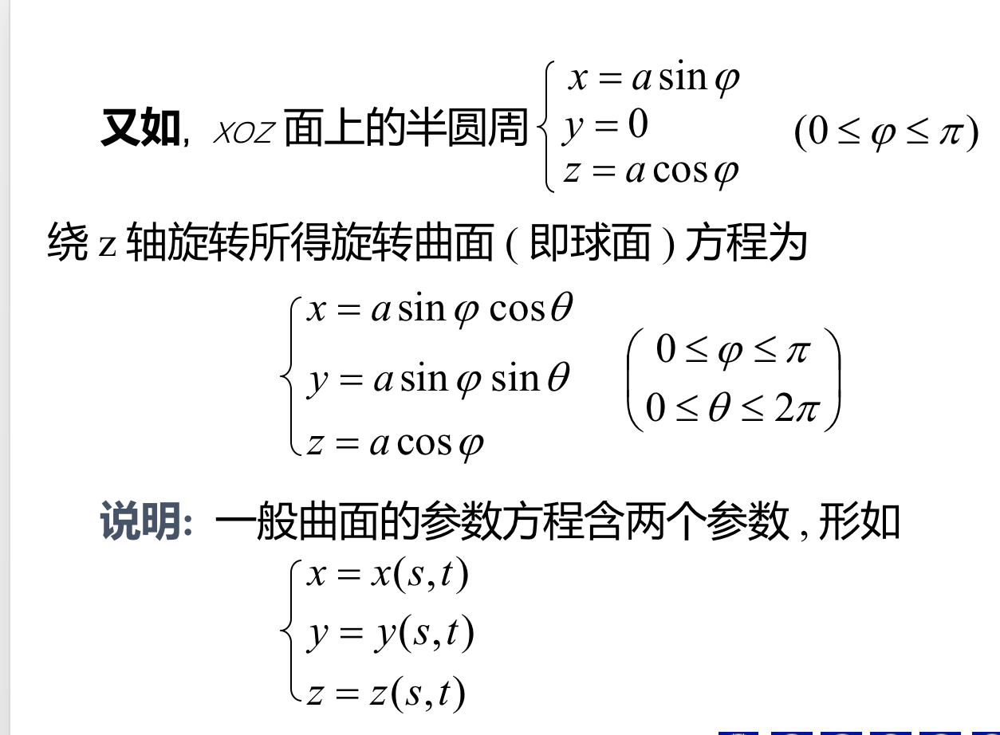
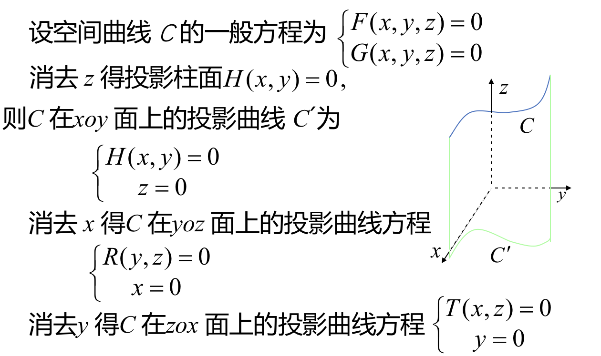
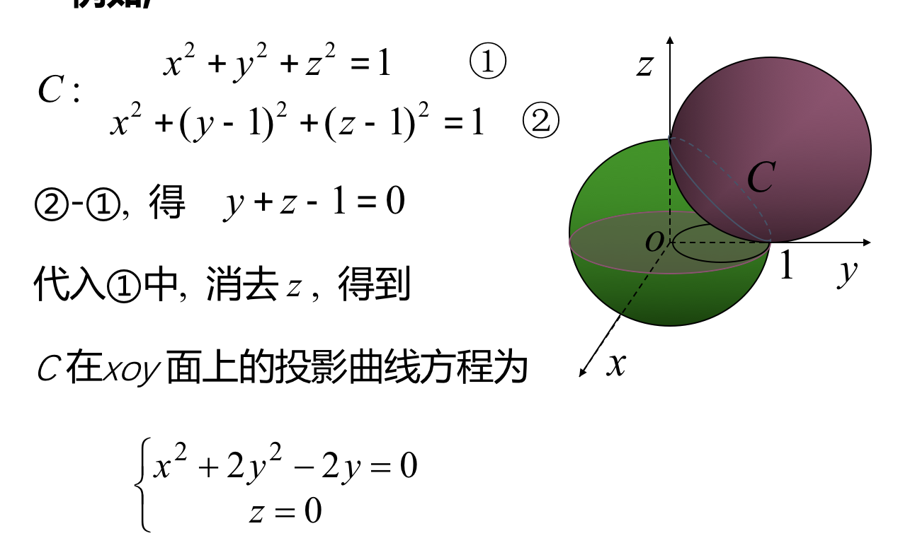

## 1、空间曲线的一般方程
### 定义：空间曲线一般视为两曲面的交线，其一般方程为方程组
> #### F(x,y,z)=0
> #### G(x,y,z)=0
### 例如，表示圆柱面与平面的交线C
> #### $x^2+y^2=1$
> #### $2x+3z=6$

## 2、空间曲线的参数方程
### 定义：将曲线c上的动点坐标x,y,z表示成参数t的函数。
> #### x=x(t)
> #### y=y(t)
> #### z=z(t)

### 称其为空间曲线的参数方程
> ####  例
### 旋转曲面满足的参数方程

## 3、空间曲线在坐标面上的投影
> ### 例如
