## 一、区域
### 1、邻域:点集$U(P_0,\delta)=\{P|PP_0|<\delta\},$称为点$P_0$的$\delta$邻域。
> #### 在直线上:$U(P_0,\delta)=\{(x,y)||x-x_0|<\delta \}$
> #### 在平面上是*圆邻域*,$U(P_0,\delta)=\{(x,y)|\sqrt{(x-x_0^2)+(y-y_0)^2}<\delta\}$
> #### 在立体空间中，是一个*球邻域*,$U(P_0,\delta)=\{(x,y,z)|\sqrt{(x-x_0)^2+(y-y_0)^2+(z-z_0)^2}<\delta\}$

- #### 注：不强调领域半径时，可写成$U(P_0)$,点$P_0$的去心邻域记为$\stackrel{\circ}{U}(x_0)=\{P|0<|PP_0|<\delta\}$

### 2、区域
#### 设点集E以及一点P：
 - #### 内点：若存在点P的某邻域$U(P) \subset E$，则称P为E的内点
 - #### 外点：若存在点P的邻域$U(P) \cap E = \emptyset$,则称P为E的外点。
 - #### 边界点：若对点P任意一个邻域$U(P)$既含有E中的内点也含有E的外点，则称P为E的边界点。
 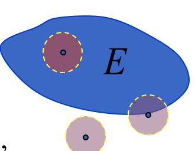

#### 聚点：若给定任意的$\delta$，点P的去心邻域$\stackrel{\circ}{U}(x_0)$内总有E中的点，则称P是E的聚点。（内点和边界点都是聚点）
- #### 导集：所有聚点所成的点集为E的导集。
#### 开区域以及闭区域：
- #### 开集：若点集E的点都是内点，则称E为开集
- #### 边界：E的边界点全体称为E的边界,记作$\partial E$
- #### 闭集：若点集$E \subset \partial E $则称E为闭集
- #### 连通：若集D中任意两点可用一条完全属于D的折线相连，则称D是连通的
- #### 开区域：连通的开集称为开区域
- #### 闭区域：开区域连同它的边际一起称为闭区域
> #### 例：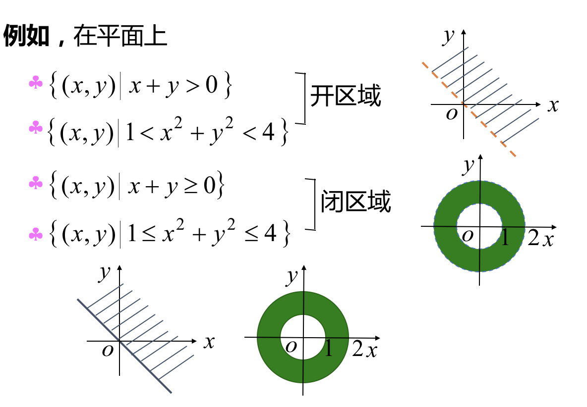所以区分开闭的关键是，是否包含了边界。
#### 有界域与无界域：对区域D，若存在正数K，使一切点$P \in D$与某定点A的距离$|AP| \leq K$,则称D为有界域，否则则称D为无界域。

### 3、n维空间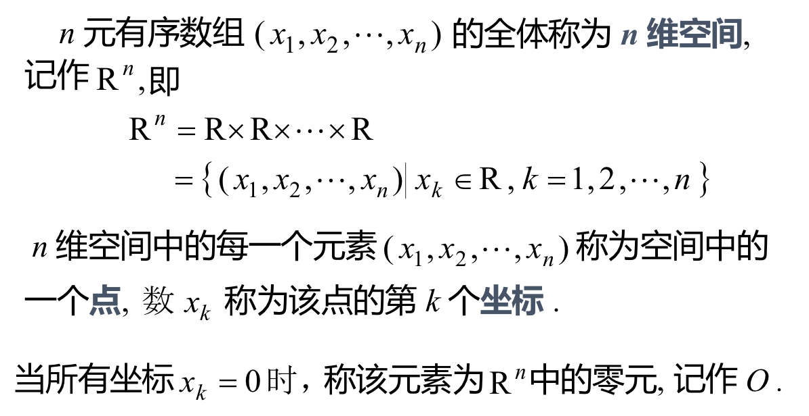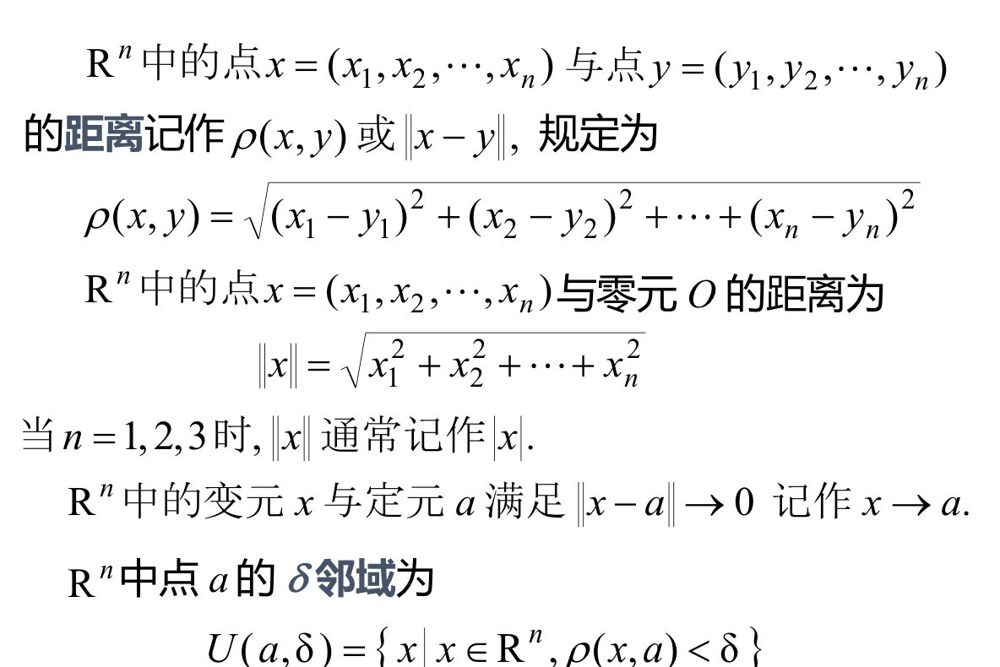

## 二、多元函数的概念
### 设非空点集 $D \subset R^n$,映射f:D-->R称为定义在D上的多元函数，记作$$u=f(x_1,x_2,...x_n)$$或$$u=f(P),P\in D$$
- #### 点集D称为函数的定义域，
- #### 数集 $\{ u |u=f(P) ,P \in D \}$为函数的值域
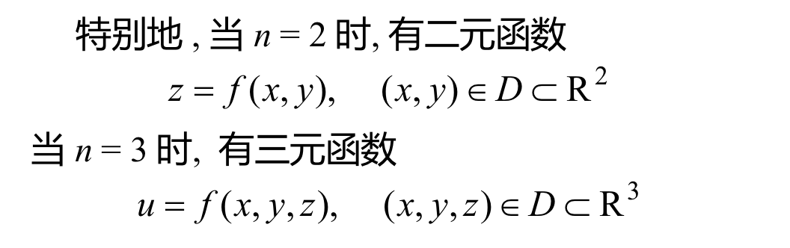
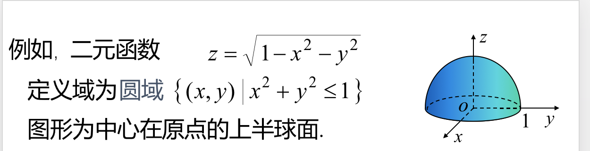

## 三、多元函数的极限
### 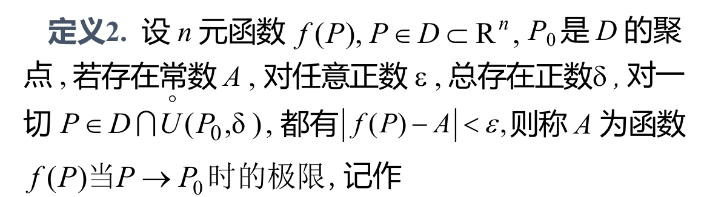$$\lim_{p \to p_0}f(P)=As$$(称为n重极限)
#### 当n=2时，记$\rho=|PP_0|=\sqrt{(x-x_0)^2+(y-y_0)^2}$,二元函数的极限可写作$$\lim_{\rho \to 0}f(x,y)=A=\lim_{x \to x_0 y \to y_0}f(x,y)=A$$

- #### 当点P(x,y)以不同的方式趋于$P_0(x_0,y_0)$时，函数趋于不同值或有的极限不存在，则函数本身的极限不存在。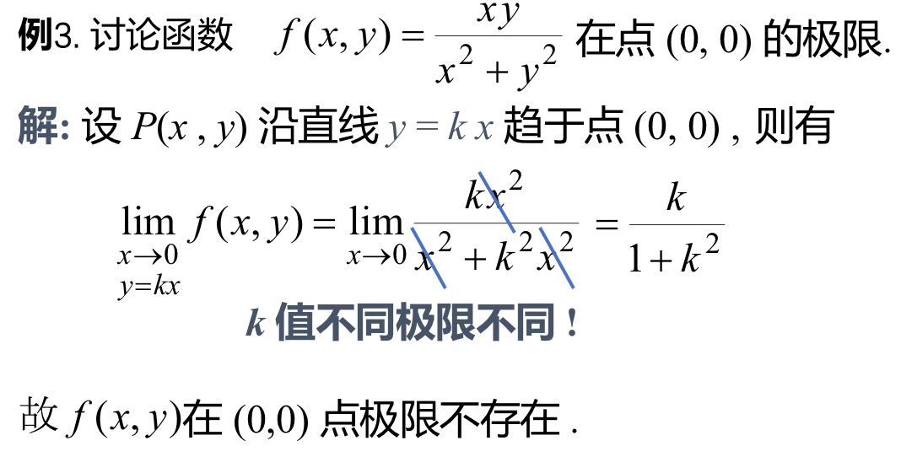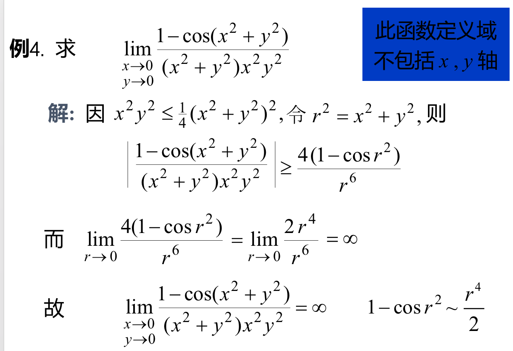

- #### 注意：二重极限与累计极限含义不同
> #### 二重极限$\lim_{x \to x_0 y\to y_0}f(x,y)$
> #### 累次极限 $\lim_{x \to x_0}\lim_{y \to y_0}f(x,y)$

> #### 例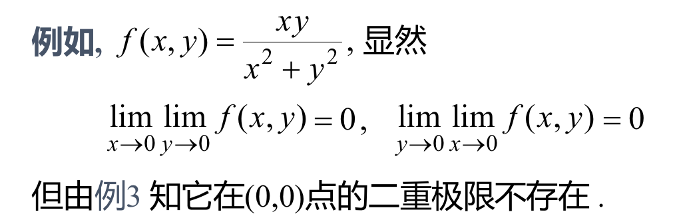

## 四、多元函数的连续性
###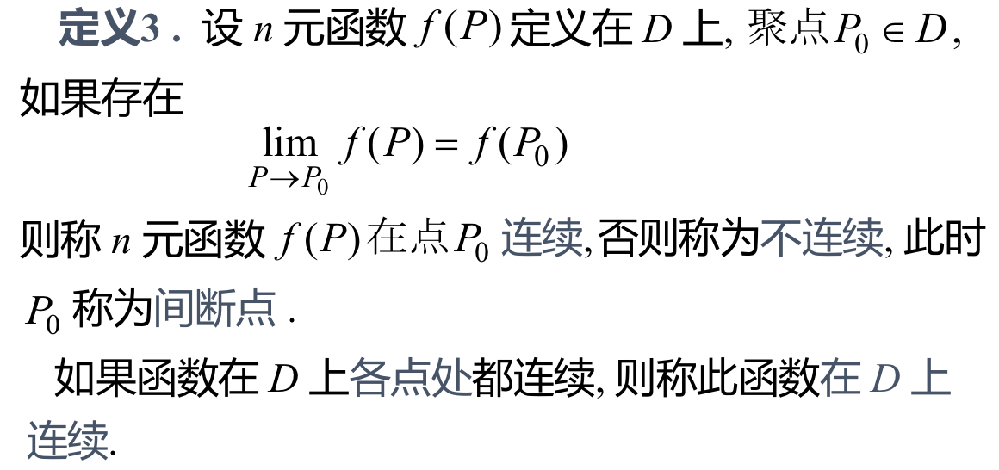函数连续的三个条件
> #### 在点处有函数值
> #### 在点处有极限值
> #### 且极限值与函数值相等
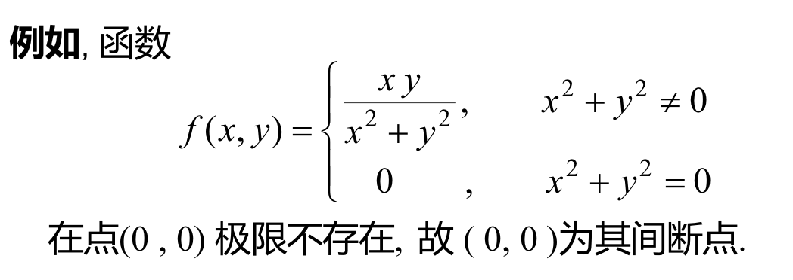
### 连续函数的性质
- #### 有界性定理:$\exists K> 0$,使$|f(P)| \leq K,P \in D $

- #### 最值定理：$f(P)$在D上可取得最大值M以及最小值m
-  #### 介值定理：对任意$\mu \in [m,M],\exists Q \in D$,使$f(Q)=\mu$
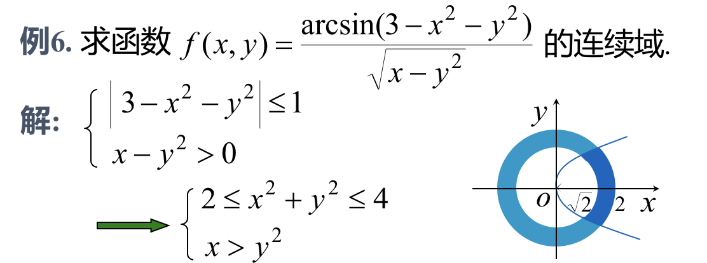
