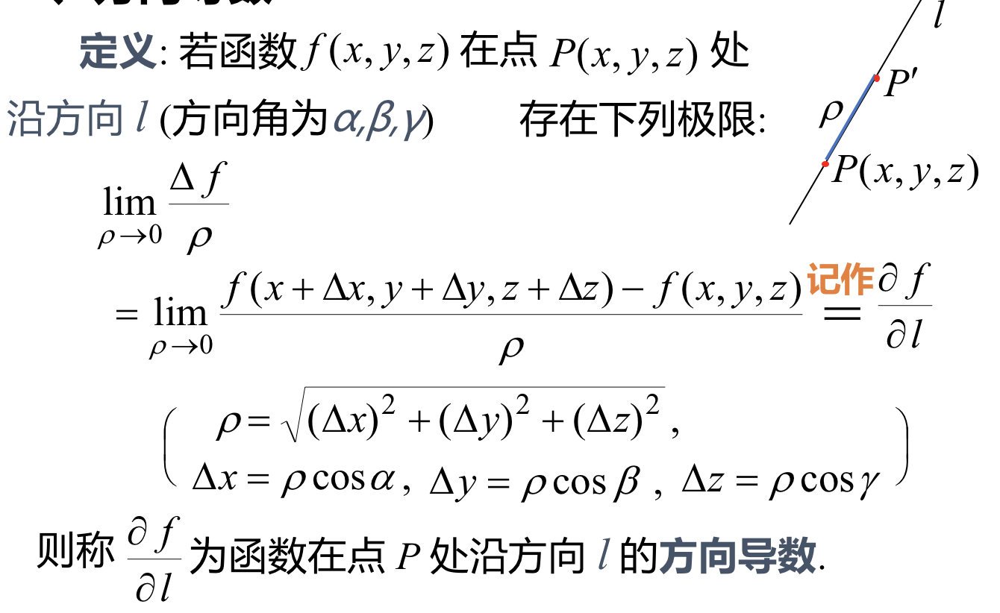
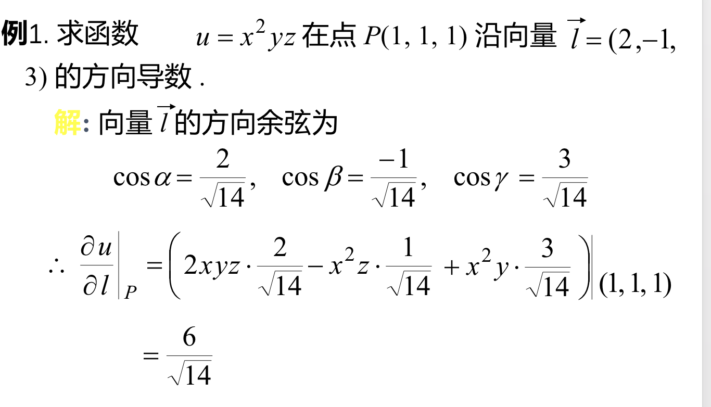
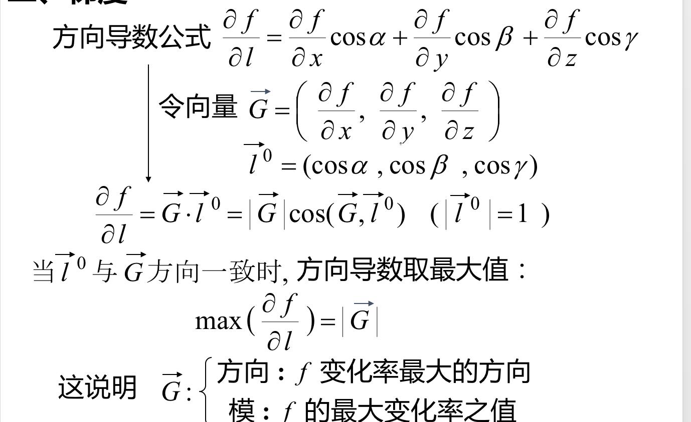
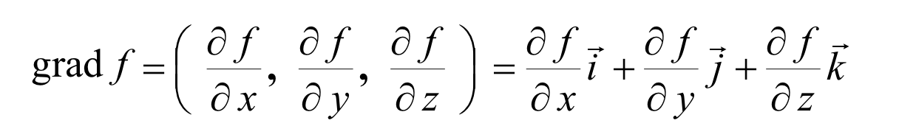
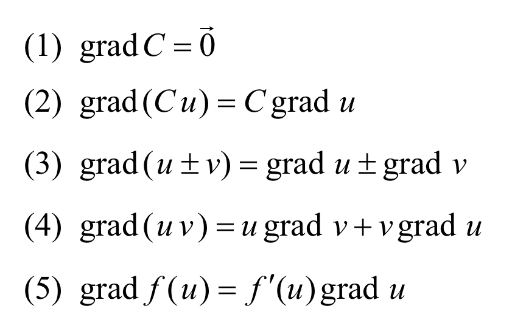

## 一、方向导数
### 定义：
### 定理：若函数f(x,y,z)在点P(x,y,z)处可微，则函数在该点沿任意方向l的方向导数存在，且有$$\frac{\partial f}{\partial l}=\frac{\partial f}{\partial x}cos \alpha+\frac{\partial f}{\partial y}cos\beta+\frac{\partial f}{\partial z}cos\gamma$$,其中$\alpha,\beta,\gamma$为l的方向角。
#### 例：

## 二、梯度
### 引入：

### 定义：向量$\vec G$称为函数$f(P)$在点P处的梯度，记作$grad f$，即
### 梯度的基本运算公式

## 三、物理意义
